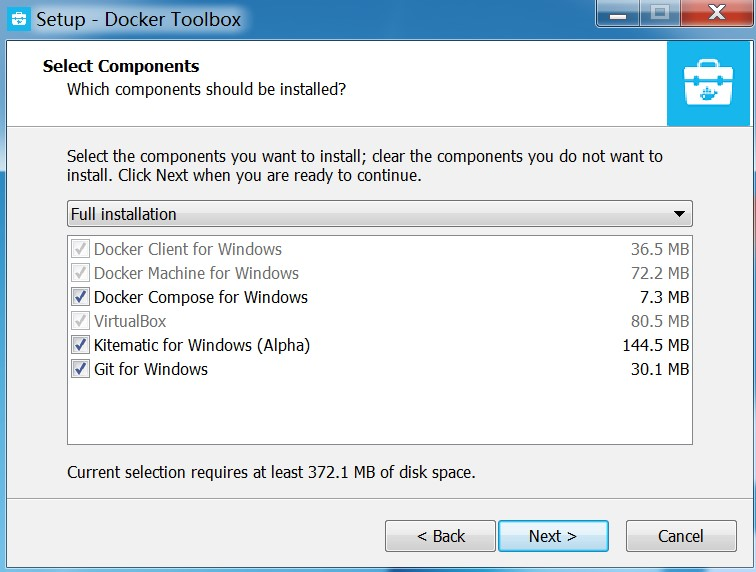

## windows 系统上的 docker 环境安装  
#### docker for windows
Docker通常是运行在Linux系统之上的，但是鉴于windows系统的用户群依然很多，所以docker现在也开始提供windows的Docker环境。该环境名为 **docker for windows**  

官方说明文档: [https://docs.docker.com/docker-for-windows/install/#what-to-know-before-you-install](https://docs.docker.com/docker-for-windows/install/#what-to-know-before-you-install)     

硬件及软件需求:       
+ Windows 10 64bit: Pro，Enterprise or Education (1607 Anniversary Update，Build 14393 or later).      
+ Virtualization is enabled in BIOS. Typically，virtualization is enabled by default. This is different from having Hyper-V enabled. For more detail see Virtualization must be enabled in Troubleshooting.  
+ CPU SLAT-capable feature.  
+ At least 4GB of RAM.  

下载链接: [https://download.docker.com/win/stable/Docker%20for%20Windows%20Installer.exe](https://download.docker.com/win/stable/Docker%20for%20Windows%20Installer.exe)    

下载好之后安装软件，安装完成后可以在开始菜单中查看


若软硬件不满足上述需求，可以安装 docker toolbox 

#### docker toolbox  
 docker toolbox 是一个安装器，在比较老的 windows 如 win7 或 mac 上提供 docker 功能。  
以 win7 为例，实际上就是在 win7 上安装了 virtualbox 并导入了 boot2docker 虚拟镜像，boot2docker 已经预先安装好了 docker ，开箱即用，省去了安装虚拟机管理程序、创建虚拟机、安装配置 docker 等步骤  

官方说明文档: [https://docs.docker.com/toolbox/overview/](https://docs.docker.com/toolbox/overview/)     

下载链接:[https://download.docker.com/win/stable/DockerToolbox.exe](https://download.docker.com/win/stable/DockerToolbox.exe)   

如无定制需求，全程下一步即可   
   

    

   

   

     

    

    

## docker 环境启动
打开安装的docker的软件即可启动docker环境。      
    
第一次环境启动时会自动下载一些依赖，其中比较重要的依赖是 boot2docker.iso 。如果本地没有 boot2docker 最新 iso 环境会从 docker 官方网站下载    

下载超时可提前手动下载好最新稳定版，现在的版本为 v18.06.1-ce ： [https://github.com/boot2docker/boot2docker/releases/download/v18.06.1-ce/boot2docker.iso](https://github.com/boot2docker/boot2docker/releases/download/v18.06.1-ce/boot2docker.iso) 。 将下载好放到指定目录，比如 C:\Users\jlive\\\.docker\machine\cache       


## docker 环境使用  
#### ssh 连接
建议通过 ssh 工具连接 docker 虚拟机，如 xshell，scrt 等工具
默认内建了一个 sudo 用户 
> 用户名: docker  
> 密码: tcuser
  
**注** : root 用户没有密码，可以通过 docker 用户直接 sudo 成 root 后修改 root 密码
  
  

#### 编写Dockerfile  
这里使用 maven3+tomcat8.5 作为基础镜像，将以下内容保存为 Dockerfile  

```
FROM maven:3.3.3 
ENV CATALINA_HOME /usr/local/tomcat 
ENV PATH $CATALINA_HOME/bin:$PATH 
RUN mkdir -p "$CATALINA_HOME" 
WORKDIR $CATALINA_HOME 
ENV TOMCAT_VERSION 8.5.34
ENV TOMCAT_TGZ_URL https://www.apache.org/dist/tomcat/tomcat-8/v$TOMCAT_VERSION/bin/apache-tomcat-$TOMCAT_VERSION.tar.gz 
RUN set -x \ 
	&& curl -fSL "$TOMCAT_TGZ_URL" -o tomcat.tar.gz \ 
	&& tar -xvf tomcat.tar.gz --strip-components=1 \ 
	&& rm bin/*.bat \ 
	&& rm tomcat.tar.gz* 
EXPOSE 8080 CMD ["catalina.sh", "run"] 
```

#### build 镜像
```
docker build -t base-tomcat-maven .
```

#### 上传至 cosmoplat 镜像仓库
```	
docker login registry.cosmoplat.com
docker tag base-tomcat-maven registry.cosmoplat.com/train/base-tomcat-maven
docker push registry.cosmoplat.com/train/base-tomcat-maven
# 镜像空间请替换成分配的指定空间名，这里的镜像空间名为 train 
```
	
## 常见报错  
#### 报错一：  
没有启用虚拟化，bios 中开启虚拟化或虚拟机管理程序开嵌套虚拟化  
 

#### 报错二：  
信任私有非权威 docker 镜像仓库  
  
编辑配置文件 /var/lib/boot2docker/profile 增加一行 `--insecure-registry 0.0.0.0/0`  
```
EXTRA_ARGS='
--label provider=virtualbox
--insecure-registry 0.0.0.0/0
'

CACERT=/var/lib/boot2docker/ca.pem
DOCKER_HOST='-H tcp://0.0.0.0:2376'
DOCKER_STORAGE=aufs
DOCKER_TLS=auto
SERVERKEY=/var/lib/boot2docker/server-key.pem
SERVERCERT=/var/lib/boot2docker/server.pem
```  

重启 docker  `/etc/init.d/docker restart`

