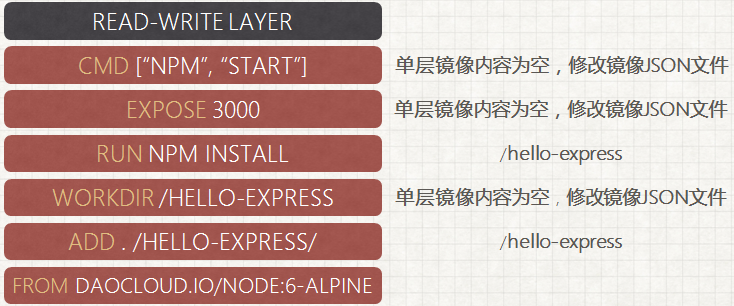

###入门概念讲解
**容器**：容器提供一个干净的环境给应用程序，容器保护其内部的资源，不同的容器之间存在着隔离。由于这种特性，容器能够很好的对资源进行管理，分发。  
**Docker**：docker不是一种容器，更多的是一种管理程序，它隐含了底层容器构建过程，直接提供容器的服务。它简化了软件安装的过程，让用户更关注于软件的服务和使用以及分发。而且它能保证不同平台中的环境一致性。  

---
Docker能够对容器进行很好的管理，并且能够限制容器资源。Docker对容器环境的隔离包括文件系统，网络，进程，以及进程之间的通信。Docker对容器资源的限制包括CPU，内存以及磁盘IO
&emsp;&emsp;Docker在容器的基础上可以轻量化应用环境。并且环境的管理是可移植的，容器可以打包成镜像。然后放置到镜像仓库之中（如docker hub）。  
Docker不是虚拟机，它直接和内核打交道，不提供虚拟内核。这代表Docker的容器消耗的资源十分少，部署会十分迅速  
Docker以及容器的存在提供了一个平台，它能将底层服务器到上层应用之间的层次完全整合，成为一整个云平台。这使得用户可以更关注于应用之上，其余可以交付给云平台（基于docker容器技术）。  
Docker同时也带来了不同平台的标准化，包括镜像，环境，基础设施以及容器基本特性

---
**docker基础架构:**  

一般而言，docker通常指的的是Docker Engine（后称DE）  
DE的架构形式是Docker Client，REST API以及Server。如下图，Server使用docker daemon对容器进行管理，它暴露REST API给Client。Client使用docker CLI（即命令行工具）来与docker daemon进行通信。当然，也可以直接使用REST API进行通信。
  
  

DE通常包括五个组件：  
1.**Docker Daemon**是docker服务进程，作为服务器管理Docker的对象(容器，镜像，网络，存储卷等)，它长期运行，监听API请求  
2.**Docker Client**是docker客户组件，提供CLI与服务端通信。发送用户请求，可以使用CLI，也可使用API  
3.**Docker Registries**是镜像仓库，用于存储，获取镜像。Registriy分公有和私有，默认Registriy是Docker Hub，在指令加限定词则会到私有或者其他共有仓库获取镜像。使用docker push会将镜像发送到指定Registriy中  
4.**Docker Image**即镜像组件，提供镜像处理。镜像提供创建容器的模板，并且镜像是只读的。Image使用Dockerfile来定义构建镜像时的步骤。dockerfile是构建镜像的文件，它的每条指令都会让Image构建镜像。镜像是一层一层写入的，同时它还有一个json文件作为元数据存在。dockerfile每一条指令都会在镜像中写入一层，其内容有无，是否修改json文件取决于指令。每写完一层都会将该层改为只读，之后加入一层读写层，用于添加新层以及读取镜像。

5.**Docker Containers**即容器，提供容器管理细节。docker的容器是镜像的实例Clinet的CLI和API都可以对容器进行管理。容器可以连上多个网络，可被分配存储，可用于构建新镜像。通过配置参数可以配置容器运行。容器在创建后docker会给容器分配可读写层，所有对于已运行的容器的文件操作都会在这个可读写层上进行。同时Docker为容器创建网卡并将该容器连接到默认网络上，这一步包括为容器分配IP地址。容器内部程序运行完后容器会停止运行，但是不会被删除。  

  通常获取镜像有三种方式：  
1.**docker run**先从本地获取镜像，若没有则去镜像仓库获取，然后运行  
2.**docker pull**直接从镜像仓库获取，然后保存到本地，不运行  
3.**docker bulid**则直接在本地构建镜像  
---
**docker存储方案：**  
1.**Volume**，最常用且推荐的数据持久化方案。volume被放在宿主的文件系统中并由docker管理。非docker进程不应该（不是不能）对这部分文件进行修改。docker提供volume指令，并且docker run的时候添加选项挂载volume时，若volume不存在则会自动创建volume。指令具体如下  
`docker run -d --name test --mount source=myvol,target=/app nginx:latest`  
2.**Bind Mount**，另一种持久化方案，它可以放在宿主机文件系统的任何地方，甚至是需要root权限的地方。非docker进程可以对这部分文件修改（但是不应该？）。虽然Bind Mount性能微高于volume，但是更推荐Volume。  
3.**Tmpfs Mount**，是一种临时存储方案，它将文件保存在宿主机的内存当中，不写入系统，关机则消失。  

---
**docker网络:**  
Docker会在被安装后自动创建三个默认网络，它们分别为Bridge，None，以及Host。使用“docker network ls”可以查看可用的网络。创建容器时，可以使用“--network“选项设置需要连接的网络。   
1.**None**是无网卡，None设定之后docker不会给该容器创建网卡，并且之后docker无法直接对其进行网络配置。只有进入容器中才可以进行网络配置与查看  
2.**Host**是直接使用宿主机的网络，它解除了网络隔离，直接占用宿主机的端口。这样也可以直接使用宿主机的网络访问容器。同时docker也无法直接对host进行网络配置  
3.**Bridge**则是网桥，创建网络的默认方式。当 Docker 启动时，会自动在主机上创建一个名为 docker0 虚拟网桥，它会在挂载到它的网口之间进行转发。当我们创建一个新的容器时，同时会创建了一对veth pair接口（即对等接口，当数据包发送到一个接口时，另外一个接口也可以收到相同的数据包）。这对接口一端在容器内，即 eth0；另一端在本地并被挂载到 docker0 网桥，名称以 veth 开头。通过这种方式，主机可以跟容器通信，容器之间也可以相互通信。  

---

