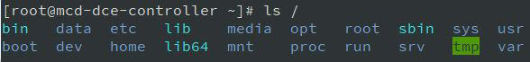
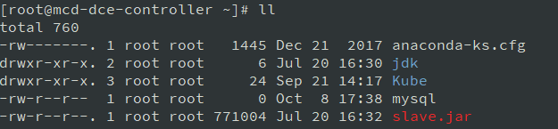

## Linux 的文件系统介绍
####  Linux 文件结构
在 Linux 或 Unix 操作系统中，所有的文件和目录都被组织成以一个根节点开始的倒置的树状结构。  
文件系统的最顶层是由根目录开始的，系统使用`/`来表示根目录。在根目录之下的既可以是目录，也可以是文件，而每一个目录中又可以包含子目录文件。    
在Linux文件系统中有两个特殊的目录，一个用户所在的工作目录，也叫当前目录，可以使用一个点 `.` 来表示；另一个是当前目录的上一级目录，也叫父目录，可以使用两个点 `..` 来表示。    

`~` 表示代码主目录，也就是当前登录用户的用户目录，也可以使用 `~/` 来表示；    
`.` 代表当前的目录，也可以使用 `./` 来表示；    
`..` 代表上一层目录，也可以 `../` 来代表。    

如果一个目录或文件名以一个点 `.` 开始，表示这个目录或文件是一个隐藏目录或文件(如 `/.bashrc` )。即以默认方式查找时，不显示该目录或文件。  

在终端输入 `ls /` 即可查看 Linux 根目录下的各个目录

根目录系统下通常包含以下一些目录

|目录名|作用|
|--|--|
|/bin|是 Binary 的缩写，存放最经常使用的命令|
|/dev|是 Device 的缩写，该目录下存放的是 Linux 的外部设备，在 Linux 中访问设备的方式和访问文件的方式是相同的。|
|/home|是用户的主目录，每个用户都拥有自身的一个目录，一般以自身用户名命名。相当于 Windows 中的 User 目录|
|/lib|存放着系统最基本的动态连接共享库，其作用类似于 Windows 里的 DLL 文件。几乎所有的应用程序都需要用到这些共享库。|
|/mnt|系统提供该目录是为了让用户临时挂载别的文件系统的，可以将光驱挂载在 `/mnt/` 上，然后进入该目录就可以查看光驱里的内容了。|
|/proc|是一个虚拟的目录，它是系统内存的映射，我们可以通过直接访问这个目录来获取系统信息。|
|/srv|目录存放一些服务启动之后需要提取的数据。
|/tmp|目录存放临时文件|
|/var|这个目录中存放着在不断扩充着的东西，我们习惯将那些经常被修改的目录放在这个目录下。包括各种日志文件。|
|/boot|这里存放的是启动 Linux 时使用的一些核心文件，包括一些连接文件以及镜像文件。|
|/etc|目录用来存放所有的系统管理所需要的配置文件和子目录。|
|/media| Linux 系统会自动识别一些设备，例如 U盘、光驱等等，当识别后，Linux 会把识别的设备挂载到这个目录下。|
|/opt|这是给主机额外安装软件所摆放的目录。比如你安装一个 ORACLE 数据库则就可以放到这个目录下。默认是空的。|
|/root|该目录为系统管理员，也称作超级权限者的用户主目录。|
|/sbin| s 就是 Super User 的意思，这里存放的是系统管理员使用的系统管理程序。|
|/sys| 2.6 内核中新出现的一个文件系统。 sysfs 文件系统集成了下面 3 种文件系统的信息： 针对进程信息的 proc 文件系统、针对设备的 devfs 文件系统以及针对伪终端的 devpts 文件系统。该文件系统是内核设备树的一个直观反映。当一个内核对象被创建的时候，对应的文件和目录也在内核对象子系统中被创建。|
|/usr|这是一个非常重要的目录，用户的很多应用程序和文件都放在这个目录下，类似于 windows 下的 program files 目录。|
|/lost+found|这个目录一般情况下是空的，当系统非法关机后，这里就存放了一些文件。|

删除或更改某些文件目录不会影响整个系统，但是有一些目录是不能随意删除或者更改的，如：   
`/etc`：该文件存放的是系统中的配置文件，如果更改了该目录的某个文件可能导致系统无法正常启动。    
`/bin, /sbin`, `/usr/bin`, `/usr/sbin`：都是系统预设的执行文件的放置目录，比如 ls 就是在 `/bin/ls` 目录下的。更改或删除会导致指令无法执行。  
`/var`：是一个非常重要的目录，系统上跑了很多程序，许多程序的数据都会存放在这里。更改删除会导致系统程序的运行错误。  

#### Linux文件基本属性
Linux 系统是一种典型的多用户系统，不同的用户处于不同的地位，拥有不同的权限。为了保护系统的安全性，Linux 系统对不同的用户访问同一文件（包括目录文件）的权限做了不同的规定。  
在 Linux 中可以使用 `ll` 或者 `ls –l` 命令来显示一个文件的属性以及文件所属的用户和组，如：  

图中显示的第一行 total 是表示该目录下所有文件的总大小，从第二行开始则表示每个文件的详细信息，从左到右一共有七项信息：  

+ 第一项，表示文件的属性。    
Linux 的文件基本上分为三个属性：可读(r)，可写(w)，可执行(x)。一个文件属性以 10 个字符表示(具体程序实现时，实际上是十个 bit 位)。  
第一个字符是特殊表示字符，表示目录或连结文件等等，`d` 表示目录，例如 `drwx------` ； `l` 表示连结文件，如 `lrwxrwxrwx` ； `-` 则表示这是文件。其余剩下的字符就以每3个字符为一个单位。  
因为 Linux 是多用户多任务系统，所以一个文件可能同时被许多人使用，所以我们一定要设好每个文件的权限，其文件的权限位置排列顺序是(以 `-rwxr-xr-x` 为例)： `rwx`(Owner) `r-x`(Group) `r-x`(Other)。这个例子表示的权限是：使用者自己可读，可写，可执行；同一组的用户可读，不可写，可执行；其它用户可读，不可写，可执行。另外，有一些程序属性的执行部分不是 X ,而是 S ,这表示执行这个程序的使用者，临时可以有和拥有者一样权力的身份来执行该程序。一般出现在系统管理之类的指令或程序，让使用者执行时，拥有 root 身份。    　 　  
+ 第二项，表示文件个数。  
如果是文件的话，那这个数目自然是 1 了，如果是目录的话，那它的数目就是该目录中的文件个数了。　　    
+ 第三项，表示该文件或目录的拥有者。  
若使用者目前处于自己的 Home ,那这一栏大概都是它的账号名称。　　    
+ 第四项，表示所属的组（group）。  
每一个使用者都可以拥有一个以上的组，不过大部分的使用者应该都只属于一个组，只有当系统管理员希望给予某使用者特殊权限时，才可能会给他另一个组。　　    
+ 第五项，表示文件大小。  
文件大小用 byte 来表示，而空目录一般都是 1024byte ，你当然可以用其它参数使文件显示的单位不同，如使用 `ls –k` 就是用 kb 来显示一个文件的大小单位，不过一般我们还是以 byte 为主。　　    
+ 第六项，表示创建日期。  
以“月，日，时间”的格式表示，如 Aug 15 5：46 表示 8 月 15 日早上 5：46 分。　　 
+ 第七项，表示文件名。  
我们可以用 `ls –a` 显示隐藏的文件名。  