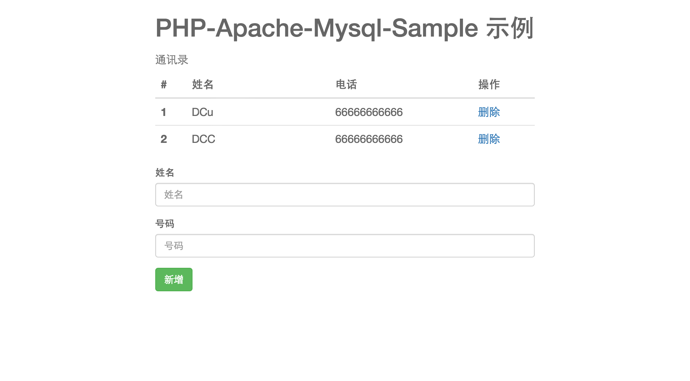

## 制作一个 PHP + MySQL 的 Docker 化应用
>   目标：基于典型的 LAMP 技术栈，用 Docker 镜像的方式搭建一个 Linux + Apache + MySQL + PHP 的应用。

#### 前言
这里，将介绍一个比较偏向实际的应用部署过程。通常一个具体应用通常包含多个子应用(微服务)容器，多个容器整合来提供一个具体的应用服务。每一个容器通常仅包含一个具体功能，从而保证容器的性能。
而这里介绍的 PHP + MySQL 需要两个容器，一个提供PHP的应用，另一个提供 MySQL 数据库的功能。

#### PHP 镜像构建
###### Dockerfile 编写
整个 PHP 应用的 Dockerfile 内容如下：
```
FROM php:7.3-rc-apache-stretch

RUN docker-php-ext-install pdo_mysql

COPY . /var/www/html/
```

###### Dockerfile 介绍
```
FROM php:7.3-rc-apache-stretch
```
这里，选择官方的 PHP-apache 镜像作为镜像。
```
RUN docker-php-ext-install pdo_mysql
```
`docker-php-ext-install` 为官方 PHP 镜像内置命令，用于安装 PHP 扩展依赖。    
`pdo_mysql` 为 PHP 连接 MySQL 扩展
```
COPY . /var/www/html/
```
`/var/www/html/`为 Apache 目录，需要将 PHP 应用文件放到 Dockerfile 所在目录中，然后将应用文件放入 Apache 目录中。    

因为基础镜像内已经声明了暴露端口和启动命令，所以在应用镜像中就可以省略这些命令。

###### PHP应用文件
PHP 应用文件的程序需要提供与 MySQL 的交互功能，以及页面前端显示功能。
这里假设已存在这些PHP程序文件。

#### MySQL镜像构建
这里，直接选择官方 MySQL 镜像进行容器构建，不自己编写 Dockerfile 。
官方 MySQL 的 Dockerfile 可以去 [Github](https://github.com/docker-library/mysql/blob/b39f1e5e4ec82dc8039cecc91dbf34f6c9ae5fb0/8.0/Dockerfile) 下载查看。     
直接运行 `docker pull mysql:latest` 即可下载官方镜像。

官方 MySQL 提供了 `MYSQL_ROOT_PASSWORD` , `MYSQL_PORT_3306_TCP_ADDR` 等环境变量，这些环境变量都可以用来连接其他容器

#### 容器部署与连接
容器部署就不赘述了，假设容器名分别为 `registry.cosmoplat.com/test/php:1.0.0` , `registry.cosmoplat.com/test/mysql:1.0.0` 。     

现在需要将容器进行连接，有两种方式：使用 PaaS 平台进行连接，或者在 docker 环境中连接。     

PaaS 平台的容器连接看教程。    

docker 环境连接，连接 mysql 需要创建 mysql 容器。然后在创建 php 容器时，输入指令
```
docker run --name test --link registry.cosmoplat.com/test/mysql:1.0.0: -d registry.cosmoplat.com/test/php:1.0.0
```
这样 mysql 的环境变量以及端口就会暴露给 php 容器，达到连接的目的。而 php 容器的程序也能读取暴露的环境变量来连接 mysql 。    

然后打开网页，即可看到下图    
    

至此，一个多个容器连接的应用部署完成！