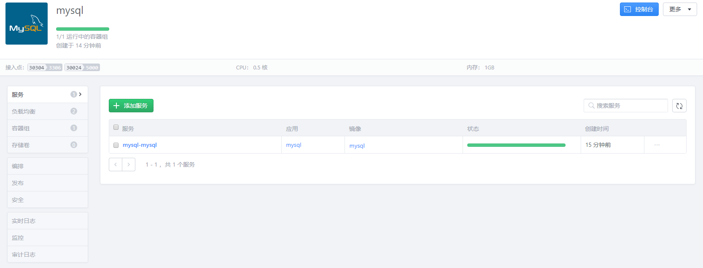

## PaaS 平台容器连接
#### 前言
PaaS 平台是基于 Kubernetes 与 Docker 的，因此也提供了容器的管理功能。通常一个应用会包含几个容器组，提供不同的功能（服务）。   
本教程将介绍如何在应用中添加服务容器，并且与其他容器进行连接。   

本教程以 python 的 flask 应用与 MySQL 交互为例

#### 构建镜像并部署
详细构建过程可以看教程 [PaaS 平台镜像构建与上传](PaaS平台应用镜像构建.md)，这里假设 MySQL 以及 python 镜像都已构建完成。    
然后部署 MySQL 应用，具体过程请看教程 [PaaS 平台应用的部署](PaaS平台应用的部署.md)

#### 添加 python 服务容器
打开 PaaS 平台，点击应用，进入应用界面。点击应用，进入应用详细信息界面。             
                     
点击添加服务，进入镜像选择界面。选择构建好的 python 镜像。点击继续                       
                            
然后点击“审核应用并部署”，然后部署完成。再次进入应用详细信息界面，可以看到存在了两个服务
                   
至此，添加服务容器完成!                   

#### 连接容器
实际上在一个应用中部署多个服务后，这些服务容器都已经进行了连接，他们之间的环境变量都会暴露给其他容器。            

以本教程的例子来说，python 容器将会接收到 MySQL 容器暴露的 `MYSQL_ROOT_PASSWORD` , `MYSQL_PORT_3306_TCP_ADDR` 等环境变量。于是 python 就可以使用这些环境变量连接 MySQL 。             

综上，只要在应用中进行添加服务，即会自动将应用中的容器进行互连。