## PaaS 平台应用的部署
#### 前言
通常一个镜像都包含一个实际应用的功能，若要让该应用能够给用户使用，那么就需要部署该应用镜像。 PaaS 平台基于 Kubernetes 与 Docker ，提供了一个快捷的应用部署的方式。本教程将介绍如何使用 PaaS 平台进行应用的部署。
PaaS 平台上应用部署有四种方式，基础镜像部署，一键部署，通过镜像部署以及 YML 编排部署。     
#### 基础镜像部署
这里以 tomcat + war 包为例。打开 PaaS 平台，点击应用           
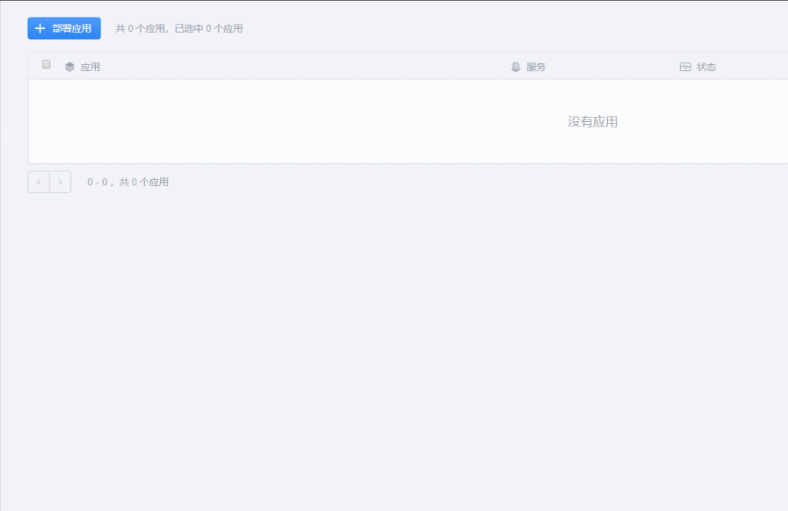      
点击 "审核应用并部署"，选择 “选择基础镜像，部署程序包” ，点继续        
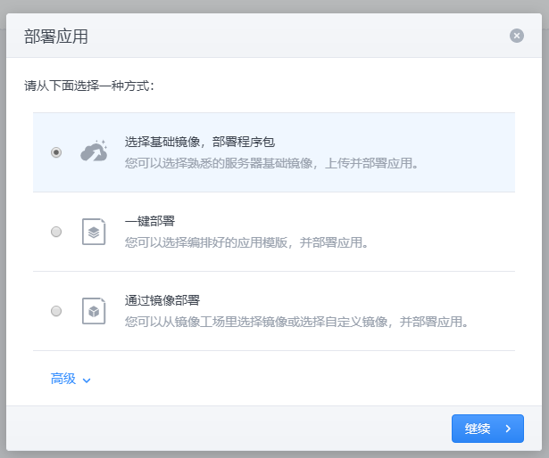      
选择 tomcat ，版本任意。点击继续。     
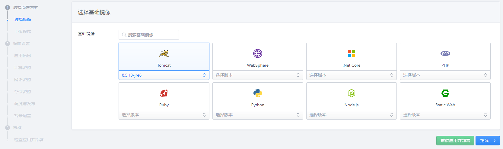       
和镜像的快速构建类似，不同镜像上传代码包形式不同。这里 tomcat 要上传 war 包。上传完毕点击继续。      
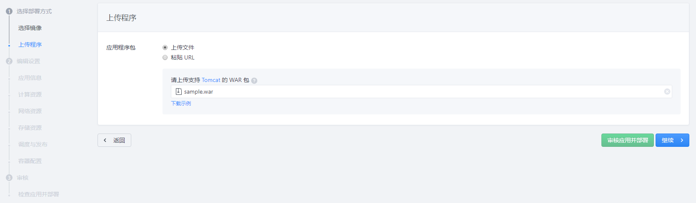     
之后进入应用的设置界面，可以一步步定制，也可以直接部署。这里我们使用默认设置，直接点击“审核应用并部署”。    
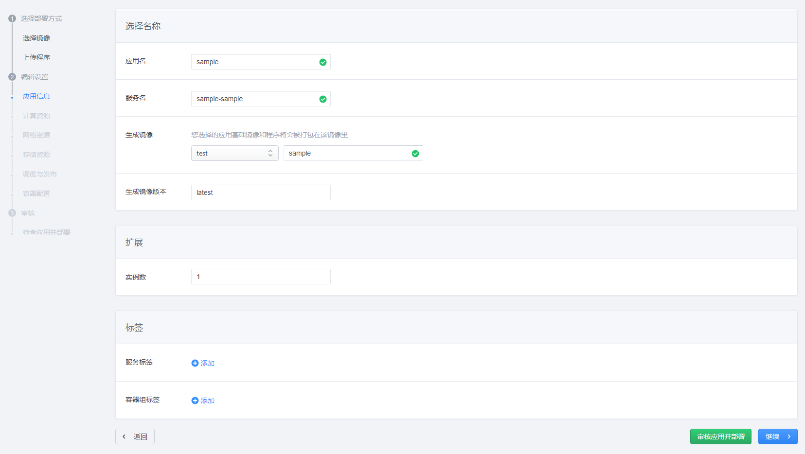    
进入完成界面点击部署应用即可。之后会弹出部署日志，等待部署完毕即可进入应用界面查看部署成功的应用。    
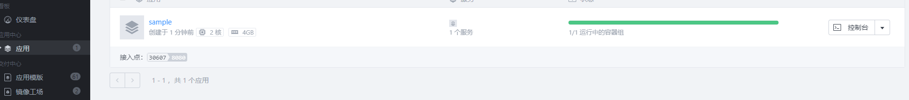    
点击应用可以看到应用的详细信息。   
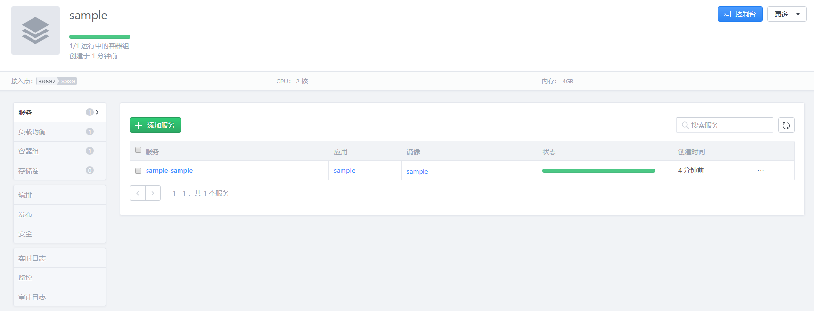   
如果应用暴露了端口，提供接入点。那么点击应用的接入点即可进入应用提供的网页。   

#### 一键部署
一键部署可以快速部署应用，不过需要该应用存在于 PaaS 平台的应用模板中。      

打开 PaaS 平台，点击应用。点击部署应用，选择“一键部署”，点继续。      
之后进入模板选择界面，在该界面可以选择存在于 PaaS 的应用模板进行部署。这里选择 tomcat 模板，点击继续。        
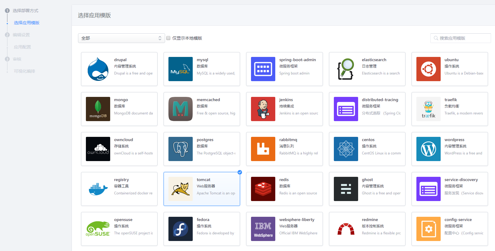       
之后输入应用名称，点继续。然后进入 kubernetes 的 YML 编排界面。通常应用模板不需要修改编排，不过若有特殊需求可以在此页面修改。编排完成，即可点击“检查镜像并部署”              
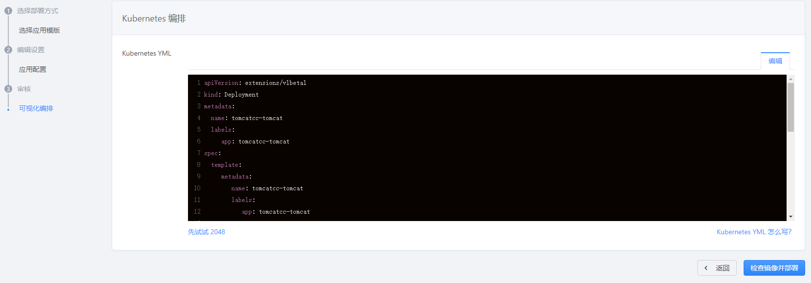                      
部署完成即可在应用界面中查看应用。     

#### 通过镜像部署
打开 PaaS 平台，点击应用。点击部署应用，选择“通过镜像部署”，点继续。       
之后进入镜像选择界面，这里可以选择已经构建好并上传到 PaaS 平台的镜像。我们选择教程中的 tomcat + maven 的基础镜像，点击继续              
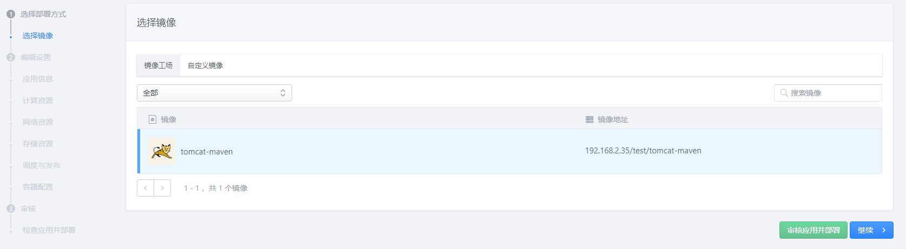          
进入应用设置界面，我们不进行定制，直接使用默认设置。直接点击“审核应用并部署”。再点击部署应用完成部署。                
最后可以在应用界面看到通过镜像部署的应用。            

--- 
镜像还可以在镜像工厂界面直接部署。进入镜像工厂，选择镜像，点击右边的部署。     
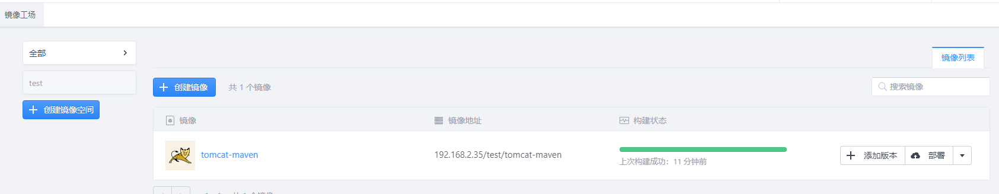             
这样点击部署直接进入应用设置界面，剩下的操作与之前的教程一样，不再赘述。             
        
部分镜像不支持部署，仅能用做其他镜像的基础镜像，需要注意。

#### YML编排部署
由于 PaaS 平台是基于 Kubernetes 的，若要深度定制一个应用，可以直接提供 YML 编排进行部署。
打开 PaaS 平台，点击应用。点击部署应用，YML 编排是隐藏的，需要点击高级才会显示。选择 “通过 YML 编排应用” ，点击继续。               
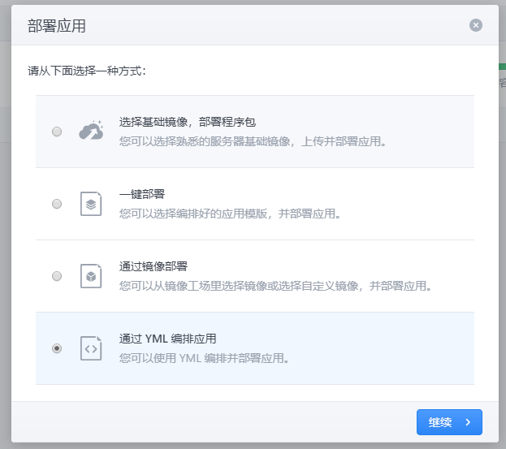        
进入 YML 编排界面，在此界面输入应用名称，YML 编排内容，点击“检查镜像并部署”。       
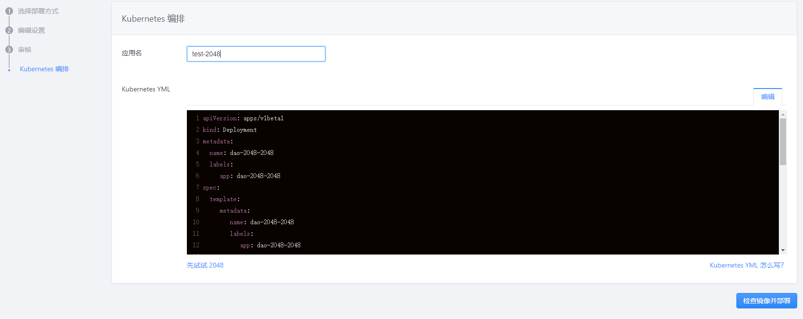         
应用部署成功的话可以在应用界面查看。      
