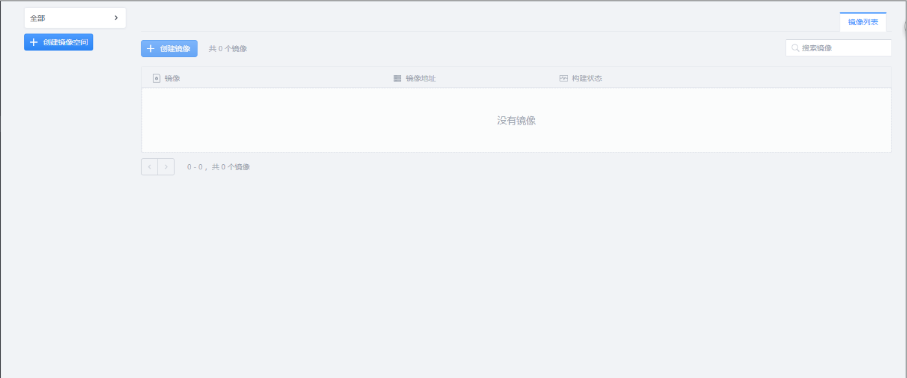
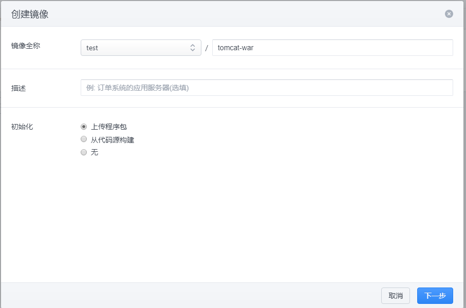
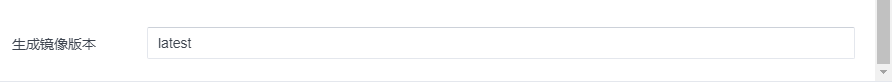
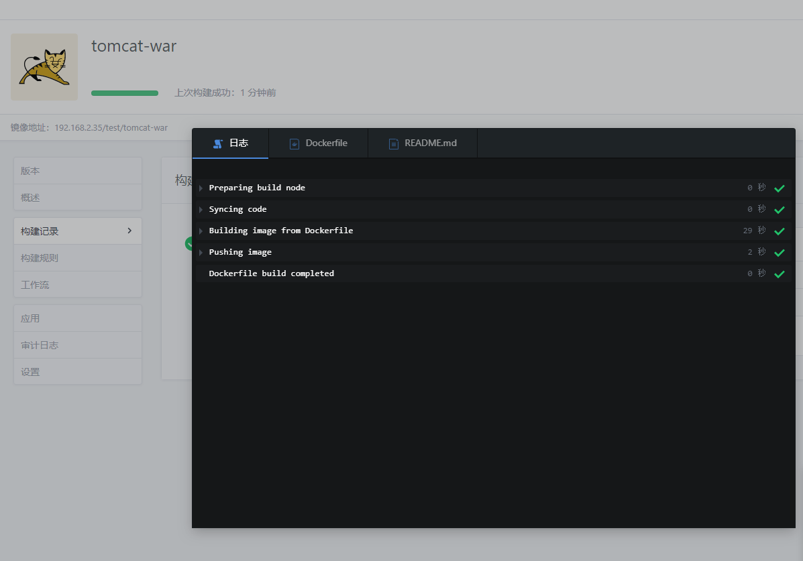
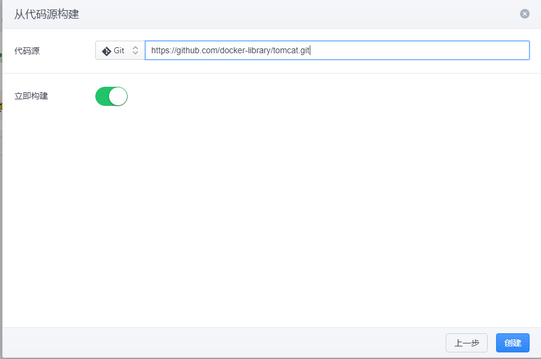
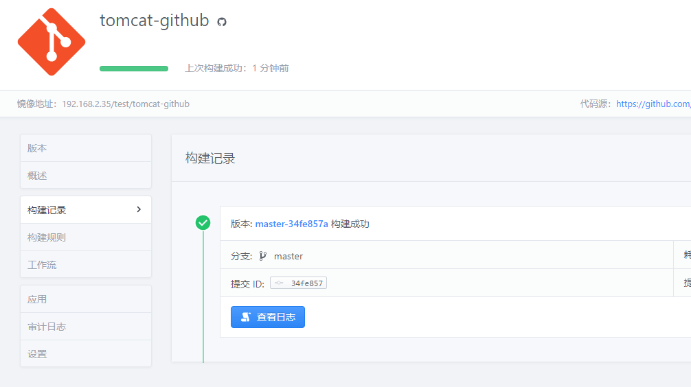
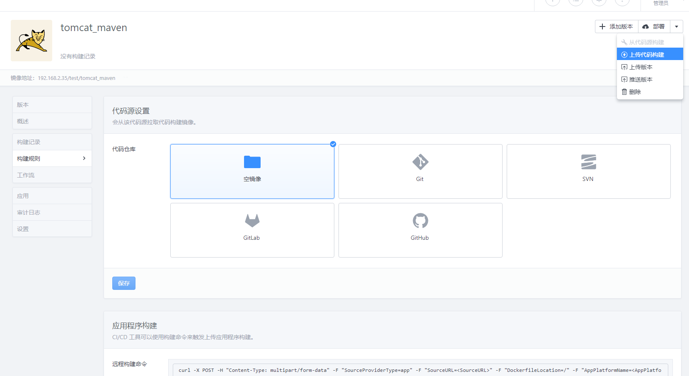
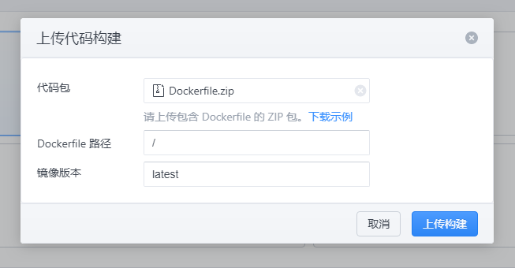
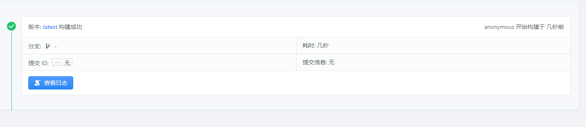

## PaaS 平台镜像构建与上传
#### 前言
PaaS 平台提供了一个云端的镜像管理仓库，可以更方便的管理镜像以及应用部署。本教程将介绍如何将本地的镜像 Dockerfile 以及对应文件上传到 PaaS 平台，并在 PaaS 平台构建镜像。     
PaaS 的镜像构建与上传通常有三种方式：快速构建，从代码源构建以及上传代码构建。

#### 快速构建
快速构建是 PaaS 平台提供的镜像构建功能，平台包含多种基础镜像。借助平台提供的基础镜像，可以不用编写 Dockerfile ，直接上传代码包让 PaaS 平台自动构建镜像。     
这里以 tomcat + war 包镜像为例。    
打开 PaaS 平台，点击镜像工厂      

点击创建镜像，若显示没有可用的镜像空间则先创建镜像空间。输入镜像名，初始化选择“上传程序包”，点击下一步    

然后进入上传应用界面，基础镜像选择 tomcat ，镜像下面的版本可自选。然后在应用程序包处选择上传文件(也可以从 URL 下载文件)，选择程序 war 包上传，填写版本号，点击创建    
    
     
创建成功后会出现镜像构建界面，并弹出构建日志，日志显示了构建过程。没有弹出可以在构建记录中点击查看日志查看。   
     
等待构建完成，镜像显示构建成功。至此快速构建镜像完成。     

+ 由于不同基础镜像需要的程序包形式不一样，所以在上传代码包前，推荐下载示例文件。参考示例文件的形式上传。    

#### 从代码源构建
PaaS 平台支持从代码源处下载镜像文件进行构建，现在支持的代码源有 Git ， SVN ， GitLab 以及 GitHub 。    
这里以 tomcat 的 Github 为例。    
打开 PaaS 平台，点击镜像工厂。点击创建镜像，若显示没有可用的镜像空间则先创建镜像空间。输入镜像名，初始化选择“从代码源构建”，点击下一步。然后选择代码源为 github ，输入 git 地址，点击创建。

创建成功后会开始构建镜像，弹出构建日志。等待构建完成，镜像显示构建成功。     
    

+ 如果要借助代码源构建自己的镜像，需要将 Dockerfile 以及相关代码文件上传到 github 等代码源，然后在构建时输入对应代码源地址进行构建。

+ 代码源构建是需要解析 Dockerfile 的，所以代码源的文件一定要包含 Dockerfile 。

#### 上传代码构建
这里以教程 中制作的 Maven 和 Tomcat 的基础镜像为例子介绍如何将镜像上传到 PaaS 平台。    

打开 PaaS 平台，点击镜像工厂。点击创建镜像，若显示没有可用的镜像空间则先创建镜像空间。输入镜像名，初始化选择无，点击创建。创建成功后会出现镜像界面，然后在右上角点击更多选项(部署旁边的小三角)，点击上传代码构建      
    
将 Dockerfile 以及相关的文件放到同一个文件夹中，然后将文件夹压缩成 zip 压缩包，然后将该 zip 上传到 PaaS 平台，然后点击上传构建    
    
上传之后， PaaS 平台会自动解析 Dockerfile ，然后构建成镜像保存在平台上。点击查看日志可以查看构建过程。构建成功后如图     
    
至此镜像完成构建以及上传，之后即可在 PaaS 平台部署该镜像，或者进行其他操作。

