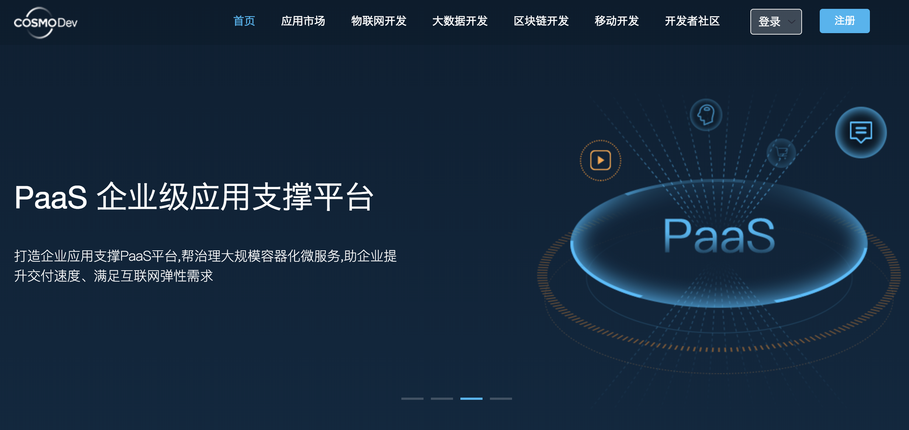
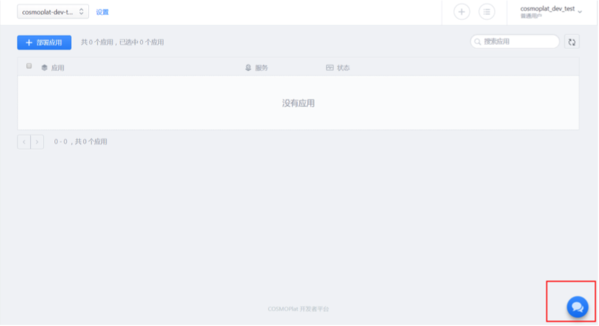
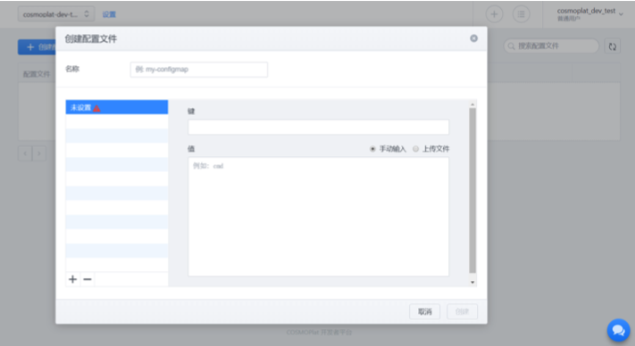
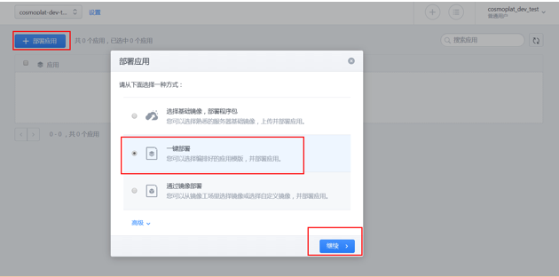
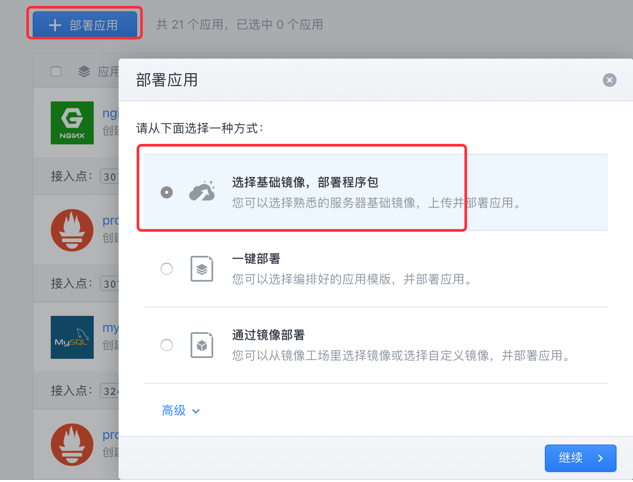
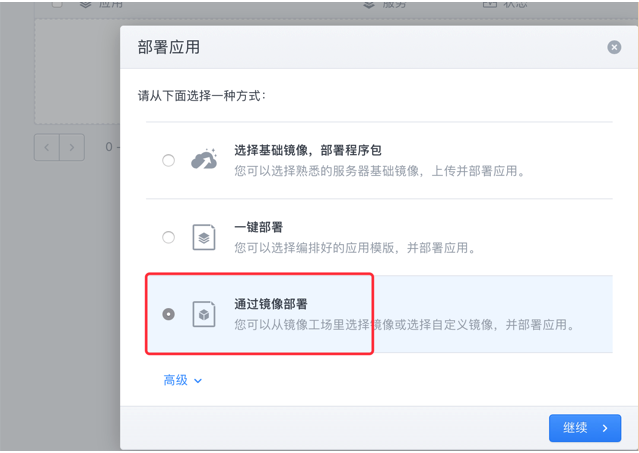

## COSMOPlat 开发者平台介绍

COSMOPlat 开发者平台以工业为中心的云计算新模式,工业互联网应用的完整生命周期。 具体优势:

>> * 微服务--针对工业互联网业务的特点设计的普适性应用架构原则和最佳实践

>> * DevOps--用最小化的代价帮助工业企业互联网业务开发进入高效的协作模式

>> * 持续创新--获得持续迭代的创新交付能力和永久可用的业务连续性

>> * 自动运维--将传统的基础架构一步带入谷歌级别的云化数据中心时代

>> * 数据驱动--即时的用户反馈和精准的用户画像，让数据驱动产品运营和创新

> COSMOPlat 开发者平台为开发模式带来了革命性的升级，对接代码仓库，自动化测试和构建，加速 研发交付流程，让代码承载业务的脉动，快速推向市场;

> COSMOPlat 开发者平台变革了应用交付，以容器为标准交付件，打造企业应用商店，实现复杂分布 式应用的秒级部署，打开拥抱互联网能力的大门;

> COSMOPlat 开发者平台重构了数据中心，让软件定义一切，充分利用企业的存量 IT 资产，打造面 向未来的计算平台，为创新插上计算的翅膀;

> COSMOPlat 开发者平台致力创造客户价值，一切以客户为中心，让每一次沟通都产生价值，让客户 的参与感驱动产品迭代，数据驱动的精益运营，塑造全新的极致体验。

## 系统使用

COSMOPlat 开发者平台接入总体流程:注册开发者账号---登录开发者平台---通过 webchat 申请镜 像空间---上传镜像---创建应用模板---通过模板部署应用---添加 7 层负载---访问应用

> 导航栏主要功能按钮

>> * 应用:最终部署到 COSMOPlat 开发者平台上的具体应用，对应 k8s 中的 deployment 

>> * 应用模板:COSMOPlat 开发者平台的模板机制，模板通过变量传参，一次定义重复使用 

>> * 4 层负载均衡:内部应用间访问的入口

>> * 7 层负载堪称:以域名的形式暴露应用访问入口，支持多域名和 uri 

>> * 存储卷:对有持久化需要的应用可以申请一定大小的存储卷 

>> * 配置管理:用于分离应用配置文件，配置文件可以外挂到应用 

>> * 安全中心:修改用户自身密码

1,登陆访问系统
> 

点击开发者平台
> 

如果己有账号，请直接点击登录，如果没有账号，可以点击注册成为开发者:

> 

> 

* 密码:密码强度至少 10 个字符，且包含大小写、数字及特殊字符

邮箱:可用邮箱，用来激活账号，开发者预览版无此步骤

新注册账号或已有账号可点击登录进入登录页面

> 

输入用户名密码点击登录，进入开发者平台:

> 

2,镜像管理

针对所有用户可用的公有镜像可以直接使用，但没有修改及删除权限。如果需要上传自定义镜像， 则需要通过 COSMOPlat 开发者平台上 webchat 工具联系客户人员，
确认需求和权限后开通指定的镜像空 间，该空间对用户是全权限。

本地镜像可以直接 docker push，也可通过 git 等 SCM 工具直接打包上传到镜像空间。后文会对自 定义镜像作详细阐述。

3,应用管理

COSMOPlat 开发者平台可能直接创建，删除，停止应用

## 应用开发

推荐使用 linux 版 Docker CE

* docker for linux

    cat <<EOF > /etc/yum.repos.d/docker-ce.repo
    [docker-ce]
    name = docker-ce
    baseurl = https://mirrors.aliyun.com/docker-ce/linux/centos/7/x86_64/stable gpgcheck = 0
    enable = 1
    EOF
    yum -y install docker-ce-17.03.2.ce
    cat > /etc/docker/daemon.json <<-EOF {
    "insecure-registries": [ "0.0.0.0/0"] }
    EOF
    systemctl start docker systemctl enable docker

* docker for mac

> 

加添 insecure registries 条目 0.0.0.0/0 后重启 docker

> 

* docker for windows

加添 insecure registries 条目 0.0.0.0/0 后重启 docker

> 

* 编写 Dockerfile

    FROM <image>[:<tag>] # 选择基础镜像 ADD <src> <dest> # 将主机文件拷贝至镜像 ENV <key> <value> # 声明环境变量
    RUN <command> # 容器内执行命令 EXPOSE <port> # 暴露端口
    ENTRYPOINT ["executable", "param1", "param2"] CMD ["executable","param1","param2"]

容器内默认执行进程ENTRYPOINT + CMD，docker run 最后加的命令替换CMD

镜像层次尽可能少

Dockerfile, 以tomcat为例

    FROM ubuntu:16.04
    ADD *.tar.gz /var/tmp/
    ADD tomcat /var/tmp/tomcat
    ADD *.war /htdocs/war/
    ADD WEB-INF/ /htdocs/WEB-INF
    RUN echo 'deb http://mirrors.163.com/ubuntu/ xenial main restricted universe multiverse\n\
    deb http://mirrors.163.com/ubuntu/ xenial-security main restricted universe multiverse\n\
    deb http://mirrors.163.com/ubuntu/ xenial-updates main restricted universe multiverse\n\
    deb http://mirrors.163.com/ubuntu/ xenial-proposed main restricted universe multiverse\n\
    deb http://mirrors.163.com/ubuntu/ xenial-backports main restricted universe multiverse' > /etc/apt/sources.list \
    && apt-get update && apt-get -y install unzip telnet dnsutils net-tools curl \ && mkdir -p /data/www/kstore/upload \
    && mv /var/tmp/apache-tomcat-7.0.81 /data/Tomcat \
    && mv /var/tmp/jdk1.8.0_112 /data/jdk8 \
    && sh -x /var/tmp/tomcat \
    && echo 'export JAVA_HOME=/data/jdk8\n\
    export PATH=${JAVA_HOME}/bin:${PATH}\n\
    export CLASSPATH=${JAVA_HOME}/lib:${CLASSPATH}' >> /etc/profile
    ENV JAVA_HOME=/data/jdk8
    ENV PATH=${JAVA_HOME}/bin:${PATH}
    EXPOSE 8000/TCP 8043/TCP
    ENTRYPOINT ["/data/Tomcat/bin/catalina.sh", "run"]

* 编译镜像

    docker build -t kstore-tomcat:0.1 .
    -t # 镜像名称:标签
    . # 表示使用当前目录下的 Dockerfile, 还可以通过-f 指定 Dockerfile 所在路径

* 上传镜像到镜像仓库

申请上传镜像权限 点击右下角，联系客服:

> 

弹出对话框，跟客服申请上传镜像权限:

> 

等运维人员开通上传权限后，就可以上传镜像了。

镜像空间名和标签命名建议规范，标签名建议不要打latest，同一个标签不要打两遍。镜像 和代码版本关联，发布回退版本即镜像升级与回滚。

镜像名格式:<仓库地址>/<空间名或组织名>/<镜像名>:<标签>

 `docker tag kstore-tomcat:0.1 10.138.227.158/COSMOPlat-dev-test/kstore-tomcat:0.1 docker push 10.138.227.158/ COSMOPlat-dev-test /kstore-tomcat:0.1`
 
 * 创建应用模板
 
 应用模板规范遵循 k8s 模板规范。
 
 > 

外挂配置文件的应用需要提前定义 ConfigMap

> 

配置管理--配置文件--创建配置文件

> 

> 

页面支持直接修改

> 

k8s yml模板，以elasticsearch为例

    apiVersion: apps/v1beta1
    kind: Deployment
    metadata:
      name: {{ APP_NAME }}
      labels:
        app: {{ APP_NAME }}
    spec:
      template:
        metadata:
          name: {{ APP_NAME }}
          labels:
            app: {{ APP_NAME }}
        spec:
          nodeSelector:    
            zone: qianmi
          containers:
          - name: {{ APP_NAME }}
            image: {{DOCKER_IMAGE}}
            ports:
            - containerPort: 9200
            - containerPort: 9300
            - containerPort: 22
            env:
              - name: NAMESPACE
                value: {{ NAMESPACE }}
            volumeMounts:
            - name: data-volume
              mountPath: /data/elasticsearch/data
            - name: config-volume
              mountPath: /data/elasticsearch/config/elasticsearch.yml
              subPath: elasticsearch.yml
          volumes:
          - name: data-volume
            hostPath:
              path: /data/elasticsearch/data
          - name: config-volume
            configMap:
              name: qianmi-elasticsearch
              items:
              - key: elasticsearch.yml
                path: elasticsearch.yml
    ---
    apiVersion: v1
    kind: Service
    metadata:
      name: {{ APP_NAME }}
    spec:
      type: NodePort
      ports:
      - port: 9200
        protocol: TCP
        name: elasticsearch-1
      - port: 9300
        protocol: TCP
        name: elasticsearch-2
      - port: 22
        protocol: TCP
        name: elasticsearch-3
        nodePort: 30091
      selector:
        app: {{ APP_NAME }}

configMap/secret的挂载是完全覆盖容器中的target目录，这一点很重要

典型场景:挂多个配置文件到容器指定位置

configMap文件qianmi-elasticsearch中如果有多个文件可以通过列表形式的key/path来定义,如果/data/elasticsearch/config/目录为空，可以直接将整个config-volume直接挂载到对应目录
    
            volumeMounts:
            - name: config-volume
              mountPath: /data/elasticsearch/config/
          volumes:
          - name: config-volume
            configMap:
              name: qianmi-elasticsearch
              items:
              - key: elasticsearch.yml
                path: elasticsearch.yml
              - key: logging.yml
                path: logging.yml

如果/data/elasticsearch/config/目录不为空，直接将config-volume挂上去类似linux下的目录mount，源目录会完全被卷覆盖，所以需要精确挂载(subPath)，示例如下：

        volumeMounts:
        - name: config-volume
          mountPath: /data/elasticsearch/config/elasticsearch.yml
          subPath: elasticsearch.yml
        - name: config-volume
          mountPath: /data/elasticsearch/config/logging.yml
          subPath: logging.yml
      volumes:
      - name: config-volume
        configMap:
          name: qianmi-elasticsearch
          items:
          - key: elasticsearch.yml
            path: elasticsearch.yml
          - key: logging.yml
            path: logging.yml

这样就完成了整个应用的开发工作

## 部署应用

开发者平台支持多种方式部署应用，我们这里逐一介绍，实际使用任选一种即可。

> 一键部署(模板)

>> 点击应用->部署应用，弹出部署应用对话框，选择一键部署，点击继续。

> 

点击继续之后我们可以看到所有可用的应用模板，如下：

> 

我们以wordpress为例介绍一键部署应用：

在搜索框搜索wordpress，会搜索到wordpress的应用模板，选中该应用模板，点击继续：

> 

这里可以设置应用名和数据库密码，设置之后，点击继续：

> 

检查镜像并部署：

> 

当看到所有组件状态正常后即完成应用的部署：

> 

> 基础镜像包

> 

> 

支持主流的开发语系，选择需要的版本后“继续”

> 

支持本地上传和url获取代码

> 

应用名对应k8s中的deployment
服务名对应k8s中的service name
镜像空间根据用户授权来选择
镜像名自定义
生成镜像版本为docker镜像的tag
实例数是真实容器运行的副本数

> 

应用cpu,内存资源限制

> 

4层负载均衡微调页面
两种访问方式(NodePort, ClusterIP)
端口和选择器为必填项，前端与k8s service定义对应关系可参考如下模板

    apiVersion: v1
    kind: Service
    metadata:
      name: pythonsample-pythonsample-5000
      labels:
        app: pythonsample-pythonsample
    spec:
      type: NodePort
      ports:
      - port: 5000
      selector:
        app: pythonsample-pythonsample

> 

如果己安装好ingress模块，则可一并配置好7层负载均衡

> 

存储卷指事先定义好的 pvc，可随容器漂移而漂移。
文件系统映射是直接将宿主机的某个目录映射到容器的某个目录，数据不会随容器漂移而漂移

> 

调度策略
任意主机: 集群内可用的任意主机
指定标签下的任意主机：集群内可用的带有某一标签的主机
指定的主机：直接指定集群内一台或多台主机
其它：容器组亲和性和容器组反亲和性

发布策略
推荐滚动发布

高可用默认开启

> 

可以指定容器运行的entrypoint/cmd及运行时的环境变量或配置文件

> 

> 通过镜像部署

> 

> 

选择待部署的镜像，之后的步骤同“一键部署”

* 通过YAML编排应用

> 

该种方式为原生k8s模板

> 

语法检测通过后会开始部署应用

## 域名访问

完成应用的部署工作之后，应用是以内网IP和端口号的形式暴露服务，外网还是无法使用的。如果需要对外暴露服务，需要我们添加7层负载均衡服务。

> 添加7层负载均衡服务

>> 点击负载均衡->添加7层负载均衡，弹出添加7层负载均衡对话框。

> 

弹出对话框后填写相关信息，点击确定：

> 

之后会跳转到如下页面，可以看到7层负载均衡创建成功。

> 访问应用

这样我们就可以使用7层负载均衡的域名来访问应用：

> 

