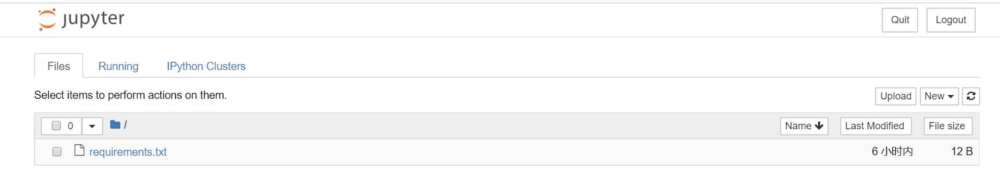

## 如何开发一个基于 Docker 的 Python 应用
>目标：用 Docker 的方式搭建一个 IPython Notebook 应用  

#### 前言
Python 家族成员繁多，能够解决五花八门的业务需求。这里将通过 Python 明星项目 IPython Notebook，使其容器化，让大家掌握基础的 Docker 使用方法。  
> IPython Notebook 目前已经成为用 Python 做教学、计算、科研的一个重要工具。  
  
#### Docker 化应用的关键元素  

* 镜像是 Docker 应用的静态表示，是应用的交付件，镜像中包含了应用运行所需的所有依赖，包括应用代码、应用依赖库、应用运行时和操作系统。  
* Dockerfile 是一个描述文件，描述了产生 Docker 镜像的过程，详细文档可以参见官方文档 [Dockerfile reference](https://docs.docker.com/engine/reference/builder/)。  	
* 容器是镜像运行时的动态表示，如果把镜像想象为一个 Class 那么容器就是这个 Class 的一个实例。  

#### 编写 Dockerfile  
一个应用 Docker 化的第一步就是通过 Dockerfile 产生应用镜像。   
构建本例中的 Dockerfile 完整代码如下
```
FROM python:3.6
	
RUN mkdir -p /app
WORKDIR /app
	
ADD requirements.txt requirements.txt
RUN pip install -r requirements.txt -i https://pypi.douban.com/simple --trusted-host=pypi.douban.com
	
	
EXPOSE 8888
CMD ["jupyter","notebook","--no-browser","--allow-root"]
```

#### Dockerfile文件说明  
```
FROM python:3.6
```
选择 Python 3.6 版本为我们依赖的系统镜像。  
 
```
RUN mkdir -p /app
WORKDIR /app
	
ADD requirements.txt requirements.txt
RUN pip install -r requirements.txt -i https://pypi.douban.com/simple --trusted-host=pypi.douban.com
```	
向镜像中添加文件并安装依赖。  	

**ADD 与 COPY 的区别**     
总体来说 ADD 和 COPY 都是添加文件的操作，其中 ADD 比 COPY 功能更多，ADD 允许后面的参数为 URL，还有 ADD 添加的文件为压缩包的话，它将自动解压。     

**注意**：在编写 Dockerfile 时尽量将安装依赖的过程提前以提高镜像层的复用率。  


```
EXPOSE 8888
CMD ["jupyter","notebook","--no-browser","--allow-root"]
```
启动应用进程。      
通过 EXPOSE 指定该镜像需要公开的端口。  
通过 ENTRYPOINT 制定镜像启动时的入口。    
> CMD 指定了容器启动时的命令
> 在 CMD 上仅需要指定参数；另外在我们需要自定义 CMD 时不容易出错。  
 
#### 添加依赖文件（requirements.txt）  
安装 IPython 以及所需的依赖  
```
# pip requirements  
ipython[all]  
```
我们将 IPython 所需的依赖写成一个文件，并通过 Dockerfile 中的 ADD requirements.txt，将 requirements.txt 放入镜像 ，之后在通过 Dockerfile 中的 RUN pip install -r requirements.txt 进行依赖的安装。  


#### 启动容器  
有了 Dockerfile 以后，我们可以借助 PaaS 平台构建 Python 应用镜像，具体过程请看教程 [PaaS 平台应用镜像构建](../PaaS平台使用指南/PaaS平台应用镜像构建.md)   

或者可以在Docker环境中运行下面的命令构建 Python 应用镜像： 

通过指令建立镜像，命名为 ipython-notebook:1.0.0
```
docker build -t registry.cosmoplat.com/test/ipython-notebook:1.0.0
```  

通过以下指令启动容器
```
docker run -d -p 8888:8888  registry.cosmoplat.com/test/ipython-notebook:1.0.0  
```   

**注意**：我们将初始登录密码以环境变量的形式传入容器并告知应用。     

打开浏览器，访问 http://127.0.0.1:8888 端口，就可以看到 IPython Notebook 了。
  
