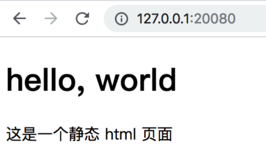

## HTML 语言 demo docker 镜像构建
> 目标：基于 nginx 的 Docker 基础镜像，开发一个静态的 HTML 示例应用 (hello world) 


#### 新建 html-demo 目录

```
mkdir html-demo
cd html-demo
```


#### 编写 HTML 示例

将如下内容保存为 **index.html**

```
<!DOCTYPE html>
<html>
	<head>
		<meta charset="utf-8">
		<title>hello,world</title>
	</head>
	<body>
		<h1>hello, world</h1>
		<p>这是一个静态 html 页面</p>
	</body>
</html>
```


#### 编写 Dockerfile

将如下内容保存为 **Dockerfile**
```
FROM nginx:1.15-alpine
COPY . /usr/share/nginx/html
EXPOSE 80
CMD nginx -g "daemon off;"
```


#### 构建镜像编译

整个 html-demo 材料包括如下 Dockerfile, index.html 两个文件
```
[root@localhost html-demo]# tree .
.
├── dockerfile
└── index.html
    
```
在 html-demo 项目目录执行如下构建命令
```
docker build -t registry.cosmoplat.com/test/helloworld_html:v0.0.1 .
```
执行成功的完整过程如下
```
Sending build context to Docker daemon 3.072 kB
Step 1/4 : FROM nginx:1.15-alpine
1.15-alpine: Pulling from library/nginx
4fe2ade4980c: Already exists
c3f09dfaf47d: Pull complete
83283d0e9bb9: Pull complete
e2e530da9538: Pull complete
Digest: sha256:ae5da813f8ad7fa785d7668f0b018ecc8c3a87331527a61d83b3b5e816a0f03c
Status: Downloaded newer image for nginx:1.15-alpine
 ---> aae476eee77d
Step 2/4 : COPY . /usr/share/nginx/html
 ---> 4a11db469b56
Removing intermediate container b8439b6e8ba8
Step 3/4 : EXPOSE 80
 ---> Running in 36c545231de4
 ---> c907e43bcef3
Removing intermediate container 36c545231de4
Step 4/4 : CMD nginx -g "daemon off;"
 ---> Running in 8a66aa27fad1
 ---> b3e06bb4381c
Removing intermediate container 8a66aa27fad1
Successfully built b3e06bb4381c
```


#### 测试镜像

上传镜像前先在本地做下测试，运行如下命令
```
docker run -d --name test_html -p 20080:80 registry.cosmoplat.com/test/helloworld_html:v0.0.1
curl localhost:20080
```
容器运行正常会看到 Hello world 字样

