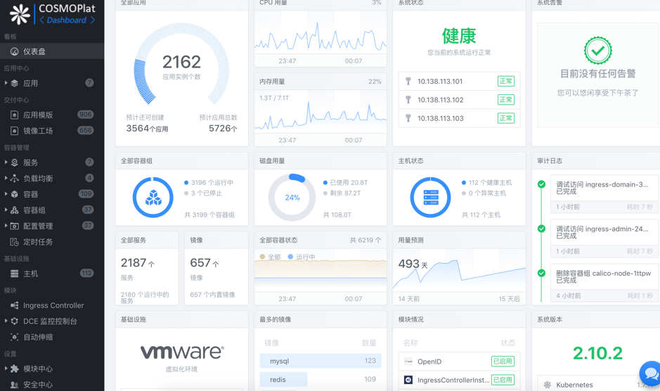
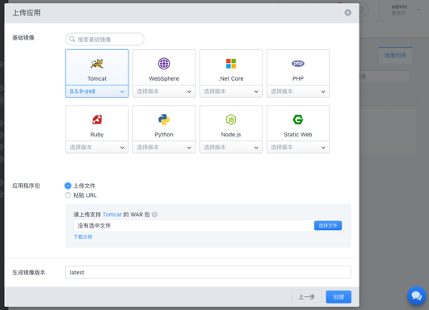
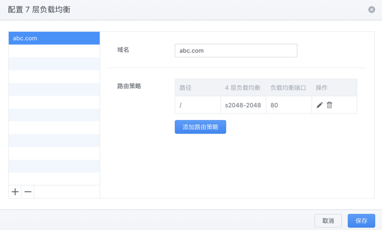
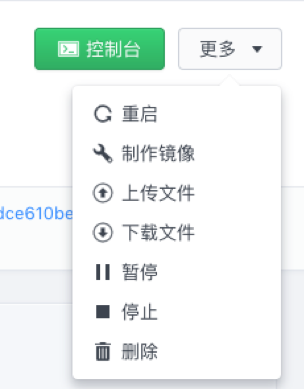
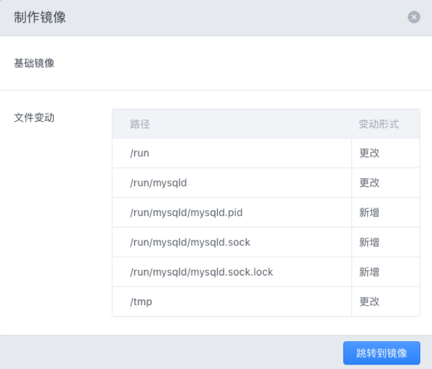
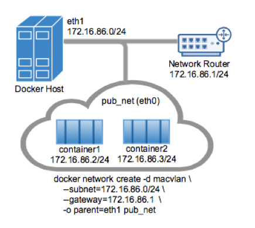
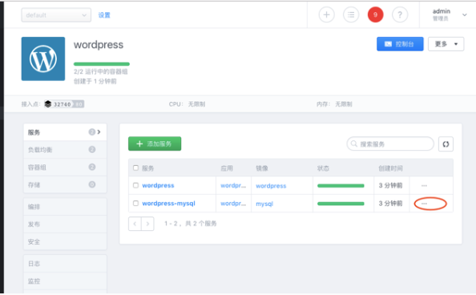
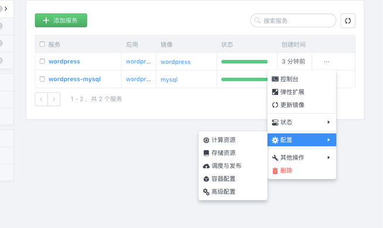

# 开发者平台

## 平台特性

### COSMOPlat平台是什么？

**COSMOPlat**平台是领先的云原生应用云平台，旨在助力企业完成新一代互联网技术驱动下的数字化转型，实现全面软件定义的数据中心，加速业务的迭代交付，满足企业快速变化的业务需求。通过COSMOPlat平台，企业可在已有 IT 基础架构之上实现 100% Docker 原生标准的「容器」集群，「DevOps」开发运维模式，标准化应用交付与流程化运维管控，安全可靠的自动化运维能力。以面向互联网「敏态 IT」的速度、规模和可靠性，管理日新月异的现代化企业应用和软件定义的数据中心

### COSMOPlat的能力和优势

功能|优势
---|---
持续交付|可通过自动触发的策略，完成业务的自动化打包封装和交付过程。
应用商店|平台内置多租户的应用商店，可实现应用上架，安全扫描，和跨数据中心的应用分发能力
持续部署|可通过全自动化的策略驱动，配合可定制的部署模板及调度策略，实现应用的一键部署及自动运维。
应用编排|支持标准的应用编排规范，将复杂的业务系统，用标准化和可视化的方式描述呈现。
弹性扩容|以应用为颗粒度进行动态的负载管理，配合持续部署规则，可实现复杂场景下的弹性调度。
双引擎模式|可统一管理物理机，虚拟机和容器的资源池，无需额外的云管平台，即可实现对资源层的统一管理。
多租户权限|内置多级权限支持，可对应现有数据中心的管控要求，并额外提供虚拟团队和空间的管理。
分布式存储|内置的分布式软件定义存储，通过编排自动创建和分配存储卷，并提供企业级存储管理能力。
软件定义网络|多种网络模式支持，应对不同情况下的网络配置，可平滑对接物理网络，虚拟机网络及容器网络。
集群高可用|按照纯分布式理论设计，去中心化的管理能力，支持在超大规模数据中心中的高可用表现
顶级开源支持|容器核心项目的维护者团队，可保证即时的技术响应支持，并汲取全球研发社区的支持。

## 系统管理

本章介绍了与平台相关的 Docker 技术以及平台的相关知识，包括平台数据中心的物理拓扑，软件组件，客户端界面等。除此之外还介绍了使用 Web 端登录或注销平台的流程，以及平台控制器的高可用以及许可证的管理和报告

### 概念与功能

* 平台管理的对象
    在平台中，清单是可对其设置权限、监控任务与事件的虚拟和物理对象的集合。平台监控和管理以下组件：镜像，服务，容器，容器组，网络，存储，配置，主机
* 平台的客户端界面
    平台提供一个功能全面的 Web UI 可视化管理界面，通过界面，用户可以浏览和管理整个平台所涵盖的各个方面
    
* 平台的物理拓扑
   平台数据中心是由 Docker Engine 组成，主要包括控制节点和容器节点。同时提供了包括应用、镜像、服务、容器、容器组、网络、存储、配置和主机管理等多个方面的服务。

   主要包括如下组件：
   
   组件名称|组件职责
   ---|---
   控制节点|该节点处理所有的用户请求，并管理集群中的所有容器节点。同一时刻，一个容器集群只有一个平台主控节点
   容器节点|该节点运行用户的容器和应用。同一时刻，一个容器集群可以有多个平台容器节点

* 平台软件组织
    平台软件组件主要分为以下两个部分基础服务和节点容器：

    服务名称|服务职责
    ---|---
    dce_base|每个 k8s 节点上安装平台控制节点或者容器节点并监控其状态，以及同步升级和更新

    控制节点和容器节点的容器
    
    容器名称|容器职责
    ---|---
    dce_agent|运行用户所有的容器和应用
    dce_controller|调用dce_kube_controller服务，向用户提供WEB控制台UI，集群管理APIheCLI运维套件服务
    dce_kube_controller|安装k8s服务的容器，负责容器节点的管理
    dce_etcd|key-value键值库，负责存储集群中的各种信息，如虚拟网络，用户信息等

* Docker基础知识
    - Docker 是一种容器技术，它将应用和其开发或部署的环境打包在一起，形成一个应用。用户可以在任意一个支持  的环境中，通过简单的命令运行该应用。和传统的虚拟化技术不同，它以更加轻量的方式实现应用服务的打包。Docker 技术让每个应用彼此隔离，同一台机器可以同时运行多个应用。Docker 技术大大加快了软件交付的速度，可以一次部署，多处运行，实现了基础设施标准化，应用交付标准化，运维管理标准化，分发部署标准化。
    - Docker技术包含两个重要部分
    镜像:镜像是一种可读模板，它可以用来创建，用户可以创建或者更新镜像。 
    容器:容器包含了应用所需的所有配置，由镜像运行而来，每一个容器都是独立运行，用户可以运行，启动，移动或删除容器。

### 使用平台Web UI
平台提供了一套完整的 Web UI 管理界面，您可以登录平台Web UI 来管理平台系统。使用平台Web UI 需要使用以下受支持的浏览器：*IE 11+、Chrome、FireFox、Safari、Windows Edge*。
`在Chrome下使用最佳。最佳分辨率为1440*900和1280*800`

#### 平台Web UI登录平台
* 通过使用平台Web UI登录到平台可管理平台清单。
    - 步骤：
        1. 打开 Web浏览器，输入平台的 URL: https:// server_ip_address。
        2. 输入具有平台权限的用户凭证，然后点击登录。
        3. 如果显示有关不可信的 SSL 证书的警告消息，请根据安全策略选择相应的操作。

    选项|操作
    ---|---
    仅忽略此登录会话的安全警告|单击*忽略*
    忽略此登录会话的安全警告，然后安装默认的证书，以使该警告不再提示|选择*安装此证书并且不显示此服务器的任何安全警告*,然后单击*忽略*。仅在使用默认证书不会给您的环境带来安全问题时，才选择此项
    继续之前请先取消并安装已签名证书|再次尝试连接之前，请先单击*取消*，并确保平台系统上安装了已签名证书

#### 平台Web UI登出平台
* 用户可以登出平台Web UI 管理界面，意味着该用户从平台系统断开连接。
    - 步骤
        1. 单击平台界面右上角的用户名称；
        2. 在下拉菜单中选择*登出*。

### 平台控制器高可用
平台目前已经支持高可用性方案。如果需要一个高可用容器集群，可以部署多个*控制节点*（推荐控制节点数量为3和5）来保证高可用性。
对于需要持续连接到平台的解决方案，可用性至关重要。为避免停机时间过长，用户可考虑在高可用性配置下运行平台。

## 应用管理
本章节介绍了如何在平台中部署、操作和查看应用。
### 应用简介
平台是以容器为交付标准件的企业级应用云平台。平台中的应用都是容器化的应用。
容器化应用运行在一个轻量的、安全的、可移植的隔离环境中，因此可以与其它有不同依赖和环境需求应用共同运行在同一个主机环境中，而无需担心互相冲突。
在开始部署和管理应用之前，您可以了解以下相关主题，以帮助您理解容器化应用。
#### Kubernetes 基础知识

Kubernetes 是一套用来自动化部署并运维容器化应用的工具。它旨在维护一套工具生态系统以应对各种不同的应用环境，因此 Kubernetes 本身只提供了非常精简但稳定高效的基础功能。

* 安装:Kubernetes 可以运行在多种平台，安装的难易程度取决于平台规模。更多细节请参考官方指南 [Setup: Picking the Right Solution](https://kubernetes.io/docs/setup/pick-right-solution/)
* 基础概念
    * Kubernetes Objects：Kubernetes Objects 是指 Kubernetes 创造的一组用来描述集群中的容器化应用、系统资源以及控制策略的概念。可以使用 Kubernetes API 操纵这些对象。关于 API 参数的 YAML 格式，可以简单参考 Kubernetes YML 语法参考, 或 官方文档。
简而言之，常见的有负责管理和运行容器的 Pod、Deployment，负责服务发现和负载均衡的 Service，负责配置管理和存储管理的 ConfigMap、Secret、PersistentVolumeClaim (PVC) 、Volume，负责集群管理的 Node 等。
    * Pod:Pod 是 Kubernetes 操纵的最小单元。它形象化表示一个或一组密切关联的容器以及共享的存储、网络等资源。
    * Deployment:可以将 Deployment 视为 Pod 的控制器，即它将根据参数的描述，按照要求的频率将 Pod 的当前状态改为描述中的状态。
    * Service:Service 在 Kubernetes 中表示对 Pod 控制策略的抽象。
    * configMap, Secret, PVC, Volume:分别负责保存和管理容器外部的环境变量、文件、存储卷，供运行中的容器使用。
    * Node:表示集群中的一个节点。
* 参考文献：[https://kubernetes.io/docs/home/](https://kubernetes.io/docs/home/)

### 应用信息
平台的应用管理系统分为"应用列表"和"应用详情"两个部分。"应用列表"简单呈现了每个应用的基本信息。点击应用的名字可以进入"应用详情"页面，其中呈现了更丰富的应用信息。
#### 应用基本信息
* 应用服务:	在应用详情中，点击服务面板可以查看应用中所有的服务
* 应用负载均衡:	在应用详情中，点击负载均衡面板可以查看应用中所有的负载均衡
* 应用容器组:在 应用详情中，点击容器组面板可以查看应用中所有的容器组
* 应用存储":在应用详情中，点击容器组面板可以查看应用中所有的容器组
#### 应用接入点

应用接入点是指应用可以被访问的地址。目前平台提供两种接入点暴露方式：

* 服务端口:
    1. 打开 应用详情
    2. 进入 负载均衡 面板，找到需要修改端口的服务，点击右侧的 ... 展开菜单，打开 配置 > 配置端口
    3. 点击配置端口下面的 添加 按钮新增一条配置，或直接修改已有的配置
    4. 修改完毕后，点击右下方 确定 保存。
* 通过给主机添加特定的标签，可以指定主机对外的IP，以此来实现浮动IP等功能。
    1. 打开 主机列表
    2. 选择主机，点击 更多 中的 修改标签 ，
    3. 添加以"-ip"结尾的标签
    4. 点击应用列表或详情的 接入点
* URL:通过为应用的负载均衡添加特定的标签，可以为该应用指定访问的URL
    1. 打开 应用详情
    2. 进入 负载均衡 面板，找到要修改的负载均衡，点击右侧的 ... 展开菜单，打开 配置 > 编辑标签
    3. 添加以"io.daocloud.dce.url."开头的标签，可以添加一个或多个。
    4. 点击应用列表或详情的 接入点 ，然后点击标签 URL ， 从默认的端口映射显示切换到 URL 显示可以查看配置的网址。
#### 应用监控
* 应用日志：应用日志记录了应用运行时的日志，包含与应用相关的每个容器的日志、以及拉取镜像等事件的日志。查看方法：
    1. 打开 应用详情
    2. 点击 日志 面板
* 应用资源监控:平台提供了监控应用资源占用情况的功能，可以监控应用的 CPU、内存的占用情况。查看方法：
    1. 打开 应用详情 页面
    2. 点击 监控 面板
* 应用审计日志审计日志记录了应用的每一次操作，包括创建应用、更新应用、启动应用等。查看方法：
    1. 打开 应用详情
    2. 点击 审计日志 面板
### 应用部署
在平台中部署新应"用目前有四种途径，分别为：一键部署、通过镜像部署、通过编排应用、选择基础镜像，部署程序包。
#### 一键部署

平台默认提供了多种常见应用的应用模版，您可直接从列表中选择并部署应用。
当平台应用模版未包含您所需应用时，您也可以通过 应用模板 页面中的 创建 或 批量导入 功能自定义应用模版。
若应用模版中已有您需要部署的应用，您可以直接选择、配置和部署应用。

* 创建步骤：
    1. 打开 应用 页面并点击 +部署应用，或者点击右上角状态栏中的 + 按钮并在展开的菜单中点击 部署应用；
    2. 选择 一键部署，点击 继续；
    3. 选择您要部署的应用模板，点击 继续；
    4. 完善应用信息（填写应用名称、可修改 Kubernetes YML）；
    5. 点击 检查镜像并部署；
    6. 完成部署。
#### 通过镜像部署

您可以从已有镜像仓库中选择镜像或手动指定镜像地址部署应用

* 创建步骤：
    1. 打开 应用 页面并点击 +部署应用，或者点击右上角状态栏中的 + 按钮并在展开的菜单中点击 部署应用；
    2. 在打开的弹窗中点击 通过镜像部署；
    3. 选择 镜像工场 然后单击选中要部署的镜像，或者选择 自定义镜像 然后手动输入镜像地址并选择合适的版本，必要时需要输入认证信息，然后点击 继续；
    4. 完善应用配置信息，这个过程中可以通过点击 返回 和 继续 按钮反复修改配置；
    5. 在完成部署前，通过审计表格确认修改无误，然后点击 部署应用 完成从镜像部署应用的操作；
#### 通过编排应用

如果熟悉 Kubernetes YML，可直接从 Kubernetes YML 部署应用。

* 创建步骤：
    1. 打开 应用 页面并点击 +部署应用，或者点击右上角状态栏中的 + 按钮并在展开的菜单中点击 部署应用；
    2. 在打开的弹窗中点击 高级 展开全部选项，然后点击 通过编排应用，然后点击 继续；
    3. 填写应用名称，和编辑 Kubernetes YML
    4. 点击 检查应用并部署
#### 选择基础镜像，部署程序包

平台支持通过选择一个基础镜像并上传程序包创建镜像然后部署应用。同时平台也提供了修改基础镜像模板的功能。
上传程序包部署应用步骤：

* 上传程序包部署应用步骤:
    j. 打开 应用 页面并点击 +部署应用，或者点击右上角状态栏中的 + 按钮并在展开的菜单中点击 部署应用；
    2. 在打开的弹窗中选择 选择基础镜像，部署程序包，点击下方的 继续 进入下一步；
    3. 选择需要的基础镜像以及版本，点击 继续；
    4. 上传程序包或者填写程序包的 URL，然后点击 继续；
    5. 完善其他的应用配置，依次点击 继续 按钮或 返回 按钮修改上一步配置，直到配置完成；
    6. 在完成部署前通过审计表格中的信息确认配置无误，最后点击 部署应用 完成整个应用部署操作；
### 应用操作

您可以在应用列表或单个应用详情页进行应用的相关操作

* 修改应用名称:	在 应用详情 中，点击 更多 下拉菜单中的 其他操作 的 重命名 按钮来修改应用名称。
* 启动应用:
    * 在 应用列表 中，单击最右侧的倒三角，在展开下拉菜单中依次点击 状态 、 启动 按钮来启动应用。
    * 在 应用详情 中，点击 更多 下拉菜单中的 状态 的 启动 按钮来启动应用。
* 重启应用:
    * 在 应用列表 中，单击最右侧的倒三角，在展开下拉菜单中依次点击 状态 、 重启 按钮来重启应用。
    * 在 应用详情 中，点击 更多 下拉菜单中的 状态 的 重启 按钮来重启应用。
* 停止应用:
    * 在 应用列表 中，单击最右侧的倒三角，在展开下拉菜单中依次点击 状态 、 停止 按钮来停止应用。
    * 在 应用详情 中，点击 更多 下拉菜单中的 状态 的 停止 按钮来停止应用。
* 删除应用: 
    * 在 应用列表 中，单击最右侧的倒三角，在展开下拉菜单中点击 删除 按钮来删除应用。
    * 在 应用详情 中，点击 更多 下拉菜单中的 删除 按钮来删除应用。
* 控制台
    * 在应用列表中，单击 控制台 按钮来打开应用的控制台。
    * 在应用详情中，点击 控制台 按钮来打开应用的控制台。
* 搜索应用:在应用列表 右上方的搜索框中，输入关键词即可筛选出包含关键词的应用。目前的关键词搜索范围仅限于"应用名"属性。
* 批量操作应用:
    * 在应用列表中，单击每一行的空白处，就可以选这一行的应用。或者单击表格左上方的多选框来全选所有应用。
    * 然后单击列表上方的 更多 下拉菜单中的按钮，就可以将所选操作应用到所有选中应用。
* 应用服务操作:应用服务的操作和服务管理一致，可以通过服务详情的侧滑栏对应用服务进行扩展、修改配置等相关操作。平台服务管理
* 应用容器操作:应用容器的操作和容器管理一致，可以通过容器详情的侧滑栏对应用容器进行扩展、修改配置等相关操作。平台容器管理
* 从应用面板上传和下载文件:平台支持上传文件到指定容器和从指定容器下载文件，您可以在应用面板便捷得指定需要上传或下载文件的容器。
* 上传文件:
    1. 在 应用列表 页面点击 控制台 旁的下拉菜单中的 其他操作 的 上传文件 按钮或 应用详情 页面点击 更多 下拉菜单中的 其他操作 的 上传文件 按钮
    2. 选择服务和容器
    3. 选择需上传的文件
    4. 指定容器路径
    5. 点击 确认上传
* 下载文件:
    1. 在 应用列表 页面点击 控制台 旁的下拉菜单中的 其他操作 的 下载文件 按钮或 应用详情 页面点击 更多 下拉菜单中的 其他操作 的 下载文件 按钮
    2. 选择服务和容器
    3. 指定容器路径
    4. 点击 确认下载
* 应用拓扑展示与修改:平台根据应用的Kubernetes信息生成拓扑结构，修改应用的Kubernetes YML可以修改应用的拓扑结构。修改方法：
    1. 打开 应用详情
    2. 进入 编排 面板
    3. 打开编辑 YML 面板，修改Kubernetes YML
    4. 点击 保存
* 持续发布：
    1. 打开 应用详情
    2. 进入 发布 面板，查看持续发布
    3. 选择持续发布中的条目，点击 启用
    4. 完善发布规则，点击 确定
    5. 当有镜像 Push 或者构建成功的时候，应用可以自动发布
* 远程发布：平台也提供了远程发布的功能，您可以使用第三方 CI/CD 工具实现持续发布，操作方法如下：
    1. 打开 应用详情
    2. 进入 发布 面板，配置远程发布命令
    3. 复制远程发布命令
    4. 在第三方 CI／CD 工具中，粘贴远程发布命令
    5. 当远程发布命令被触发后，应用可以自动发布
* 镜像认证：平台支持配置应用镜像的认证信息，当 私有镜像 的验证信息发生改变后，可以在应用的安全面板中更新。
    1. 打开 应用详情
    2. 进入 安全 面板
    3. 查看某一私有镜像仓库
    4. 完善认证信息，点击 确定
### 应用模板
应用模版是系统提供的快速部署服务的应用编排，系统可以从互联网获取丰富的应用模版，同时用户可以创建自定义的应用模版，并配置应用模版的访问权限。对离线用户来说，导入应用模版的功能可以将互联网模版快速的导入到系统中。
#### 应用模版的属性

应用模版主要包括两个部分，Kubernetes YML 和模版变量，同时可以为应用模版定义详细描述等。

* Kubernetes YML 中可以通过双大括号的方式定义模版变量，例如 {{parameter_1}}。
* 模版变量可以定义变量名、变量类型以及变量的默认值等。
#### 应用模版操作
* 部署应用:	在 应用模板详情 中，点击 部署 按钮来部署应用。
* 创建应用模板:	在 应用模板列表 中，点击 ＋创建应用模板 按钮来创建自定义应用模板。
* 创建应用模板类型:	在 应用模板列表 中，点击 ＋创建应用模板 按钮，在 概述 栏目中，输入不存在于类型列表的类型名称，点击 保存 按钮保存自定义应用模板的同时可创建应用模板类型。
* 删除应用模板:自定义应用模板中，在 应用模板详情 中，点击 删除 按钮来删除应用模板。
* 修改模版概述:自定义应用模板中，在 应用模板详情 中，点击侧边栏中的 概述 侧边栏中的 编辑 按钮来编辑概述。
* 查看模版相关应用:	在 应用模板详情 中，点击侧边栏中的 相关应用，可以在右侧查看到当前与该模版相关的所有应用。
* 修改模板:
    * 自定义应用模板中，在 应用模板详情 中，点击侧边栏中的 模板，可以在 Kubernetes 模版 栏目中修改 Kubernetes 模版。
    * 自定义应用模板中，在 应用模板详情 中，点击侧边栏中的 模板，可以在 模版变量 栏目中添加、删除、修改模版变量。
    * 自定义应用模板中，在 应用模板详情 中，点击侧边栏中的 设置，可以在 设置 栏目中配置该模版的基本信息。
    * 自定义应用模板中，在 应用模板详情 中，点击侧边栏中的 设置，可以在 安全 栏目中配置该模版的授权团队及其权限。
* 搜索应用模板:在 应用模板列表 右上方的搜索框中，输入关键词即可筛选出包含关键词的应用。目前的关键词搜索范围仅限于"应用模板名"属性。
* 导入应用模板:用户可以上传一个 Zip 包，来批量导入应用模板。
#### 应用模版自定义图标

应用模版可以自定义图标，操作方法如下：

1. 进入 应用模板 页面
2. 选择一个自定义模板，进入应用模板详情页面
3. 打开 设置 面板
4. 点击 定制图标 按钮进行文字图标的定制
用户在定制完成图标，使用自定义应用模板部署应用后，应用的图标将优先使用应用模板已设置的图标。
#### 应用模版团队授权设置

应用模版授权给不同的团队，操作方法如下：

1. 打开一个自定义应用模版
2. 通过左侧侧边栏点击进入 设置 页面
3. 在 安全 栏目中可以配置该模版的授权团队和公开与否
4. 当该模版公开时，所有平台用户均可见该模版（无法修改）
5. 当一个团队被授予 管理 权限时，该团队下所有用户可以修改该模版
6. 当一个团队被授予 只读 权限时，该团队下所有用户对该模版仅可读
#### 应用模版默认行为设置

应用模版可以配置许多默认行为，操作方法如下：

1. 进入 设置 页面
2. 打开 高级设置 面板
3. 配置 从互联网获取应用模版，不从互联网获取应用模版通常用于离线环境
4. 配置 用户可公开应用模版，用户是否能够将一个应用模版公开给所有用户
5. 配置 新建应用模版默认公开，用户新建对应用模版是否默认公开给所有用户
## 镜像管理

平台镜像管理包含管理平台镜像仓库以及管理集成的镜像仓库。
用户可以选择镜像仓库，通过镜像空间的分类快速找到镜像。
本章节介绍了平台镜像的相关知识，并且包括了镜像在平台系统的信息和操作。
包含以下内容

* Docker 镜像简介
* 平台镜像工厂设置
* 管理镜像空间
* 构建镜像
* 管理镜像
### Docker 镜像简介
Docker 镜像是一个只读的模板。例如：一个镜像可以包含一个完整的 Ubuntu，里面仅安装了 操作系统环境Apache 或用户需要的其它应用程序。
镜像可以用来创建 Docker 容器。Docker 提供了一个很简单的机制来创建镜像或者更新现有的镜像，用户甚至可以直接从其他用户那里下载一个已经做好的镜像来使用。
### 平台镜像工厂设置

本章节介绍了镜像工场的配置，只有平台镜像工场支持配置，其余集成的镜像工场无法配置。

* 存储配置:平台镜像工场目前支持文件存储与 S3 存储两种方式。
    * Amzaon S3 配置:平台镜像工场支持 Amazon S3 存储（或支持 Amazon S3 API 的存储，如 Minio），您可以在镜像工场设置页面中进行配置。步骤如下
        * 进入 设置 界面
        * 点击 镜像工场设置
        * 在选择存储类型为 S3
        * 填写相关配置
        * 点击 保存，完成配置
    * 文件系统配置：平台镜像工场支持文件系统存储，您可以将存储配置到任一一台控制节点上。存储路径固定为：/var/local/dce/registry
        * 进入 设置 界面
        * 点击 镜像工场设置
        * 选择存储类型为 文件系统
        * 填写相关配置
        * 点击 保存，完成配置
* 访问配置:平台镜像工场支持配置访问路径，您可以在"镜像工场设置"里进行设置
### 管理镜像空间

镜像可以通过镜像空间来分组显示。对于平台镜像工场，管理员可以通过镜像空间来管理镜像的访问权限。其他镜像工场只能查看镜像空间列表

* 创建镜像空间：对于平台镜像工场，管理员可以创建镜像空间。创建方法：1.打开镜像工场，2.点击创建镜像空间。
* 删除镜像空间：对于平台镜像工场，管理员可以删除镜像空间。创建方法：1.打开镜像工场，2.选择某一镜像空间，3.在镜像空间设置中，点击删除。
* 设置镜像空间：对于平台镜像工场，管理员可以通过修改镜像空间配置来管理镜像工场的权限。
* 团队权限:镜像空间的权限分为只读(只能查看和拉取镜像)和全部(能对镜像空间下的镜像做任何操作)。
* 私有镜像空间：只有拥有权限的团队才能访问该空间下的镜像，其余人无法对该镜像空间的镜像做任何操作。反之，任何人都可以访问非私有镜像空间下的镜像，但只有拥有全部权限的团队才能修改（推送、删除等）该空间下的镜像。设置方法:1.	打开镜像工场,2.	选择某一镜像空间，进入镜像空间设置面板,3.	修改镜像空间设置。
### 构建镜像

在平台中构建镜像目前有五种方式，分别为：从代码源构建、远程构建、触发构建、上传代码构建、上传应用构建。平台支持对每次构建任务做内存和 CPU 的限制，以及并发构建任务数、构建超时等设置，设置方法如下：

* 从导航点击 设置，并进入 镜像构建设置；
* 修改后点击 保存；
* 完成修改。
#### 从代码源构建:平台支持 Git、SVN、GitLab 和 GitHub 四种代码源。
* 配置代码源
    1. 打开镜像工场
    2. 查看镜像详情
    3. 进入构建规则面板
    4. 在代码源设置中，配置代码源
* 构建方法
    1. 打开镜像工场
    2. 选择配置有代码源的镜像
    3. 点击构建
    4. 完善构建信息后，点击构建
    5. 在镜像的构建记录中，查看构建进程
#### 远程构建

平台支持使用远程构建命令来触发镜像构建，可以与第三方 CI/CD 工具配合使用。
使用远程构建命令，需要与平台密钥配合使用。管理员可以在 安全中心 > 密钥管理 中管理密钥。

* 构建方法
    1. 打开镜像工厂
    2. 选择配置有代码源的镜像
    3. 进入构建规则面板，配置远程构建命令
    4. 复制远程构建命令
    5. 在第三方 CI/CD 工具中，粘贴远程构建命令并使用
    6. 在镜像的构建记录中，查看构建进
#### 触发构建

通过配置镜像的触发规则，实现持续构建的能力，目前平台的持续构建功能仅可用于以 GitLab 和 GitHub 作为代码源的项目。

* 配置触发构建规则
    1. 打开镜像工场
    2. 选择配置有 GitLab 或 GitHub 代码源的镜像
    3. 进入构建规则面板，查看触发构建面板
    4. 点击添加触发规则
    5. 完善触发规则信息后，点击保存
* 构建方法：
    1. 根据配置的触发条件，提交代码到对应的代码仓库
    2. 在镜像的构建记录中，查看构建进程
#### 上传代码构建

上传代码构建是指：直接将含有 Dockerfile 的代码包上传到 平台，平台会自动完成镜像构建并推送到平台镜像工场中

* 构建方法
    1. 打开镜像工场
    2. 选择任一镜像
    3. 在更多按钮中，点击上传代码构建
    4. 选择包含 Dockerfile 文件的 zip 包
    5. 完善构建信息后，点击上传构建
    6. 在镜像的构建记录中，查看构建进程
#### 上传应用构建

上传应用构建是指：直接将应用程序包上传到平台或者 CI/CD 工具可以使用构建命令来触发上传应用程序构建，平台会自动完成镜像构建并推送到平台镜像工场中。
使用远程构建命令，需要与平台密钥配合使用。管理员可以在 安全中心 > 密钥管理 中管理密钥。

* 构建命令构建方法：
    1. 打开镜像工场
    2. 查看镜像详情
    3. 点击侧边栏中的 构建规则
    4. 在 应用程序构建 配置构建命令的参数
    5. 复制远程构建命令
    6. 在第三方 CI/CD 工具中，粘贴远程构建命令并使用
    7. 在镜像的构建记录中，查看构建进程
* 镜像创建构建方法
    1. 打开镜像工场
    2. 点击 ＋创建镜像，弹出创建镜像弹出
    3. 完善镜像基本信息，初始化选择  上传程序包，点击 下一步
    4. 完善上传应用配置选项，其中可选择上传应用包或者使用应用程序包 URL
    5. 点击 创建
    6. 在镜像的构建记录中，查看构建进程
    
### 管理镜像
平台提供了完善的镜像管理界面。
在 镜像列表页 能罗列出当前帐号下可见的所有镜像及其版本信息，您可在列表中进行一些基本操作。
要查看更详细的信息，请点击列表中的应用名进入 镜像详情 页面。
平台镜像工场支持以下全部功能，其余镜像工场仅支持查看镜像概览和详情。
#### 创建镜像
* 创建镜像步骤
    1. 通过 交付中心 可以进入 镜像工场。默认展示的是平台镜像工场
    2. 点击创建镜像
    3. 配置镜像的全称、描述，并初始化镜像构建设置
    4. 可以直接创建空镜像，也可以上传程序包或者从代码源构建镜像
    5. 点击 创建 按钮
    
#### 推送版本

平台提供在平台镜像工场中推送本地 Docker 镜像。首先需要创建镜像，目前平台只支持在平台镜像工场中创建镜像。

* 通过创建新镜像推送本地 Docker 镜像步骤：
    1. 通过导航 交付中心 可以进入 镜像工场，默认展示的是平台镜像工场
    2. 选择一个镜像空间
    3. 点击 创建镜像 按钮
    4. 填写镜像名称，完成镜像
    5. 在镜像列表中找到新建的镜像
    6. 点击 推送版本 按钮
    7. 弹出提示框，根据提示将提示中的命令复制到终端中运行，就能够推送镜像
* 通过已有镜像推动本地Docker镜像步骤
    1. 在镜像列表中找到需要推送的镜像
    2. 点击 推送版本 按钮
    3. 弹出提示框，根据提示将提示中的命令复制到终端中运行，就能够推送镜像
#### 查看构建记录

镜像所有的构建历史都会被记录在构建记录中，包括从代码源构建、远程构建、触发构建和上传代码构建。您可以从构建记录的日志中了解到完整的构建过程

* 查看方法：
    1. 打开镜像工场
    2. 查看任一镜像详情
    3. 点击构建记录面板
#### 制作镜像

平台支持从应用、服务、容器来制作镜像。用户可以将一个运行中的应用、服务、容器制作成镜像。

* 从应用制作镜像：
    1. 通过导航 应用 点击一个运行中的应用进入应用详情页面
    2. 点击更多，选择 制作镜像
    3. 选择服务、容器、制作镜像的空间和镜像名称，并填写镜像的版本
    4. 点击 开始制作
    5. 制作完成后，可以点击跳转到镜像详情页面
* 从容器制作镜像
    1. 通过导航 容器 点击一个运行中的容器进入容器详情页面
    2. 点击更多，选择 制作镜像
    3. 选择制作镜像的空间和镜像名称，并填写镜像的版本
    4. 点击 开始制作
    5. 制作完成后，可以点击跳转到镜像详情页面
#### 部署镜像

用户找到需要部署的镜像后点击部署按钮可新建应用进行镜像的部署。
如果是平台镜像工场中新建的镜像，需要先推送镜像，之后才能进行部署操作。
平台还提供针对不同版本的镜像进行发布。

* 部署最新镜像版本步骤
    1. 通过导航可以进入 镜像工场，默认展示的是平台镜像工场
    2. 选择一个镜像空间
    3. 在镜像列表中找到需要部署的镜像
    4. 点击 部署 按钮
    5. 跳转至创建新应用页面完成镜像部署
* 部署不同版本的镜像步骤
    1. 通过导航可以进入 镜像工场，默认展示的是平台镜像工场
    2. 选择一个镜像空间
    3. 在镜像列表中找到需要部署的镜像
    4. 点击镜像名，展开侧边栏
    5. 选择 版本 标签页
    6. 在镜像版本列表中找到需要部署的镜像版本
    7. 点击 部署 按钮
    8. 跳转至创建新应用页面完成镜像部署
#### 工作流

通过配置镜像的工作流，实现应用的持续发布和自定义持续发布

* 应用持续发布:将镜像与应用关联，每当镜像推送或构建成功时，应用将会自动发布。操作方法如下：
    1. 打开 镜像工场 页面
    2. 查看某一镜像详情
    3. 进入 工作流 面板
    4. 点击 关联应用 按钮
    5. 在弹出的面板中选择需要持续发布的租户下的应用、服务和容器，并填写版本规则
    6. 点击 创建 按钮完成配置
* 自定义持续发布:平台支持配置镜像的 webhook，每当镜像推送或构建成功的时候，会向 webhook 发送 POST 请求。操作方法如下：
    1. 打开 镜像工场 页面
    2. 查看某一镜像详情
    3. 进入 工作流 面板
    4. 点击 添加 webhook 按钮
    5. 完善 webhook 配置后，点击 添加 按钮完成配置
#### 添加版本

平台支持复制镜像的一个版本到另一个新的版本，相当于为该镜像添加了一个新版本。通常用于将某一镜像版本设为 latest 版本。

* 添加方法：
    1. 打开 镜像工场 页面
    2. 查看某一镜像详情
    3. 进入 版本 面板
    4. 点击某一版本的 更多 按钮，选择 添加版本
    5. 输入新版本的名称，并点击 确定 按钮完成配
#### 查看应用

通过镜像的应用面板，可以查看所有使用了该镜像的应用。

* 查看方法
    1. 打开 镜像工场 页面
    2. 查看某一镜像详情
    3. 进入 应用 面板，其中会列出所有使用了该镜像的应用
#### 查看审计日志

审计日志记录了镜像的每一次操作，包括创建镜像、拉取镜像、推送镜像等。

* 查看方法
    1. 打开 镜像工场 页面
    2. 查看某一镜像详情
    3. 进入 审计日志 面板，其中列出了该镜像有关的所有操作
#### 上传版本

平台提供在平台镜像工场中上传本地 docker save 得到的 .tar 包。首先需要创建镜像，目前平台只支持在平台镜像工场中创建镜像。

* 通过创建新镜像推送本地 Docker 镜像步骤：
    1. 通过导航 交付中心 可以进入 镜像工场，默认展示的是平台镜像工场
    2. 选择一个镜像空间
    3. 点击 创建镜像 按钮
    4. 填写镜像名称，完成镜像创建
    5. 在镜像列表中找到新建的镜像
    6. 点击 上传版本 按钮
    7. 弹出对话框，根据提示上传镜像包，点击确认
    8. 镜像包验证通过后填写改镜像的版本号，点击确认即可上传版本
* 通过已有镜像推送本地 Docker 镜像步骤
    1. 在镜像列表中找到需要上传版本的镜像
    2. 点击 上传版本 按钮
    3. 弹出对话框
    4. 镜像包验证通过后填写改镜像的版本号，点击确认即可上传版本
## 服务管理
平台服务管理主要包含管理平台服务列表以及更新服务的详细信息。
用户可以选择服务管理，进入服务列表。
本章节介绍了平台服务的相关知识，并且包括了服务在平台系统的信息和操作。
### 服务简介
应用是由一个或者多个服务（Deployment）以及负载均衡（Service）构成。服务管理任务，每个容器组对应一组容器的生命周期。
### 服务分类
#### Deployment 简介
* Kubernetes 提供了一种更加简单的更新 RC 和Pod 的机制，叫做 Deployment。通过在 Deployment 中描述你所期望的集群状态，Deployment Controller 会将现在的集群状态在一个可控的速度下逐步更新成你所期望的集群状态。
* Deployment 主要职责同样是为了保证 pod 的数量和健康，90%的功能与 Replication Controller 完全一样，可以看做新一代的 Replication Controller,但是，它又具备了Replication Controller之外的新特性。
#### Deployment 功能
* Replication Controller 全部功能：Deployment 继承了上面描述的 Replication Controller 全部功能。
* 定义 Deployment 来创建 Pod 和 ReplicaSet
* 滚动升级和回滚应用
* 扩容和缩容
* 暂停和继续 Deployment
### 服务列表
服务管理页面有以下信息
#### 列表信息
在服务列表显示了：服务所属应用、服务对应的镜像、服务状态以及运行中的容器数量、创建时间。
#### 服务操作
* 控制台：仅当服务有运行中的容器时可用。
* 弹性扩展：服务将会被水平伸缩到指定的容器数。
* 更新镜像：用户可以修改服务某容器对应的镜像以及选择其版本。
* 状态：
    * 启动：只有停止状态的服务可以启动。
    * 停止：只有运行中状态的服务可以停止。
    * 重启：重启当前服务。
* 配置：
    * 标签：设置该服务的服务标签和容器组标签
    * 计算资源：设置该服务容器的 CPU 限制、内存限制、CPU 预留、内存预留。
    * 存储资源：设置该服务的文件系统映射、存储卷。
    * 调度与发布：设置该服务的调度策略、发布策略、高可用。
    * 容器配置：设置该服务容器的命令、命令参数、工作目录、TTY、环境变量、配置文件、健康检查、生命周期钩子。
* 其他操作：
    * 编辑标签：设置服务标签。
    * 制作镜像： 仅当服务有运行中的容器时可用。
    * 上传文件／下载文件： 仅当服务有运行中的容器时可用。
    * 高级配置：编写 yaml 直接修改服务配置。
* 删除：删除当前服务。
### 服务更新
点击服务，可以看到服务的侧滑框，侧滑框的上方会显示服务的状态和跟列表一致的操作。
侧滑框分为两个标签页，容器和配置。
#### 容器标签
* 镜像：用户可以修改服务对应的镜像以及选择其版本。
* 扩展数量：用户可以修改扩展容器数量
* 容器组列表：容器组列表中，可以点击进入容器组详情以及对应主机详情、查看容器组状态以及运行中的容器数。
#### 配置标签
* 计算资源：主要包含 CPU 、内存限制以及高级设置的 CPU 、内存预留设置。
* 调度策略：调度策略也是服务运行的节点限制，可以指定主机运行服务，也可以根据主机标签运行在符合条件的主机列表中。
* 灰度发布：默认为滚动发布，用户可以自定义并发发布数量。用户可以查看历史服务历史版本并回滚到指定版本。
* 高可用：当容器退出时会在其他主机上自动创建，保障应用高可用。
* 高可用：当容器退出时会在其他主机上自动创建，保障应用高可用。
* 服务标签：用户可以修改服务标签。
## 负载均衡管理

### 负载均衡操作
您可以在负载均衡列表或单个负载均衡详情页进行负载均衡的相关操作。负载均衡操作大致可分为：

#### 编辑标签
* 在" 负载均衡详情 "中，点击" 更多 "下拉菜单中的" 配置 "中的二级菜单" 编辑标签 "，弹出设置标签弹窗。／ 在" 负载均衡列表 "中，点击" … "下拉菜单中的" 配置 "中的二级菜单" 编辑标签 "，弹出设置标签弹窗。
* 点击" 添加 "，新增一个标签，编辑标签的键、值。
* 或者点击 已有标签，修改已有标签
* 编辑完成后点击" 确定 "，弹出设置成功的提示，编辑标签完成。
* 也可点击" 取消 "，忽略之前端口标签的改变，关闭弹窗
#### 负载均衡调试访问
* 在" 负载均衡详情 "中，点击" 更多 "下拉菜单中的" 调试访问 "，弹出" 调试访问 "弹窗。或在" 负载均衡列表 "中，点击" … "下拉菜单中的" 调试访问 "，弹出 调试访问弹窗。
*  在对话框中选择，或者手动输入你要调试访问的端口。
*  点击调试访问，等待几十秒，就会产生调试访问的链接
*  点击 " 访问调试链接 "，进入调试链接。
*  也可点击" 取消 "，关闭弹窗。
#### 配置端口
* 在" 负载均衡详情 "中，点击" 更多 "下拉菜单中的" 配置 "中的二级菜单" 设置端口 "，弹出设置端口弹窗。／ 在" 负载均衡列表 "中，点击" … "下拉菜单中的" 配置 "中的二级菜单" 设置端口 "，弹出设置端口弹窗。
* 负载均衡模式: 选择负载均衡模式，
* 配置端口:
    - 	点击" 添加 "，新增一个端口，编辑端口的名称、负载均衡内网端口、协议、容器端口、主机端口。
    -	或者点击 已有端口相关信息，修改已有端口
* 配置选择器:
    - 	点击" 添加 "，新增一个选择器，编辑选择器的键、值
    - 	或者点击 已有选择器相关信息，修改已有选择器
* 编辑完成后点击" 确定 "，弹出设置成功的提示，配置端口完成。
* 也可点击" 取消 "，忽略之前端口配置的改变，关闭弹窗。
#### 高级配置
* 在" 负载均衡详情 "中，点击" 更多 "下拉菜单中的" 高级配置 "，弹出高级配置弹窗。／ 在" 负载均衡列表 "中，点击" … "下拉菜单中的" 高级配置 "，弹出高级配置弹窗
* 编辑配置的 yaml
* 编辑完成后点击" 确定 "，弹出配置成功的提示，高级配置完成。
* 也可点击" 取消 "，忽略之前 yaml 的改变，关闭弹窗。
### 7层负载均衡
#### 7 层负载均衡简介
4 层负载均衡（Service）工作在 TCP/IP 层，对于基于 HTTP 的服务来说，不同的 URL 地址经常对应到不同的后端应用，应用层的转发机制仅通过 Service 机制无法实现。 kubernetes 通过 Ingress 资源对象结合 Ingress Controller 来支持 HTTP 层的业务路由机制。
#### 相关概念
* 域名：访问应用时使用的域名，如 cosmoplat.com、google.com。域名与路径是 一对多 的关系
* 路径：uri 路径，如 /api，/frontend。7层负载均衡根据路径将请求转发到后端应用。路径与4层负载均衡是 一对一 的关系
* 4层负载均衡：通过 4 层负载均衡将后端 HTTP 应用的端口暴露出来。
* 后端应用：需要被访问的 HTTP 应用。
#### 7 层负载均衡信息
* 7 层负载均衡概览信息
    * 负载均衡:负载均衡的名称
    * 应用:负载均衡所在的应用
    * 支持协议:支持访问的协议
    * 路由策略:域名、路径与后端应用的对应关系
    * IP:通过该 IP 访问 Ingress 对应的后端。依赖 Ingress Controller 的实现，此项不一定显示。
    * 创建时间:该 Ingress 资源的创建时间
* 7 层负载均衡高级信息
    * 点击 高级 按钮，可查看该负载均衡的yaml编排文件
* 7 层负载均衡配置
    * 在 负载均衡详情 中，点击 更多 下拉菜单中的 配置 ，弹出 配置7层负载均衡弹窗 或者 在 负载均衡列表 中，点击 ... 下拉菜单中的 配置 ，弹出 配置7层负载均衡弹窗。
    * 点击左侧的 +／- ，添加／移除 域名。
    * 点击 添加路由策略 或操作列的 按钮 可以配置路径与4层负载均衡的对应关系。
    
* 7 层负载均衡高级配置
    * 在" 7层负载均衡详情 "中，点击" 更多 "下拉菜单中的" 高级配置 "，弹出高级配置弹窗 或者 在" 7层负载均衡列表 "中，点击" … "下拉菜单中的" 高级配置 "，弹出高级配置弹窗。
    * 编辑配置的 yaml
    * 编辑完成后点击" 确定 "，弹出配置成功的提示，高级配置完成。
    * 也可点击" 取消 "，忽略之前 yaml 的改变，关闭弹窗


## 容器组管理

### 容器组简介

容器组是平台K模式下最基本的部署调度单元。容器组主要是在容器化环境中建立了一个面向应用的“逻辑主机”模型，同个组内的容器共享一个存储卷(volume)以及网络空间，它可以包含一个或多个相互间紧密联系的容器。比如一个web站点应用由前端、后端及数据库构建而成，这三个组件将运行在各自的容器中，那么我们可以创建包含三个container的容器组

### 容器组信息
平台的容器组管理系统分为“容器组列表”和“容器组详情”两个部分。“容器组列表”呈现了每个容器组的基本信息。
点击容器组的名字可以进入“容器组详情”页面，其中呈现了更丰富的容器组信息，包括概览、配置、监控、编排、日志、事件等。

- **概览** 
    - **容器组标签**  
    容器组标签名和标签的值。
    - **IP**  
    容器组的内网IP地址。
    - **重启策略**   
    容器组的重启策略。
    - **容器列表**   
    容器组包含的所有容器。

- **配置**   
    配置页面展示容器组所有容器的配置信息。
    * **容器信息**  
    	+ **镜像**    
        容器的镜像。
        + **端口**    
        容器的端口和协议。
        + **Mount**    
        容器挂载路径。
        + **CPU**    
        容器占用CPU和最大CPU。
        + **内存**    
        容器占用内存和最大内存。
    * **环境变量**    
    容器的环境变量信息。

- **监控**    
平台提供了监控容器组资源占用情况的功能，可以监控容器组所有容器的 CPU、内存、网络和存储资源的占用情况。  
**操作步骤：**   
    1.	在平台Web UI 界面中，打开 **容器组** 页面；   
    2.	从 **容器组** 页面，找到您想查看的容器组；     
    3.	单击容器名称进入 **容器组详情** 页面；    
    4.	单击 **监控** 面板；    
    5.	即可查看容器组所有容器的监控。    

- **编排**      
编排面板以yaml数据格式展示了容器组所有的配置信息。

- **日志**    
平台提供了查看容器组日志的功能。

**操作步骤：**   
    1.	在平台界面中，打开 **容器组** 页面； 
    2.	从 **容器组** 页面，找到您想查看的容器组； 
    3.	单击容器名称进入 **容器组详情** 页面； 
    4.	单击 **日志** 面板； 
    5.	即可查看容器组日志。 

- **事件**    
平台提供了查看容器组事件的功能。  
**操作步骤：** 
    1.	在平台Web UI 界面中，打开 **容器组** 页面；
    2.	从 **容器组** 页面，找到您想查看的容器组；
    3.	单击容器名称进入 **容器组详情** 页面；
    4.	单击 **事件** 面板；
    5.	即可查看容器组事件的时间轴。

### 容器组操作
- **调试访问**  
平台提供了对容器组进行调试访问的功能。
**操作步骤：**  
    1.	在平台Web UI 界面中，打开 **容器组** 页面；
    2.	从 **容器组** 页面，找到您想调试访问的容器组，单机右侧下拉列表中的调试访问；
    3.	或者单击容器组名称进入 **容器组详情** 页面；
    4.	单击右上角的 **调试访问** 按钮；
    5.	在对话框中选择，或者手动输入你要调试访问的端口。
    6.	点击调试访问，等待一段时间，就会产生调试访问的链接。


## 容器管理

本章节介绍了平台容器的相关知识，并且包括了容器在平台系统的分类，信息和操作。

### 容器简介

- 什么是 Docker 容器?  

Docker 容器类似于一个目录，一个 Docker 容器包含了运行一个应用所需的所有东西。每个 Docker 容器都是通过一个 Docker 镜像来创建的。Docker 容器可以运行、启动、停止、移动和删除。每个 Docker 容器都是一个被隔离和安全的应用平台。Docker 容器是 Docker 中的可运行的组件。

- 容器是如何工作的？  

一个容器由一个操作系统、用户添加的文件和元数据组成。上文已经提到，每个容器都是由一个镜像创建的。镜像告诉 Docker 该容器的组成部分、该容器启动时运行的进程以及其他的配置数据。Docker 镜像是只读的。当 Docker 通过一个镜像运行容器时，它会往镜像的最顶层加一个读写层，这样你的应用就可以在其中运行了。

- 运行容器时发生了什么？  

当你需要创建一个容器时，Docker 客户端通知 Docker daemon创建一个新容器。要创建一个新容器，Docker 客户端最少需要两个信息：
    1.	容器所要运行的 Docker 镜像，比如 ubuntu。
    2.	当容器启动时运行的命令，比如 /bin/bash

然后，Docker Engine 会按顺序做如下事情：  
    1.	**下载 unbutu 镜像：**Docker Engine 会先检查 ubuntu 镜像在本地是否存在。如果镜像已经存在，那么 Docker Engine 就会用这个镜像来创建新容器。如果不存在，Docker Engine 就会从 Docker Hub 下载镜像。   
    2.	**创建一个新容器：**一旦 Docker Engine 拿到了需要的镜像，就会用它创建一个容器。   
    3.	**分配文件系统并且挂载读写层：**Docker 会把容器创建于一个隔离的文件系统中，并且在镜像的最上层添加一个读写层。    
    4.	**分配网络/桥接口：**创建一个网络接口允许 Docker 容器和本地通信。    
    5.	**设置 IP 地址：**从地址池中分配一个可用的 IP 给容器。    
    6.	**运行用户指定的进程：**运行用户指定的应用。    
    7.	**捕获并提供应用的输出：**连接并打印出标准输入、输出和错误，以显示应用的运行状态。    

现在你有一个运行的容器了！你可以管理的容器和应用。当应用运行完毕时，你就可以停止并删除容器了。


### 容器信息

平台的容器管理系统分为“容器列表”和“容器详情”两个部分。“容器列表”简单呈现了每个容器的基本信息。
点击容器的名字可以进入“容器详情”页面，其中呈现了更丰富的容器信息，并且提供编辑容器的信息和配置的功能。

- **基本信息**  
    - **容器**    
    容器的名称。
    - **应用**   
    容器所属的应用。
    - **主机**   
    运行容器的主机。
    - **镜像**  
    主机所属的镜像。
    - **端口**  
    主机暴露的端口设置。
    - **状态**  
    容器的状态。包括：运行中、已停止、已暂停、已创建、重启中、已损毁。

- **容器监控**  
    -	[容器日志](#log)
    -	[容器进程](#process)
    -	[资源监控](#monitor)

<h4 id="log">容器日志</h4>

平台提供了查看容器日志的功能。  
**操作步骤：**   
    1.	在平台Web UI 界面中，打开 **容器** 页面；  
    2.	从 **容器** 页面，找到您想查看的容器；  
    3.	单击容器名称进入 **容器详情** 页面；  
    4.	单击 **日志** 面板；  
    5.	即可查看容器日志。  

<h4 id="process">容器进程</h4>

平台提供了查看容器内正在运行的进程的信息，这些信息会实时更新。        
**操作步骤：**   
    1.	在平台Web UI 界面中，打开 **容器** 页面；  
    2.	从 **容器** 页面，找到您想查看的容器；  
    3.	单击容器名称进入 **容器详情** 页面；  
    4.	单击 **进程** 面板；  
    5.	即可查看容器进程。  

<h4 id="monitor">资源监控</h4>

平台提供了监控容器资源占用情况的功能，可以监控容器的 CPU、内存、网络和存储资源的占用情况。  
**操作步骤：**  
    1.	在平台Web UI 界面中，打开 容器 页面；  
    2.	从 容器 页面，找到您想查看的容器；  
    3.	单击容器名称进入 容器详情 页面；  
    4.	单击 监控 面板；  
    5.	即可查看容器监控。  

- **容器镜像**   
在容器的 容器详情 > 镜像 面板展示了容器所属镜像的信息。  
    - **镜像概览**     
    展示了镜像名称和镜像大小。
    - **镜像层级**  
    展示了容器所属镜像的 layer 构成。
    - **更改的文件**    
    展示容器的文件系统中发生变动的文件。


### 容器分类

在平台的“容器列表”中，所有容器被分为以下三类：

- **全部**       
包含所有的容器。
- **运行中**      
包含所有状态为运行中、重启中或暂停的容器。
- **停止**      
包含所有状态为停止或损毁的容器。

系统设置中，用户选择显示系统容器时，容器列表可以看到系统容器，主要包括平台的系统容器和镜像构建等容器。


### 部署容器

用户可以从容器列表页面点击\*部署容器\*按钮，进入部署容器页面。

- 镜像信息（必填项）： 镜像地址和镜像版本。
- 计算资源： 主要包含 CPU 、内存限制和内存预留设置。
- 调度策略： 指定容器运行的主机
- 容器配置： 命令、命令参数、环境变量、用户、工作目录、标签、特权模式等。其中环境变量支持 YAML 格式导入导出。
- 存储配置： 容器的存储包括直接挂载主机目录到容器和关联存储卷。
- 网络配置： 网络包括：端口映射、网络模式的设置。
- 日志收集： 默认日志驱动为 json-file。用户还可以使用syslog, journald, gelf, fluentd, awslogs 日志驱动。用户可以设置日志选项。
-	高可用： 主要包括重启策略、重调度策略。

点击\*直接创建\*创建容器，系统首先会拉取镜像，然后创建容器。用户可以通过审计日志查看创建过程进展。


###	容器操作

您可以在容器列表或单个容器详情页进行容器的相关操作。

容器操作大致可分为：  
- [上传和下载文件](#upload)  
- [基本操作](#basic)  
- [在容器中制作镜像](#image)  



- <strong id="upload">上传和下载文件</strong>

#### 上传文件到容器 
1.	在 **容器详情** 中，点击 **更多**；
2.	点击下拉菜单中的 **上传文件** 按钮；
3.	选择要上传的文件；
4.	输入一个容器文件系统中的路径；
5.	单击 **上传** 按钮。

#### 从容器中下载文件
<!---->
    1.	在 **容器详情** 中，点击 **更多**；     
    2.	点击下拉菜单中的 **下载文件** 按钮；    
    3.	输入要下载的文件在容器文件系统中的路径；    
    4.	单击 **下载** 按钮。    

- <strong id="basic">基本操作</strong>

#### 启动容器

-   在“容器列表”中，单击“启动”按钮来启动容器。
-   在“容器详情”中，点击“更多”下拉菜单中的“启动”按钮来重启容器。

#### 重启容器

-	在“容器列表”中，单击“重启”按钮来重启容器。
-	在“容器详情”中，点击“更多”下拉菜单中的“重启”按钮来重启容器

#### 停止容器

-	在“容器列表”中，单击“重启”按钮来停止容器。
-	在“容器详情”中，点击“更多”下拉菜单中的“停止”按钮来重启容器。

#### 暂停容器

在“容器详情”中，点击“更多”下拉菜单中的“暂停”按钮来暂停启动的容器。

#### 恢复容器

在“容器详情”中，点击“更多”下拉菜单中的“恢复”按钮来恢复暂停的容器。

#### 删除容器

-	在“容器列表”中，单击“删除”按钮来停止容器。
-	在“容器详情”中，点击“更多”下拉菜单中的“删除”按钮来重启容器。

#### 搜索容器

在“容器列表”右上方的搜索框中，输入关键词即可筛选出包含关键词的容器。目前的关键词搜索范围限于“容器名”和“镜像”两个属性。

#### 批量操作容器
<!---->
    1.	在“容器列表”中，单击每一行的空白处，就可以选这一行的容器。或者单击表格左上方的多选框来全选所有容器。   
    2.	然后单击列表上方的“重启”或“更多”下拉菜单中的按钮，就可以将所选操作应用到所有选中容器。     

- <strong id="image">制作镜像</strong>  
    1.	在 容器详情中，点击 **更多**；   
    2.	点击下拉菜单中的 **制作镜像** 按钮；    
    3.	选择要制作的镜像；       
    4.	输入要制作的镜像的版本；   
    5.	单击 **开始制作** 按钮。   




## 网络管理

本章介绍了平台网络的一些基本知识，以及如何在平台中查看、创建、连接和删除网络。

### Docker网络基础知识

如果想要安全的创建行为一致的网络应用，使用 Docker 网络特性是很好的选择。Docker 网络能够让你完全控制应用所运行的网络环境。

关于网络的介绍分为两部分，默认创建的网络和用户自定义的网络。

- **默认网络**  
在安装 Docker 的时候，会自动创建三个网络，使用命令 docker network ls 可以查看这些网络：

```
$ docker network ls
NETWORK ID          NAME                DRIVER              SCOPE
1d1f5687dc6e        bridge              bridge              local
9f8ba68b4116        none                null                local
b9e002417f99        host                host                local
```

这三个网络是 Docker 实现的一部分，在运行容器的时候可以通过 --net 来指定容器运行的网络。

#### bridge 网络

**bridge** 网络代表所有 Docker 安装中的 docker0 网络。除非使用 `docker run --net=<NETWORK>` 指令来进行修改，否则 Docker 会自动把所有容器都连接到这个网络上。bridge网络是主机网络栈的一部分，对主机使用 `ifconfig` 指令可以看出：
```
$ ifconfig
docker0   Link encap:Ethernet  HWaddr 02:42:47:bc:3a:eb  
          inet addr:172.17.0.1  Bcast:0.0.0.0  Mask:255.255.0.0
          inet6 addr: fe80::42:47ff:febc:3aeb/64 Scope:Link
          UP BROADCAST RUNNING MULTICAST  MTU:9001  Metric:1
          RX packets:17 errors:0 dropped:0 overruns:0 frame:0
          TX packets:8 errors:0 dropped:0 overruns:0 carrier:0
          collisions:0 txqueuelen:0
          RX bytes:1100 (1.1 KB)  TX bytes:648 (648.0 B)

```

#### none

**none** 网络向容器指定的网络栈中加入一个容器，这个容器没有网络接口，连接到这个容器，查看它的栈可以看到：

```
$ docker attach nonenetcontainer

root@0cb243cd1293:/# cat /etc/hosts
127.0.0.1	localhost
::1	localhost ip6-localhost ip6-loopback
fe00::0	ip6-localnet
ff00::0	ip6-mcastprefix
ff02::1	ip6-allnodes
ff02::2	ip6-allrouters
root@0cb243cd1293:/# ifconfig
lo        Link encap:Local Loopback  
          inet addr:127.0.0.1  Mask:255.0.0.0
          inet6 addr: ::1/128 Scope:Host
          UP LOOPBACK RUNNING  MTU:65536  Metric:1
          RX packets:0 errors:0 dropped:0 overruns:0 frame:0
          TX packets:0 errors:0 dropped:0 overruns:0 carrier:0
          collisions:0 txqueuelen:0
          RX bytes:0 (0.0 B)  TX bytes:0 (0.0 B)
root@0cb243cd1293:/#
```

* **注意：** 你可以使用指令 **CTRL-p CTRL-q** 从这个容器断开并让它继续运行*

#### host网络

**host** 网络在主机网络栈中加入一个容器。你会发现这个容器的网络配置和主机是一致的。
除了 **bridge** 网络以外，你不需要和其他默认网络进行交互。尽管你可以查看它们，但你不能移除它们。这些默认网络对于 Docker 安装是必须的。但是你可以创建自己定义的网络，也就是下面要介绍的用户自定义网络，当你不再需要自己定义的网络的时候，可以移除它们。

- **用户自定义网络**

您可以创建能更好隔离容器的用户自定义网络。Docker 默认提供一些的网络驱动（network driver）用来创建这些网络。
您可以创建新的 **bridge 网络**或 **overlay 网络**，也可以根据需要创建自己的 network plugin 或远程网络。
你可以创建多个网络，可以将容器加入到多个网络中。在相同网络中的容器才能交互。如果一个容器连接了两个网络，那么它可以和两个网络中的任一个容器交互。当一个容器连接着多个网络的时候，它的外部连接属性由字典序排列中第一个非内部网络定义。
下面两节会详细介绍用户可以创建的自定义网络的两种类型， **bridge** 网络和 **overlay**网络，即本地网络和虚拟网络。

- **Bridge 本地网络** 

本地网络（bridge 网络）是用户自定义网络中最简单的一种。它和默认的 docker0 网络是相似的。其中有一些新加入的特性和一些不能使用的旧特性。

```
$ docker network create --driver bridge isolated_nw
1196a4c5af43a21ae38ef34515b6af19236a3fc48122cf585e3f3054d509679b

$ docker network inspect isolated_nw
[
    {
        "Name": "isolated_nw",
        "Id": "1196a4c5af43a21ae38ef34515b6af19236a3fc48122cf585e3f3054d509679b",
        "Scope": "local",
        "Driver": "bridge",
        "IPAM": {
            "Driver": "default",
            "Config": [
                {
                    "Subnet": "172.21.0.0/16",
                    "Gateway": "172.21.0.1/16"
                }
            ]
        },
        "Containers": {},
        "Options": {}
    }
]

$ docker network ls
NETWORK ID          NAME                DRIVER
9f904ee27bf5        none                null
cf03ee007fb4        host                host
7fca4eb8c647        bridge              bridge
c5ee82f76de3        isolated_nw         bridge
```

创建完网络后，可以使用命令 `docker run --net=<NETWORK> `来启动网络上的容器。

```
 $ docker run --net=isolated_nw -itd --name=container3 busybox
8c1a0a5be480921d669a073393ade66a3fc49933f08bcc5515b37b8144f6d47c

$ docker network inspect isolated_nw
[
    {
        "Name": "isolated_nw",
        "Id": "1196a4c5af43a21ae38ef34515b6af19236a3fc48122cf585e3f3054d509679b",
        "Scope": "local",
        "Driver": "bridge",
        "IPAM": {
            "Driver": "default",
            "Config": [
                {}
            ]
        },
        "Containers": {
            "8c1a0a5be480921d669a073393ade66a3fc49933f08bcc5515b37b8144f6d47c": {
                "EndpointID": "93b2db4a9b9a997beb912d28bcfc117f7b0eb924ff91d48cfa251d473e6a9b08",
                "MacAddress": "02:42:ac:15:00:02",
                "IPv4Address": "172.21.0.2/16",
                "IPv6Address": ""
            }
        },
        "Options": {}
    }
]
```

这个网络中的所有容器必须是在同一个 Docker 主机上的。网络中的所有主机立刻可以同网络中的其它主机交互。但是，本地网络会拒绝外部网络访问网络中的容器。

在一个用户自定义的本地网络内部是不支持链接的。你可以对网络中的容器进行操作，暴露并发布容器接口，当你想要将本地网络中的一部分开放给外部网络的时候，这个功能是很有用的。

当你想要在一台主机上运行一个特别小的网络时，可以使用本地网络。但是，你可以使用虚拟网络来创建一个很大的网络。

- **Overlay 虚拟网络**
Docker 的虚拟网络（overlay）驱动支持多个主机间的网络连接，这个功能是借助于 libnetwork、一个基于 VXLAN 的内置虚拟网络驱动和 Docker 的 libkv 库实现。
虚拟网络需要有一个有效的键值存储服务。目前，Docker 的 libkv 支持 Consul、Etcd 和 ZooKeeper。在创建一个虚拟网络之前，必须要先安装并配置你自己的键值存储服务。同时要确保你要连接的 Docker 主机和存储服务之间可以通信。网络中的每一个主机必须都运行着一个 Docker 引擎实例。最简单的方法就是使用 Docker Machine。
 
必须把主机间的以下端口开启：

| 协议 | 端口 | 描述 |
| - | - | - |
| udp | 4789 | 数据层［VXLAN］|
| tcp/udp | 7946 | 控制层 |

你的键值存储服务可能需要其它额外的端口，可以根据需求来开启。
当你拥有几个主机之后，就可以快速的把他们组织成集群，同时还能够获得发现服务。

在创建虚拟网络的时候，可以配置下面的三个选项：

| 选项 | 描述 |
| ----- | ----- |
| --cluster-store=PROVIDER://URL | 描述 KV 服务的路径 |
| --cluster-advertise=HOST_IP|HOST_IFACE:PORT | 集群使用主机的 IP 地址和接口 |
| --cluster-store-opt=KEY-VALUE OPTIONS | 一些配置项，如 TLS 证书或调谐发现定时器或 |

在机器上创建虚拟网络指令：
`$ docker network create --driver overlay my-multi-host-network`

在每一个主机上，启动容器的时候要确保指定网络名称
`$ docker run -itd --net=my-multi-host-network busybox`

一旦连接成功，每一个容器都能够进入网络中的所有容器，即使这些容器运行在不同的主机上。

- **开始使用 Macvlan 网络驱动**

Macvlan 驱动是一个让 Docker 用户可以使用示例和审查执行来确保产品稳定的驱动。Libnetwork现在允许用户完全控制IPv4和IPv6寻址。VLAN驱动程序在此基础上构建，使运营商能够完全控制对底层网络集成感兴趣的用户的第2层VLAN标记。对于抽象出物理约束的覆盖部署，请参阅多主机覆盖驱动程序。

Macvlan是一种新的尝试和真正的网络虚拟化技术。Linux 实现是非常轻量级的，因为相比于使用传统 Linux 网桥隔离，它们简单的关联到以太网或子网口用以实现网络和物理网络连接的强制隔离。

Macvlan提供了许多独特的功能和充足的空间为了多种模式的进一步创新。这些方法的两个高级优点是，通过绕过 Linux 网桥获取更好的性能和通过减少模块移动使之更简洁。移除了一直驻留在Docker主机 NIC 和容器接口之间的连接，留下一个非常简单的设置，包括直接连接到Docker主机接口的容器接口。这个改动使那些面向外部但是没有端口映射的服务更容易访问。

#### Macvlan 网络模式应用示例

Macvlan Bridge模式具有每个容器唯一的 MAC 地址，用于追踪 Docker主机到 MAC 的端口映射。

\* Macvlan 驱动程序网络连接到 Docker主机父接口。
示例是一个物理接口，例如 eth0，用于802.1q VLAN标记的子接口，例如eth0.10怕[.10表示VLAN 10] 或甚至捆绑了两个以太网接口到一个逻辑接口的主机适配器。

\* 指定的网关是由主机外部的网络基础设施提供的。

\* 每个 Macvlan Bridge 模式的 Docker 网络彼此隔离，并且每次只能有一个 网络连接到父接口。理论上一个 Docker 网络最多可以连接的每个主机适配器最大数目为 4094。

\* 同一子网内的任何容器可以与同一网络中的任何其他容器通信，而无需在**macvlan网桥** 中有网关。

\* **docker网络** 命令同样适用于 vlan 驱动程序。

\* 在 Macvlan 模式下，如果两个网络/子网之间没有外部进程路由，则隔离网络上的容器无法通信。这也适用于同一个 **docker 网络**中的多个子网
在以下示例中，docker主机上的 **eth0** 在 **172.16.86.0/24** 网络上有一个 IP，默认网关为 **172.16.86.1**。网关地址为 **172.16.86.1** 的外部路由器。在桥接模式下，Docker 主机接口 **eth0** 不需要IP地址，它只需要在正确的上游网络上，以便由网络交换机或网络路由器转发。



- **服务发现简介**

服务发现（Service Discovery）大致分为三类：

1.	类似 Hadoop 通过 ZooKeeper 实现服务发现，这样的机制需要在程序中安装客户端，并且实现相关逻辑；  
2.	通过 Orchestration 和 LoadBalance 提供服务发现，这样的服务发现不需要程序介入，但 LoadBlance 需要走数据流，有额外的性能开销；  
3.	通过 DNS 服务发现，这个机制也不需要程序介入，支持 DNS RoundRobin，但外置 DNS 服务器依然有通信开销，网络不稳定会造成影响。从 Docker 1.10 版本开始，Docker 内嵌了 Embedded DNS 服务器提供了原生的服务发现能力。  

平台的服务发现机制，也就是 Docker 原生通过内嵌 DNS 服务器而实现的服务发现
机制，发现连接到用户自定义网络的容器。其特点包含：     
- 通过平台的网络界面来配置容器别名  
- 无需更改代码  
- 内建 Load Balance  
- Embedded DNS  

设置容器别名步骤：    
    1.	打开 网络 管理页面；  
    2.	从网络列表中查找到目标网络，点击其 连接容器 按钮；或者点击其名称进入详情页面，在详情页面右上方点击 连接容器；  
    3.	选择要加入网络的容器，并设置 别名；  
    4.	点击确认。  

查看网络连接的容器：   
    1.	打开 网络 管理页面；  
    2.	点击 容器 标签页；  
    3.	查看连接的容器列表。  

###	创建网络
您可以通过以下步骤创建： **单机网络（即本地网络）** 或 **虚拟网络**  

**步骤：**   
    1.	打开 **网络** 面板  
    2.	点击 **创建** 按钮  
    3.	填写网络名称     
    4.	选择网络驱动类型，分为 **单机网络（即本地网络)， 虚拟网络** 和 **MAC VLAN**（创建本地网络时，建议选择一个主机进行创建）  
    5.	填写其他配置信息（IP范围、子网掩码、网关、是否仅内部、是否启用 IPV6 及选项）  
    6.	点击 **确定**    
    7.	完成创建

 

### 将容器连入网络

一个网络可以连接多个容器，在网络详情中可以进行连接与断开，想要将容器连接到网络，需要如下步骤：  
    1.	在网络列表中查找到目标网络，点击其右侧连接容器按钮；或者点击网络名称进入详情页，点击网络详情页面右上角的 **链接容器** 按钮   
    2.	在容器选择框中选择目标容器  
    3.	为容器配置相关内容，包括容器别名、IPv4 地址、 IPv6 地址  
    4.	点击 **连接容器** 按钮  
    5.	完成连接  

完成上述步骤后，如果连接成功，页面会给出 **连接容器成功** 的提示，之后就可以在目标网络详情的容器tab中看到刚刚连接的容器。


### 将容器断开网络

一个网络可以连接多个容器，在网络详情中可以进行连接与断开，想要将容器断开网络，需要如下步骤：   
    1.	在网络列表中点击网络名称进入详情页   
    2.	点击网络详情中的容器   
    3.	找到目标容器，点击对应容器后面的操作下拉按钮    
    4.	点击 **断开** 按钮    
    5.	完成断开连接    

断开连接成功以后，页面会提示 **容器断开连接成功**，在网络详情 **容器** 标签页中可以看到该容器已经被移除容器列表。  


### 查看网络配置

网络面板将网络分为两类显示，单机网络（即本地网络）和虚拟网络，需要查看虚拟网络则点击虚拟网络的标签，查看单机网络同理。

在对应的网络列表中，点击想要查看的网络名称，就会进入网络配置详情页面。

网络配置详情页面包括三部分：  

- 第一部分是网络配置概览，包括网络的子网掩码、网管、IPAM、作用范围 IPV6 支持情况等；    
- 第二部分为容器情况，即连接到该网络的所有容器列表。 
- 第三部分为应用情况，即关联了该网络的所用应用列表。   


###	删除网络

网络可以自己创建，也可以进行删除，删除有两种方式，结果相同。

**第一种** 在网络列表中直接删除  
    1.	在网络列表中找到要删除的网络   
    2.	点击该网络所在行最后一列的按钮下拉菜单   
    3.	点击 **删除** 按钮   
    4.	点击弹出框中的 **删除** 按钮   
    5.	完成删除   

**第二种** 在网络详情中删除
    1.	在网络列表中找到要删除的网络，进入网络详情
    2.	点击网络详情中右上脚的 **删除** 按钮
    3.	点击弹出框中的 **删除** 按钮
    4.	完成删除

删除成功后，都可以再页面中看到 删除成功 的提示信息，网络列表中该网络也会被移除。


## 存储卷管理

本章介绍了与平台相关的存储管理系统，包括创建、查看、修改、删除

在 Kubernetes 编排中用户可直接使用管理员添加的存储驱动创建存储卷。只有当存储卷绑定成功后才可使用，应用才能挂载该存储卷。

<font color=red>注</font>：如果应用需要使用本地存储，在部署应用时的“容器资源”步骤添加“文件系统映射”即可，不需要单独的创建存储卷。

#### 存储卷基础知识   

1. 存储卷为 PVC (PersistentVolumeClaim)，是一种对存储资源的请求，只有当存储卷的状态为“绑定成功”(即:资源请求被满足)时才可用，否则该存储卷是不可被应用使用的。   
2. 在创建存储卷前，系统管理员应添加可用的存储驱动，如 Portworx、ScaleIO 驱动等。   
3. 创建时需选定适合的存储驱动，只有当存储驱动正确配置并相应存储系统可用时，存储卷才能“绑定成功”，即存储卷可用。 
4. 在存储卷创建后，相对应存储驱动会根据存储卷的参数设置动态创建 PV(PersistentVolume)，成功创建 PV 后存储卷与其绑定，绑定成功后该存储卷可用。   
5. 存储卷除访问模式、容量由本身参数决定，但其他性质由所选存储驱动决定，如“文件系统类型”、“副本数”等。故创建存储卷时应根据需求需选择相对应存储驱动。   


###	创建存储卷

步骤：   
1.	打开 **存储** 页面；   
2.	单击 **创建存储卷** 按钮；   
3.	在弹出窗口中，选择存储驱动，并填入名称、访问模式、容量等信息。    
4.	单击 **确认**。    

<font size=2>存储卷创建后，相应驱动会根据存储卷的设置自动创建PV(PersistentVolume),PV创建成功后存储卷会与其绑定，绑定成功则该存储卷可用。

注：存储卷的容量需小于存储驱动所依赖的存储系统总容量。</font>


### 查看存储卷配置

点击存储卷名称即可进入对应的详情页面。


###	挂载存储卷

一：部署应用时挂载  
1.	选择“通过镜像部署”方式   
2.	在配置“容器资源”步骤中，选择关联存储卷     
3.	选择存储源(即存储卷)，填写映射名称、容器路径、是否可写参数    
4.	点击确认    


二：挂载到已部署应用   
1.	进入 应用中心 - 应用    
2.	点击应用名称进入应用详情页    
3.	在需要挂载的服务一栏选择更多，如下图      
  
4.	选择 配置 - 存储资源 ，进入存储资源配置页面   
    
5.	选择“存储卷”   
6.	选择“关联存储卷”，然后选择 存储源，填写映射名称、容器路径、是否可写   
7.	确认无误后，点击确定    


### 删除存储卷

**一：列表页删除存储卷**  
1.	打开 **容器管理 - 存储** 面板   
2.	选择要删除的存储卷，可同时选择多个   
3.	点击“更多”，选择“删除”   

**二：详情页删除**    
1.	打开 **容器管理 - 存储** 面板   
2.	点击要删除的存储卷名称，进入存储卷详情页    
3.	点击 “更多”， 选择删除   


## 配置管理

本章主要讲解平台的配置文件，平台的配置文件分为两种类型，分别是配置文件和加密配置文件。
我们知道许多应用程序会从配置文件、命令行参数或环境变量中读取配置信息。这些配置信息需要与 Docker Image 解耦，平台配置文件要解决的正是配置文件和容器之间的解耦的难题。
平台配置文件可以用来保存用户不敏感信息的配置，同样也可以用来保存用户敏感信息的配置。

###	配置文件

配置文件是一种键值对数据，用于保存用户不敏感的信息，其本质是 Kubernetes ConfigMap。

- 配置文件简介

配置文件是 Kubernetes 中通过键值对配置数据，这个数据可以在容器组里使用，或者被用来为像 controller 一样的系统组件储存配置数据。
虽然配置文件与加密配置文件类似，但是配置文件可以更方便的处理不包含敏感信息的字符串。

配置文件可以被用来：  
    1.	设置环境变量的值   
    2.	在容器里设置命令行参数   
    3.	在数据卷里面创建配置文件   

- **创建配置文件**   
创建配置文件步骤：    
    1.	打开 **配置管理 > 配置文件** 页面   
    2.	单击 **创建配置文件** 按钮   
    3.	在弹出对话框中，填入 配置文件**名称，键，值**或者通过上传文件的方式传入键，值    
    4.	单击 **创建** 完成创建    

- **删除配置文件**   
    1.	打开 **配置管理** > 配置文件 页面    
    2.	单击配置文件列表中的  '...'  按钮    
    3.	在下拉菜单中点击 **删除**    

- **查看配置文件**   
    1.	打开 **配置管理 > 配置文件** 页面
    2.	单击配件文件列表中的配置文件 **名称**   

    在查看界面中列出了配置文件的概述详细情况如下：    
    - 标签   
    - 内容   
    - 展开高级设置 》注解    

- **编辑配置文件内容**    
    -	在“ **配置文件详情** ”中，点击“ **编辑内容** ”按钮，弹出编辑内容弹窗。／ 在“ **配置文件列表** ”中，点击“ … ”下拉菜单中的“ **编辑内容** “，弹出编辑内容弹窗。     
    -	编辑、增加或删除内容的键和值。     
    -	编辑完成后点击“ **确定** ”，弹出修改成功的提示，编辑内容完成。     
    -	也可点击“ **取消** ”，忽略之前的内容的改变，关闭弹窗。  

- **高级配置配置文件**      
    -	在“ **配置文件详情** ”中，点击“ **更多** ”下拉菜单中的“ **高级配置** “，弹出高级配置弹窗。／在“ **配置文件列表** ”中，点击“ … ”下拉菜单中的“ **高级配置** “，弹出高级配置弹窗。  
    -	编辑配置的 yaml。  
    -	编辑完成后点击“ **确定** ”，弹出配置成功的提示，高级配置完成。   
    -	也可点击“ **取消** ”，忽略之前 yaml 的改变，关闭弹窗。  


###	加密配置文件
加密配置文件也是一种键值对数据，用于保存用户敏感信息，其本质是 Kubernetes  Secrets。

- 加密配置文件简介

加密配置文件是 Kubernetes 中一个包含少量敏感信息如密码，令牌或秘钥的对象。
这些信息可能被保存在容器组定义或者 Docker 镜像中，把这些信息保存在加密配置文件对象中，可以在这些信息被使用时加以控制，并可以降低信息泄漏的风险。

加密配置文件可以被用来：  
    1.	设置环境变量的值     
    2.	在容器里设置命令行参数    
    3.	在数据卷里面创建加密配置文件     

- **创建加密配置文件**  
创建加密配置文件步骤：   
    1.	打开 **配置管理** > 加密配置文件 页面   
    2.	单击 **创建加密配置文件** 按钮   
    3.	在弹出对话框中，填入 配置文件 **名称，键，值** 或者通过上传文件的方式传入 **键，值**   
    4.	单击 **创建** 完成创建   

- **删除加密配置文件**   
    1.	打开 **配置管理** > 加密配置文件 页面   
    2.	单击配置文件列表中的  '...'  按钮   
    3.	在下拉菜单中点击 **删除**   

- **查看加密配置文件**   
<!---->
    1.	打开 **配置管理 > 加密配置文件** 页面   
    2.	单击配件文件列表中的配置文件 **名称**  
 
在查看界面中列出了配置文件的概述详细情况如下：  
    -	标签  
    -	内容  
    -	展开高级设置 > 注解  

- **编辑加密配置文件内容**
    -	在“ **加密配置文件详情** ”中，点击“ **编辑内容** ”按钮，弹出编辑内容弹窗。／ 在“ **加密配置文件列表** ”中，点击“ … ”下拉菜单中的“ **编辑内容** “，弹出编辑内容弹窗。
    -	编辑、增加或删除内容的键和值。
    -	编辑完成后点击“ **确定** ”，弹出修改成功的提示，编辑内容完成。
    -	也可点击“ **取消** ”，忽略之前的内容的改变，关闭弹窗。

- **高级配置加密配置文件**  
    -	在“ **加密配置文件详情** ”中，点击“ **更多** ”下拉菜单中的“ **高级配置** “，弹出高级配置弹窗。／ 在“ **加密配置文件列表** ”中，点击“ … ”下拉菜单中的“ **高级配置** “，弹出高级配置弹窗。
    -	编辑配置的 yaml。
    -	编辑完成后点击“ **确定** ”，弹出配置成功的提示，高级配置完成。
    -	也可点击“ **取消** ”，忽略之前 yaml 的改变，关闭弹窗。


## 主机管理

本章介绍如何平台中添加主机，如何管理主机上的资源，以及如何删除主机信息等。

###	接入主机

您可以通过多种方式将各类主机接入到平台中。

- 接入容器节点   

平台支持接入多种环境的主机。   
    1. 要将您云主机接入 平台，请首先需要在云主机上安装 Docker。    
    2. 进入平台web 界面，点击侧边栏 “主机”     
点击 “接入主机” 按钮, 依据实际情况选择操作系统, 根据提示一步步操作即可。

- 接入控制节点

平台支持平台的高可用，要实现高可用需要至少 3 台控制节点   
</br>
    *要使平台稳定运行，控制节点的数量要求必须为奇数，建议数量为 3 台或 5 台。5 台以上虽然会提高容错性但可能会降低平台的响应速度。*


#### 添加控制节点的步骤

首先保证有两个以上的节点，并且有容器节点。  

选择 侧边栏“设置” -> 控制节点高可用 -> 添加控制节点 -> 从下拉框中选择一个容器节点 -> 点击添加将其升级为控制节点 -> 等待一段时间直到其安装完毕
</br>
    *警告：不要频繁升降节点，改变节点角色后请耐心等待安装完成*

- 最佳实践  
本文介绍如何在一台或多台主机上快速部署 平台。

普通方式:
适用于 UCloud 等。
    1.	首先正确安装一个平台Controller，可以参考 平台安装和设置
    2.	在镜像节点上安装 Docker，可以参考 安装 Docker
    3.	制作一个平台Engine 镜像:
```
$ bash -c "$(docker run daocloud.io/daocloud/dce:2.8 build-template TOKEN CONTROLLER_IP:SWARMKIT_PORT [CONTROLLER_PORT])"
```
把 CONTROLLER_IP 换成正确的 IP，把 TOKEN 换成正确的 TOKEN。
    4.	在新节点中克隆该镜像。

注意：   
在 CentOS 中，建议配置 Docker 遇到异常退出能自动重启。配置方法为，修改 `/usr/lib/systemd/system/docker.service`，在 Service 下添加 `Restart=always`。
```
[Service]
...
Restart=always
...
```

#### 查看主机概要信息

通过使用平台Web UI 登录到平台后，进入 主机 标签页，您可以看到如下信息:
-	主机名称
-	IP
-	状态：健康、下线。
-	虚拟网络
-	角色：普通节点或者控制节点
-	主机 CPU 核心数和使用率
-	主机内存和用量
-	镜像仓库访问
-	Docker 版本
-	内核版本


###	主机的维护模式

维护模式 : 调度者不会在节点上部署新任务,但现存任务回继续运行。   
节点升级时，为保证升级稳定进行。建议进入维护模式，再进行升级。


### 查看主机系统信息

通过使用平台Web UI 登录到平台后，点击侧边栏 主机，点击需要管理的主机，再进入 系统 标签页。  
您可以
-	查看该主机运行的集群的信息。
-	查看该主机的 Kubernetes 的系统信息。
-	查看该主机的 Kubernetes 的资源使用信息。
-	查看该主机的 Docker 系统信息。
-	查看该主机的标签和注解。
-	查看该主机的时间配置。


###	管理主机容器

通过使用平台Web UI 登录到平台后，进入 主机 标签页，点击需要管理的主机，再进入 容器 标签页。  
您可以：  

-	查看该主机中正在运行，停止运行和所有的容器。
-	重启一个容器。
-	停止一个正在运行的容器。
-	删除一个容器。
-	恢复一个容器
-	进入容器的控制台。
-	向容器上传文件或者从容器下载文件。


###	管理主机容器组

通过使用平台Web UI 登录到平台后，进入 主机 标签页，点击需要管理的主机，再进入 容器组 标签页。   
您可以：

-	查看主机上的所有容器组。
-	查看每个容器组的应用、镜像、运行状态、重启次数和创建时间。
-	对容器组调试访问。
-	删除选中的容器组。
-	点击容器组名称可以进入容器组详情页面。


###	查看主机事件

通过使用平台Web UI 登录到平台后，进入 主机 标签页，点击需要查看的主机，再进入 事件 标签页。  
您可以：

-	查看该主机上的所有事件以及事件发生的时间。


###	管理主机标签

用户可在主机列表中对主机的标签进行管理   
你可以：

-	点击主机列表右侧的下拉菜单，选择修改标签来增加、删除或修改主机的标签。
-	你可以在左侧看到主机的筛选按钮，点击以对主机进行筛选

主机的标签可用于管理应用资源的分配，团队的专项主机等


### 主机资源使用与监控

通过使用平台Web UI 登录到平台后，进入 主机 标签页，点击进入想要监控的主机，再进入 监控 标签页，您可以看到该主机的如下信息: 

-	CPU 使用监控图
-	内存使用监控图
-	网络使用监控图


###	删除主机

您可以通过以下步骤来删除主机：   
    1.	通过平台Web UI 登录 平台;   
    2.	进入 **集成中心 > 主机**页面;   
    3.	单击需要管理的 **主机名称**;   
    4.	在主机详情页面中，单击 **更多** 按钮;    
    5.	单击 **下线**;    
    6.	单击 **删除**;    
    7.	单击 **确定**，即可删除该主机。   

注意： 尽量不要直接删除控制节点。先降级，确认降级完成之后；确认降级彻底完成之后（系统容器除了 dce_agent／dce_base 都已经移除），再进行删除。


### 查看主机硬件信息

通过使用平台Web UI 登录到平台后，进入 主机 标签页，点击需要管理的主机，再进入 硬件 标签页。  
您可以:

-	查看该主机的主要硬件的信息。
-	查看该主机的 CPU 的信息及使用信息。
-	查看该主机的内存的资源使用信息。
-	查看该主机的网络设备的信息及网络地址。
-	查看该主机的存储设备的信息及资源使用信息。
-	查看该主机的图形设备的信息。

## 模块中心
### 模块商店
模块商店提供了模块安装入口，包括由 COSMOPlat 提供的模块和由社区提供的模块。

对于未安装的模块，可以预览模块的详细信息，包括模块的发行版本、对平台的版本要求、模块概述信息、功能截图以及其他相关资源链接。

对于已安装的模块，可以通过「管理」按钮进入管理页面。
模块商店根据 **模块功能类型** 将模块划分为以下几种类型：

[公有云](#公有云)

[存储系统](#存储系统)

[容器工具](#容器工具)

[持续集成](#持续集成)

[日志管理](#日志管理)

[监控工具](#监控工具)

[硬件管理](#硬件管理)

[虚拟化平台](#虚拟化平台)

[负载均衡](#负载均衡)

<span id="公有云">**公有云**</span>

平台提供了快速集成 AWS-EC2 的功能。

集成 AWS-EC2 后可在集成中心分配可调计算资源。

<span id="存储系统">**存储系统**</span>

代表产品有 ScaleIO、Ceph、RackHD 等，平台提供了 ScaleIO 的深度集成服务。

<span id="容器工具">**容器工具**</span>

代表产品有 DockerRegistry、SecurityScanner、DCleaner、Kubernetes。

平台提供了 DockerRegisry 的深度集成服务，集成之后可以在平台直接部署对应仓库中的中的镜像。在应用模版中，应用模版中的 registry 可以快速部署一个镜像仓库。在镜像工场设置中，用户可以修改镜像仓库地址。

<font color="#dd0000">SecurityScanner 模块提供了镜像安全检查的功能。

DCleaner 提供了磁盘清理等功能，确保集群保持在最佳性能。

Kubernetes 是一个基于 Docker 容器的开源编排系统，它能在跨多个主机上管理 Docker 应用，并提供应用程序部署维护和扩展的基本机制。</font>

<span id="持续集成">**持续集成**</span>

持续集成的代表产品是 Jenkins。

集成中心提供了Jenkins 的解决方案，方便用户快速上手。

此外，用户可以通过镜像仓库里面提供的镜像制作功能，连接代码库构建镜像，详细请参考镜像仓库的章节。

<span id="日志管理">**日志管理**</span>

代表产品有 ELK、Graylog、Splunk，平台提供了这些产品的快速入手文档。

平台可以对接 ELK、Graylog、Splunk，来集成日志收集系统的功能。

<span id="监控工具">**监控工具**</span>

代表产品有 DataDog、Zabbix、NTP，平台可以快速集成 NTP 模块。

NTP 模块可以通过网络授时，保障集群时间同步在 10ms 内。

<span id="硬件管理">**硬件管理**</span>

代表产品有 Lenovo-HCI、RackHD 等:

&ensp; &ensp; 平台提供了 Lenovo-HCI 的快速接入服务，接入后可以直接使用平台进行管理。

&ensp; &ensp; 平台还提供了 Lenovo 硬件监控管理插件，接入后可以更好的查看 Lenovo 主机的硬件信息。

集成后，用户可以通过虚拟机列表访问并管理基础设施，同时为部分基础设施集成提供了可视化仪表盘，展示集成的物理机的监控信息等。

<span id="虚拟化平台">**虚拟化平台**</span>

代表产品有 vSphere、OpenStack 等，平台提供了 vSphere、OpenStack 的快速接入服务，接入后可以直接使用平台进行管理。

用户集成了虚拟化平台后，可以在集成中心的虚拟化页面管理平台对相关资源的创建和分配。

<span id="负载均衡">**负载均衡**</span>

代表产品有 AppLB、NetLB。

AppLB 是工作于 HTTP/HTTPS 协议的负载均衡方案，可以提供应用域名访问和更多高级功能。

NetLB 是 TCP/UDP 协议的负载均衡，可以全自动地在应用的多个容器之间分配流量。


### 模块管理

[启用模块](#启用模块)

[停用模块](#停用模块)

[卸载模块](#卸载模块)

[手动安装模块](#手动安装模块)

<span id="启用模块">**启用模块**</span>

在 **模块管理** 页面可以操作已安装的各个模块，启用模块需要以下步骤：

1. 打开 **模块管理** 页面；

2. 在模块的选项卡中点击 **启用**。

不同模块的扩展点不相同，可以去该模块的页面查看模块的启用状态。

<span id="停用模块">**停用模块**</span>

在 **模块管理** 页面可以操作已安装的各个模块，停用模块需要以下步骤：

1. 打开 **模块管理** 页面；

2. 在模块的选项卡中点击 **停用**。

<span id="卸载模块">**卸载模块**</span>

在 **模块管理** 页面可以操作已安装的各个模块，卸载模块需要以下步骤：

1. 打开 **模块管理** 页面；

2. 在模块的选项卡中点击 **卸载**。

**提示**：内置模块不能卸载。

<span id="手动安装模块">**手动安装模块**</span>

在 **模块管理** 页面可以操作已安装的各个模块，支持 **手动安装模块**：

1. 打开 **模块管理** 页面；

2. 点击 **手动安装模块**；

3. 可以选择 **从镜像工场安装** 选择已有镜像或者 **从互联网安装** 填入镜像地址；

4. 对镜像进行验证并通过后，点击 **确认安装**。

**提示**：选择安装的镜像需要通过镜像检查。

### 开发者中心

[扩展点定义](#扩展点定义)

[构建一个模块](#构建一个模块)

[使用SDK](#使用SDK)

<span id="扩展点定义">**扩展点定义**</span>

平台提供了以下扩展点可供模块提供功能：

&ensp; &ensp; 侧边栏

&ensp; &ensp; 管理视图

&ensp; &ensp; &ensp; &ensp; o应用的管理视图

&ensp; &ensp; 按钮组

&ensp; &ensp; &ensp; &ensp; o应用的按钮组

模块需要提供一份 plugin.json 来描述该模块所需的扩展点，平台通过标准 JSON Schema V4 来描述此份 plugin.json，所有模块提供的 plugin.json 应满足以下 JSON Schema：

```
{
  "$schema": "http://json-schema.org/draft-04/schema#",
  "id": "plugin_schema.json",
  "type": "object",
  "required": [
    "Name"
  ],
  "properties": {
    "Name": {
      "type": "string"
    },
    "Extensions": {
      "id": "#/properties/extensions",
      "type": "object",
      "patternProperties": {[启用模块](#启用模块)

[停用模块](#停用模块)

[卸载模块](#卸载模块)
        ".*": {
          "anyOf": [
            {
              "$ref": "#/definitions/extension.navigator.nodeSpecs"
            },
            {
              "$ref": "#/definitions/extension.global.views"
            },
            {
              "$ref": "#/definitions/extension.plugin.settings"
            },
            {
              "$ref": "#/definitions/extension.manageViews"
            },
            {
              "$ref": "#/definitions/extension.actions.sets"
            }
          ]
        }
      },
      "additionalProperties": false
    }
  },
  "additionalProperties": false,
  "definitions": {
    "extension.global.views": {
      "id": "#/definitions/extension.global.views",
      "type": "object",
      "required": [
        "ExtendedPoint",
        "Object"
      ],
      "properties": {
        "ExtendedPoint": {
          "enum": [
            "dce.global.views"
          ]
        },
        "Object": {
          "type": "object",
          "properties": {
            "Name": {
              "type": "string"
            },
            "ComponentClass": {
              "$ref": "#/definitions/client.htmlbridge.htmlview"
            }
          },
          "additionalProperties": false
        }
      },
      "additionalProperties": false
    },
    "extension.navigator.nodeSpecs": {
      "id": "#/definitions/extension.navigator.nodeSpecs",
      "type": "object",
      "required": [
        "ExtendedPoint",
        "Object"
      ],启用模块
      "properties": {
        "ExtendedPoint": {
          "enum": [
            "dce.navigator.nodeSpecs"
          ]
        },
        "Object": {
          "type": "object",
          "properties": {
            "Title": {
              "type": 手动安装模块"string"
            },
            "ParentUID": {
              "enum": [
                "dce.core.navigator.plugins"
              ]
            },
            "Icon": {
              "type": "string"
            },
            "NavigationTargetUID": {
              "type": "string"
            }
          },
          "additionalProperties": false
        }
      },
      "additionalProperties": false
    },
    "extension.plugin.settings": {
      "id": "#/definitions/extension.plugin.settings",
      "type": "object",
      "required": [
        "ExtendedPoint",
        "Object"
      ],
      "properties": {
        "ExtendedPoint": {
          "enum": [
            "dce.plugin.sett启用模块ings"
          ]
        },
        "Object": {
          "type": "object",
          "properties": {
            "NavigationTargetUID": {
              "type": "string"
            },
            "PluginName": {
              "type": "string"
            }
          },
          "additionalProperties": false
        }
      },
      "additionalProperties": false
    },
    "extension.manageViews": {
      "id": "#/definitions/extension.manageViews",
      "type": "object",
      "required": [
        "ExtendedPoint",
        "Object"
      ],
      "properties": {
        "ExtendedPoint": {
          "enum": [
            "dce.core.Application.manageViews"
          ]
        },
        "Object": {
          "type": "object",
          "properties": {
            "Name": {
              "type": "string"
            },
            "ComponentClass": {
              "$ref": "#/definitions/client.htmlbridge.htmlview"
            }
          },
          "additionalProperties": false
        }
      },
      "additionalProperties": false
    },
    "extension.actions.sets": {
      "id": "#/definitions/extension.actions.sets",
      "type": "object",
      "required": [
        "ExtendedPoint",
        "Object",
        "Metadata"strong text
      ],
      "properties": {
        "ExtendedPoint": {
          "enum": [
            "dce.actions.sets"
          ]
        },
        "Metadata": {
          "type": "object",
          "properties": {
            "ObjectType": {
              "type": "string"
            }
          },
          "additionalProperties": false
        },
        "Object": {
          "type": "object",
          "properties": {
            "Actions": {
              "type": "array",
              "items": {
                "type": "object",
                "properties": {
                  "UID": {
                    "type": "string"
                  },strong text
                  "Label": {
                    "type": "string"
                  },
                  "Description": {
                    "type": "string"
                  },
                  "Icon": {
                    "type": "string"
                  },
                  "Delegate": {
                    "$ref": "#/definitions/client.htmlbridge.htmlactiondelegate"
                  }
                },
                "additionalProperties": false
              }
            }
          },
          "additionalProperties": false
        }
      }
    },
    "clienter code hereent.htmlbstrong textridge.htmlview": {
      "id": "#/definitions/client.htmlbridge.htmlview",
      "type": "object",
      "properties": {
        "ClassName": {
          "enum": [
            "dce.client.htmlbridge.HtmlView"
          ]
        },
        "Object": {
          "type": "object",
          "properties": {
            "Root": {
              "type": "object",
              "properties": {
                "URL": {
                  "type": "string"
                }
              },
              "additionalProperties": false
            }
          },
          "additionalProperties": false
        }
      },
      "additionalProperties": false
    },
    "client.htmlbridge.htmlactiondelegate": {
      "id": strong text"#/definitions/client.htmlbridge.htmlactiondelegate",
      "type": "object",
      "properties": {
        "ClassName": {
          "enum": [
            "dce.client.htmlbridge.HtmlActionDelegate"
          ]
        },
        "Object": {
          "type": "object",
          "properties": {
            "Root": {
              "type": "object",
              "properties": {
                "ActionURL": {
                  "type": "string"
                },
                "DialogTitle": {
                  "type": "string"
                },
                "DialogSize": {
                  "type": "object",
                  "properties": {
                    "Height": {
                      "type": "number"
                    },
                    "Width": {
                      "type": "number"
                    }
                  },
                  "additionalProperties": false
                }
              },
              "additionalProperties": false
            }
          },
          "additionalProperties": false
        }
      }
    }
  }
}
```

模块提供的 plugin.json 如果无法通过验证，那么对应的扩展将不会被显示。


<span id="构建一个模块">**构建一个模块**</span>

平台的模块的分发方式为标准 Docker 镜像，且该镜像需要满足以下条件：

&ensp; &ensp; Label 镜像需要满足表格一中的声明

&ensp; &ensp; 镜像中的应用需要使用 HTTP 协议与外部通信

&ensp; &ensp; 镜像中的应用需要监听在容器的 0.0.0.0:80 端口上

表格一：

| Label | 含义 | 是否必须 |
| ------------- |:-------------:| -----:|
| io.daocloud.dce.plugin.name | 模块名 | 是 |
| io.daocloud.dce.plugin.description | 模块的详细描述 | 否 |
| io.daocloud.dce.plugin.categories | 模块类型 | 否 |
| io.daocloud.dce.plugin.vendor | 模块的作者 | 否 |
| io.daocloud.dce.plugin.required-dce-version | 模块所需的平台版本 | 否 |
| io.daocloud.dce.plugin.nano-cpus-limit | 模块 CPU 限制 | 否 |
| io.daocloud.dce.plugin.memorystrong text-bytes-limit | 模块内存限制 | 否 |

模块与平台之间通过 HTTP 协议进行通信，模块必须实现一个 HTTP API 接口 GET /plugin.json，当平台对该接口发送请求时，模块需要在 3 秒内响应该请求，否则会认为该插件失效。

<span id="使用SDK">**使用SDK**</span>

#### 后端 SDK

模块后端可能需要存储一些配置信息，这时可以使用平台提供的后端 SDK。
目前平台提供两种后端编程语言的 SDK：

[Python](https://github.com/DaoCloud/dce-plugin-sdk-py)

[Java](https://github.com/DaoCloud/dce-plugin-sdk-java)

模块开发者可以参考 SDK 示例来进行学习。

#### 前端 SDK

前端 SDK 用于调用提供模块相关的平台功能，获取模块当前所在上下文的信息（所在应用等等）、关闭弹框等等。

目前可以通过以下方式引入该 SDK：
  

```
 <script src="/plugin/js/dce-sdk.js"></script>
```

引入后开发者可以通过 window.ObjectInfo 属性获取当前上下文对象的信息，通过 window.close() 方法关闭弹框。


## 资源管理

本章主要讨论了平台资源管理。

包含如下主题：

[资源管理入门](#资源管理入门)

[容器启用模块配置资源分配设置](#容器配置资源分配设置)

[管理容器CPU资源](#管理容器CPU资源)

[管理容器内存资源](#管理容器内存资源)

[管理容器网络资源](#管理容器网络资源)

[管理容器进程资源](#管理容器进程资源)

[服务的资源限制](#服务的资源限制)

[租户的资源限制](#租户的资源限制)

### <span id="资源管理入门">**资源管理入门**</span>

本章将讨论容器的资源分配设置，包括如何设置它们并对其进行查看。

**包含下列主题：**

[资源提供方](#资源提供方)

[资源用户](#资源用户)

[资源管理的目标](#资源管理的目标)

[资源类型](#资源类型)

<span id="资源提供方">**资源提供方**</span>

主机和群集（包括存储卷群集）是物理资源的提供方。

对于主机（或虚拟机），可用的资源是主机的硬件规格减去系统容器所用的资源。

群集是一组主机。可以接入云平台、物理机或者接入虚拟机环境创建虚拟机并将多个主机添加到群集。平台一起管理这些主机的资源：群集拥有所有主机的全部 CPU 和内存。可以针对联合负载平衡或故障切换来启用群集。有关详细信息，请参见**平台主机管理/接入主机**。

存储卷即 Docker Volume, 可以随时创建修改并挂载到容器中。平台可以通过Docker Volume Plugin支持各种存储。详情请参见 **平台存储管理**。

<span id="资源用户">**资源用户**</span>

容器是资源用户。

创建期间分配的默认资源设置是没有限制的。可以在以后编辑容器设置，以便基于份额分配占资源提供方的总 CPU、内存以及存储 I/O 的权重。启动容器时，服务器检查是否有足够的未预留资源可用，并仅在有足够的资源时才允许启动容器。

<span id="资源管理的目标">**资源管理的目标**</span>

管理资源时，应清楚自己的目标。

除了解决资源过载问题，资源管理还可以帮助您实现以下目标：

&nbsp;&nbsp;性能隔离 — 防止虚拟机独占资源并保证服务率的可预测性。

&nbsp;&nbsp;高效使用 — 利用未过载的资源并在性能正常降低的情况下过载。

&nbsp;&nbsp;易于管理 — 控制容器的相对重要性，提供灵活的动态分区并且符合绝对服务级别协议。

<span id="资源类型">**资源类型**</span>

容器资源管理主要包括 容器使用的CPU、内存、网络、进程。Docker支持容器级别的资源限额配置。

### <span id="容器配置资源分配设置">**容器配置资源分配设置**</span>

在容器详情页面，用户可以对资源分配进行设置，或者使用 Compose YAML 文件来统一配置。

这里可配置的选项包括了：

| 名称 | 默认值 | 描述 |
| ------------- |:-------------:| -----:|
| CPU 限制 | 不限 | 限制 CPU 的核数，可以是小数 |
| 内存限制 | 不限 | 限制容器的内存使用量，内存最小为 4MB。 |
| 磁盘IO权重 |  | 磁盘 IO 权重是在可用时间内相对 I/O 比例。范围是 10 至 1000，默认为 500。 |
| CPU 权重 |  | CPU 权重为容器可用的相对CPU时间。默认为 1024。CPU 权重最小为 2。 例如设为 2048 的容器可使用的CPU时间为设为 1024 的两倍。 |
| 指定 CPU 核心 |  | 指定容器运行在相应核心上。例如：0-3 或 0,1 或 0 或 1 |
| 指定 CPU 内存 |  | 在NUMA架构下，CPU会独享内存。 指定容器运行在相应内存中。例如：0-3 或 0,1 或 0 或 1。|
| 内核内存限制 | 不限 | 对内核内存的限制。该内存不会被交换到 swap 上。一般情况下，不建议修strong text改。内核内存最小为 4MB。设置内核内存限制需要先将容器停止。 |
| 内存 Swap 限制 | 不限 | 该值等于内存和 swap 分区大小的总和。内存 Swap 必须不小于当前设置的内存限制。默认值为内存限制的两倍。当值为-1时，表示不限制内存 Swap 限制。 |
| 内存预留 | 不限 | 启用弹性的内存共享，当宿主机资源充足时，允许容器尽量多地使用内存。当检测到内存竞争或者低内存时，强制将容器的内存降低到内存预留时所指定的内存大小。不设置此选项时，有可能出现某些容器长时间占用大量内存，导致性能上的损失。 |

### <span id="管理容器CPU资源">**管理容器CPU资源**</span>

Docker 支持 3 种 CPU 资源限制方式：

&nbsp;&nbsp;cpu_shares: 相对 CPU 资源权重

&nbsp;&nbsp;cpu_quota and cpu_period: CFS 调度方式下的 CPU 分配

&nbsp;&nbsp;cpuset: 可以使用哪个（几个）CPU 线程

参见 Docker 文档：[容器运行时资源限制](https://docs.docker.com/engine/reference/run/)

&nbsp;&nbsp;cpu_period 可以在容器页面的 “CPU 核限制” 进行设置

&nbsp;&nbsp;cpu_shares 可以点击容器详情的“高级”后在展开的选项中进行设置

&nbsp;&nbsp;cpu_set 可以点击容器详情“资源”部分的“高级”开关后在展开的选项中进行设置


**具体设置**

用户在容器详情页面对 CPU 资源分配进行设置，或者使用 Compose YAML 来统一配置。

平台容器详情页面支持如下配置选项：

**CPU 核限制**

限制 CPU 的核数，可以是小数。相当于 compose 中的 cpuset 和 docker run 中的 --cpuset-cpus

**CPU 权重**

CPU 权重为容器可用的相对 CPU 时间。默认为 1024。CPU 权重最小为 2。例如设为2048的容器可使用的 CPU 时间为设为 1024 的两倍。

**指定 CPU 核心**

指定容器运行在相应核心上。例如：0-3 或 0,1 或 0 或 1

**指定 CPU 内存**

在NUMA架构下，CPU会独享内存。指定容器运行在相应内存中。例如：0-3 或 0,1 或 0 或 1。


### <span id="管理容器内存资源">**管理容器内存资源**</span>

使用参数对容器运行时内存和swap资源进行配置

**内存限制**

```
$ docker run -m,--memory
```

为正整数加上单位，如 10000B, 1024KB, 16MB, 1GB，最小为 4MB。

**shm 大小限制**

```
$ docker run --shm-size
```

可对容器允许使用的/dev/shm大小进行限制，参数应为正整数加上单位，默认单位为 byte，默认大小为 64MB

**以下可在容器详情界面进行配置**

**内核内存限制**

```
$ docker run --kernel-memory
```

对内核内存的限制。该内存不会被交换到swap上。一般情况下，不建议修改。内核内存最小为 4MB。设置内核内存限制需要先将容器停止。

**内存 Swap 限制**

```
docker run --memory-swap
```

该值等于内存和swap分区大小的总和。

内存 Swap 必须不小于当前设置的内存限制。默认值为内存限制的两倍。

当值为 -1 时，表示不限制内存 Swap 限制。

**内存预留**

```
docker run --memory-reservation
```

启用弹性的内存共享，当宿主机资源充足时，允许容器尽量多地使用内存。

当检测到内存竞争或者低内存时，强制将容器的内存降低到内存预留时所指定的内存大小。

不设置此选项时，有可能出现某些容器长时间占用大量内存，导致性能上的损失。

### <span id="管理容器网络资源">**管理容器网络资源**</span>

容器的网络资源主要包括几个部分，DNS服务器信息，容器所属网络列表，以及容器端口的映射列表。

在应用的服务详情页面，用户可以修改端口映射。

### <span id="管理容器进程资源">**管理容器进程资源**</span>

在容器详情页面，用户可以点击 进程 查看容器中启动的所有进程信息，主要包括每个进程的用户、PID、命令以及进程占用的内存、CPU资源等信息。

### <span id="服务的资源限制">**服务的资源限制**</span>

在平台服务的列表中都可以看到各个服务的 CPU 和内存资源限制情况
进入服务详情 配置 > 计算资源 可以看到如下资源限制参数

| 参数 | 描述 |
| ------------- |:-------------:| 
| CPU 限制 | 限制 CPU 的核数，可以是小数。 设置为 0 表示不限制 |
| 内存限制 | 限制容器的内存使用量，内存最小为 4MB。 设置为 0 表示不限制 | 
| CPU 预留 | 预留 CPU 的核数，可以是小数。 设置为 0 表示不预留 | 
| 内存预留 | 预留容器的内存使用量，内存最小为 4MB。 设置为 0 表示不预留 | 

服务的总资源限制 = 服务的资源限制 X 实例数

### <span id="租户的资源限制">**租户的资源限制**</span>

在平台中可以对租户进行资源限制，限制指定租户所能使用的最大资源总量。

**限制 CPU 与内存使用**

在管理员视图下，点击进入左侧 **安全中心** 至 **租户管理** 视图。在此视图下可以看见当前所有租户与其各自所占资源大小。

点击任一租户名即可进入该租户的详情页面，在租户的 **概览** 面板下可以配置该租户所能使用的最大 CPU 额度和最大内存额度。

**限制主机使用**

除了给租户限制 CPU 与内存外，平台还可以限制租户所能使用的主机。

在租户详情页面，点击左侧 **专享主机** 进入租户 **调度策略** 配置页面，选择一个 **主机标签**，作为租户应用调度的基础策略，强制租户下的应用不会脱离至其余主机。

## 平台安全性

平台支持多租户模式，并且具有团队与租户设定，可以实现基于群组的应用隔离。此外，针对企业安全需求，平台提供了五级用户权限，保证平台安全性，便于管理。

平台完善的权限系统保证企业信息安全，并且实现了组织间团队的协作。

**相关主题：**

[角色控制权限](#角色控制权限)

[设置权限系统认证方式](#设置权限系统认证方式)

[用户管理](#用户管理)

[团队管理](#团队管理)

[租户管理](#租户管理)

[密钥管理](#密钥管理)

[密码安全](#密码安全)


### <span id="角色控制权限">**角色控制权限**</span>

**简介**

角色控制权限在企业级产品中作用尤为重要。它严谨地为企业内部基础设施解决了以下 3 个问题。

&nbsp;&nbsp;哪一类用户有权限获取某一类资源？

&nbsp;&nbsp;用户获取某一类资源的权限属于什么级别？

&nbsp;&nbsp;在基础设施环境中如何执行这部分权限？

平台支持五级角色控制权限，管理员角色通过用户类型区分，而具体权限跟具体租户绑定在一起。

**用户权限**

用户权限主要分为管理员和用户，其中管理员拥有如上控制权限中的管理员权限。

&nbsp;&nbsp;普通用户：仅对被授权的资源拥有特定的权限。

&nbsp;&nbsp;管理员：对任意的资源拥有任何权限。除了对容器、网络、存储等资源具有完全控制权限外，对组织、用户等同样拥有最高权限。另外，对整个平台系统环境拥有完备的配置管理权限。

**团队**

团队可以包含多个用户，一个用户可以属于多个团队。

团队可以设置多个管理员，管理员可以添加用户到该团队、从团队中移除成员、修改团队名和删除团队。

**租户**

租户中可以给不同团队不同的权限，这些权限。

&nbsp;&nbsp;租户管理员：拥有普通权限的所有功能，且拥有修改资源配给，删除租户，修改授权团队的权限

&nbsp;&nbsp;普通权限：除了团队、用户、平台配置权限外，对平台管辖内的任意资源有完整权限，包括：创建、重启、删除、查看相关应用、容器、容器组、网络、存储等。

&nbsp;&nbsp;受限权限：在全控制权限的基础上，受到部分的限制（挂载主机目录，创建特权容器等等）。

&nbsp;&nbsp;只读权限：面对资源，只有查看的权限，并不包含修改的权限。

&nbsp;&nbsp;无权限：对资源或者平台没有任何权限。


### <span id="设置权限系统认证方式">**设置权限系统认证方式**</span>

平台的权限系统有三种选择：

&nbsp;&nbsp;**无**：平台默认选项。当您不需要用户等级权限时，您可以选择关闭用户权限认证。

&nbsp;&nbsp;**用户认**证：使用平台提供的 5 中角色管理权限方式。

&nbsp;&nbsp;**接入企业用户目录**：支持 LDAP、OpenDS 等类型的企业用户目录。

平台还提供了 SSO 接口，来对接其它 SSO 认证。

**相关主题：**

[接入 LDAP 企业认证](#接入 LDAP 企业认证)

[SSO 认证](#SSO 认证)

<span id="接入 LDAP 企业认">**接入 LDAP 企业认**</span>

平台支持接入 LDAP 企业用户目录认证。

1.在 **安全中心** > **企业用户目录** 页面中

2.输入企业用户目录的类型、服务器地址等信息

3.单击 **保存**停用模块

当前平台支持包括：
>OpenLDAP
OpenDS
Apache Directory Server
Generic Directory Server
Microsoft Active Directory

<span id="SSO 认证">**SSO 认证**</span>

平台配置项对接第三方登录客户端，设置方法如下：

1.在 **安全中心** > **SSO 认证** 页面中

2.点击 **添加** 按钮，在弹框中输入名称及登录 url

3.单击 **创建第三方登录**

设置只使用第三方登录，使用该功能必须确保可以用第三方登录管理员账户，否则任何人将无法登录：

1.在 **安全中心** > **SSO 认**证 页面中

2.打开 **只使用第三方登录**

### <span id="用户管理">**用户管理**</span>

在平台中，只有 **管理员** 才有权限添加、删除和管理用户。

**相关主题：**

[修改用户权限](#修改用户权限)

[创建用户](#创建用户)

[移除用户](#移除用户)


<span id="修改用户权限">**修改用户权限**</span>

>只有管理员才有权限进行修改用户权限操作。

修改用户权限的步骤：

1.打开 **安全中心** > **用户管理** 页面

2.在用户列表中，找到要修改权限的用户

3.点击列表中“权限”一栏修改用户权限

4.弹出确认框，点击确定完成修改

<span id="创建用户块">**创建用户**</span>

>只有管理员才有权限进行创建用户操作。

创建用户的步骤：

1.打开 **安全中心** > **用户管理** 页面

2.单击 **创建用户** 按钮

3.在弹出对话框中，填入 **用户名**、**邮箱**、**权限**、**密码** 等信息

4.单击 **确定** 完成创建

<span id="移除用户">**移除用户**</span>

>只有管理员才有权限进行移除用户的操作。

移除用户的步骤：

1.打开 **安全中心** > **用户管理** 页面

2.在用户列表中，找到需要移除的用户

3.单击该用户右侧的 **移除** 按钮

单击弹出的提示框的 **移除** 按钮确认移除用户


### <span id="团队管理">**团队管理**</span>

平台除了为个人用户设置不同权限之外，也支持为团队设置权限，为团队成员的权限管理提供了便利。您可以在平台中创建团队、添加成员加入团队、从团队中移除成员和删除团队等操作。

您可以浏览如何：

[创建团队](#创建团队)

[删除团队](#删除团队)

[添加成员](#添加成员)

[删除成员](#删除成员)

[设置团队管理员](#设置团队管理员)

<span id="创建团队">**创建团队**</span>

>只有管理员才有权限创建团队。

#### 创建团队的具体步骤

1.平台管理员进入 **安全中心** 界面，

2.点击左侧菜单栏按钮 **团队管理**

3.点击 **创建团队** 按钮，输入团队名称，选择并添加团队成员
点击确定按钮，完成团队创建

<span id="删除团队">**删除团队**</span>

>只有管理员才有权限创建团队。

**团队管理** 界面中显示了当前存在的团队列表。团队列表的每一行最右侧有一个删除按钮，点击该按钮即可删除团队。

<span id="添加成员">**添加成员**</span>

>只有管理员和团队管理员才有权限添加成员。

#### 添加成员的具体步骤

1.通过 **安全中心** 界面进入 **团队管理** 面板或 **我的信息 面板**

2.点击需要添加成员的 **团队名**

3.在团队设置的弹框中，选择需要添加的用户，并点击 **添加** 按钮

<span id="删除成员">**删除成员**</span>

>只有管理员和团队管理员才有权限添加成员。

#### 管理员删除成员的具体步骤

1.通过 **安全中心** 界面进入 **团队管理** 面板或 **我的信息** 面板

2.点击需要添加成员的 **团队名**

3.成员列表的每一行最右侧有一个 **删除按钮**，点击该按钮即可删除成员。

<span id="设置团队管理员">**设置团队管理员**</span>

>只有管理员和团队管理员才有权限添加成员。

#### 设置团队管理员的具体步骤

1.通过 **安全中心** 界面进入 **团队管理** 面板或 **我的信息**面板

2.点击需要设置团队管理员的 **团队名**

3.在团队设置的弹框中，选择一个用户，将 **团队管理**员 设为是


### <span id="租户管理">**租户管理**</span>

用户可以从安全中心，点击租户管理，查看租户列表，同时可以在该列表删除租户。

添加租户方法：

1.点击 **创建租户**

2.输入租户名称

3.点击 **确认** 按钮完成创建。

**租户设置页面**

用户可以从安全中心租户列表点击租户名称进入租户管理页面。

#### 资源配额和使用情况

配额和使用情况界面会分别显示该租户当前各中资源的限制情况和使用情况。

#### 团队授权

在团队授权页面，用户可以把当前租户的某个权限授权给团队，权限包括租户管理员、普通、受限、只读、无权限。

#### 专享主机设置

在专享主机页面，用户可以为租户选择主机标签，默认为无标签，也就是全部主机。

选定主机标签后，租户只能够调度拥有该标签的主机。 如果选择“全部主机”，租户将能够调度全部的主机。

系统初始的三个租户

1. **default**： default 租户为默认租户。

2. **kube-system**： kube-system 租户是由Kubernetes系统创建的对象的租户。

3. **kube-public**： kube-public 租户是自动创建的，默认情况下，所有租户都可以读取这个租户空间的应用状态，当然可以认为设置限定其权限。

**租户网络隔离**

用户可以从 **安全中心 租户列表** 点击 **租户名称** 进入租户管理页面，选择 安全 标签页配置该租户的网络隔离策略。

#### 网络隔离策略配置

1. 未启用时，各租户网络互通。

2. 启用后，可选择网络隔离策略。目前支持 3 种网络隔离策略的配置：

（1）仅允许该租户内部容器组之间网络互通；

（2）仅允许选中的租户访问本租户的容器组；

（3）参考 [kubernetes Network Policy](https://v1-7.docs.kubernetes.io/docs/concepts/services-networking/network-policies/) 文档，通过 YAML 进行高级网络隔离策略的配置。

### <span id="密钥管理">**密钥管理**</span>

密钥可以用于访问开放 API 和持续发布。

**创建方法**

&nbsp;&nbsp;左侧菜单栏点击设置中的安全中心，进入安全中心页面

&nbsp;&nbsp;点击密钥管理标签进入密钥管理页面。

&nbsp;&nbsp;点击 **创建** 按钮会创建一个密钥。密钥列表会显示密钥的创建时间、归属用户以及 Access Key 和 Secret Key。 Secret Key 默认不显示，需要点击显示图标才能查看。

### <span id="密码安全">**密码安全**</span>

平台的密码安全策略提供密码强度、密码有效时间和最大尝试次数的设置。

**设置密码安全策略**

1.通过 **安全中心** 进入 **密码安全** 面板

2.配置 **密码强度**、 **密码有效时间** 和 **最大尝试次数**

## 监控和性能

本章讨论了平台平台的监控和性能。

**相关主题**

[使用性能监控图表监控](#使用性能监控图表监控)

[使用集成监控方案](#使用集成监控方案)

[性能图表](#性能图表)

[监控主机监控状况](#监控主机监控状况)

[监控策略和告警](#监控策略和告警)

[系统日志](#系统日志)

[审计日志](#审计日志)

### <span id="使用性能监控图表监控">使用性能监控图表监控</span>

平台提供了丰富的可视化性能监控图表。

**相关主题：**

[平台仪表盘](#平台仪表盘)

[主题查看性能图表](#主题查看性能图表)

[图标类型](#图标类型)

[数据收集时间间隔](#数据收集时间间隔)

[数据计数器](#数据计数器)

<span id="平台仪表盘">**平台仪表盘**</span>

通过使用平台Web UI 登录到平台后，进入默认页面，您可以看到 **仪表盘** 面板，上面包含了平台集群中所有的性能指标。

<span id="主题查看性能图表">**主题查看性能图表**</span>

您可以按主题查看该主题所对应的性能图表。

比如，如您想查看 **容器** 的性能指标，您可以定位到 **容器** 面板，上面包含平台集群中已存在的容器数，平台集群还可以包含的容器数，平台集群中可以容纳的容器最大数。

首页仪表盘，用户还可以查看应用数量与预估数量，CPU、内存最近的性能图标等。

<span id="图标类型">**图标类型**</span>

性能衡量指标在不同类型的图表中显示，具体取决于衡量指标类型和对象。
性能图表类型

**性能图表类型**

| 图表类型 | 描述 | 
| ------------- |:-------------:|
| 线图 | 显示单个清单对象的衡量指标。每个性能计数器的数据绘制在图表中单独的一条线上。例如，一台主机的网络图表可以包含两条线：一条线显示接收的数据包数量，另一条显示传输的数据包数量。 | 
| 饼图 | 基于文件类型或虚拟机显示单个对象的存储衡量指标。例如，数据存储的饼图可以显示由占据最大空间的虚拟机所占据的存储空间总量。 |

<span id="数据收集时间间隔">**数据收集时间间隔**</span>

收集时间间隔用以确定统计信息汇总、计算、累计和存档的持续时间。收集时间间隔可以共同确定有多少统计数据收集和存储在平台数据库中。

| 收集时间间隔 | 收集频率 | 默认行为 |
| ------------- |:-------------:| -----:|
| 1 小时 | 1 分钟 | 实时统计信息在累计时每 1 分钟创建 1 个数据点。因此，每个小时将创建 60 个数据点，每天创建 1440 个数据点。 |
| 1 年| 1 天 | 1 年统计信息在累计时每天创建 1 个数据点。因此，每年可创建 365 个数据点。 |

<span id="数据计数器">**数据计数器**</span>

每个数据计数器包括多个属性，这些属性用于确定所收集的统计值。

测量单位(测量统计信息数量的标准)

&nbsp;&nbsp;千字节 (KB) – 1024 字节

&nbsp;&nbsp;千字节/秒 (KBps) – 1024 字节每秒

&nbsp;&nbsp;千位 (kb) – 1000 位

&nbsp;&nbsp;千位/秒 (kbps) – 1000 位每秒

&nbsp;&nbsp;兆字节 (MB)* 兆字节/秒 (MBps)

&nbsp;&nbsp;兆位 (Mb)，兆位每秒 (Mbps)

&nbsp;&nbsp;兆赫兹 (MHz)

&nbsp;&nbsp;微秒 (µs)

&nbsp;&nbsp;毫秒 (ms)

&nbsp;&nbsp;秒 (s)

&nbsp;&nbsp;数量 (#)

&nbsp;&nbsp;百分比 (%)

汇总类型(在统计间隔期间累计数据所用的计算方法。用于确定为计数器返回的统计值类型)

&nbsp;&nbsp;平均值 - 对时间间隔内收集的数据进行合计并取平均值。

&nbsp;&nbsp;最小值 - 对最小值进行汇总。

&nbsp;&nbsp;最大值 - 对最大值进行汇总。

&nbsp;&nbsp;合计 - 所收集数据之和。图表中显示的测量值表示时间间隔内收集的数据的合计。

&nbsp;&nbsp;最新 - 时间间隔内收集的数据为给定值。性能图表中显示的值表示当前值。


### <span id="使用集成监控方案">使用集成监控方案</span>

平台允许您集成第三方监控方案，您可以访问 **集成中心** 查找平台已预制的监控方案。

**更多：**

[集成 Zabbix 监控](#集成 Zabbix 监控)

<span id="集成 Zabbix 监控">**集成 Zabbix 监控**</span>

您可以在平台集群中集成 [Zabbix](https://www.zabbix.com/) 监控。
>[Zabbix](https://www.zabbix.com/) 是一个基于 WEB 界面的提供分布式系统监视以及网络监视功能的企业级的开源解决方案。

**步骤:**

您可以在模块中心的「模块商店」中找到 Zabbix 模块

1.打开 **模块中心** > **模块商店** 页面

2.点击 Zabbix 模块的 **安装** 按钮

3.点击 **确定** 等待安装结束

4.在左侧 **模块** 中可以查看到 Zabbix 模块安装完成

5.点击 Zabbix 模块，添加正确的 Zabbix 管理地址

### <span id="性能图表">性能图表</span>

通过使用平台Web UI 登录到平台后，进入默认页面:

**应用**

点击 **应用** 标签页，然后点击想要监控的应用，然后点击 **监控** 栏，您可以看到:

&nbsp;&nbsp;该应用的 CPU 占用情况

&nbsp;&nbsp;该应用的内存占用情况

&nbsp;&nbsp;该应用的网络占用情况

&nbsp;&nbsp;该应用的存储实时速度

**容器**

点击 **容器** 标签页，然后点击想要监控的容器，然后点击 监控 栏，您可以看到:

&nbsp;&nbsp;该容器的 CPU 占用情况

&nbsp;&nbsp;该容器的内存占用情况

&nbsp;&nbsp;该容器的网络占用情况

&nbsp;&nbsp;该容器的存储实时速度

点击 **进程** 栏，您可以看到:

&nbsp;&nbsp;该容器的用户名

&nbsp;&nbsp;该容器的 PID

&nbsp;&nbsp;该容器的 CPU 占用情况

&nbsp;&nbsp;该容器的内存占用情况

&nbsp;&nbsp;该容器占用的虚拟内存

&nbsp;&nbsp;该容器占用的实际内存

&nbsp;&nbsp;该容器启动时间

&nbsp;&nbsp;该容器 CPU 占用时间

&nbsp;&nbsp;该容器的命令

**主机**

点击 **主机** 标签页，然后点击想要监控的主机，然后点击 监控 栏，您可以看到:

&nbsp;&nbsp;该主机的 CPU 占用情况

&nbsp;&nbsp;该主机的内存占用情况

&nbsp;&nbsp;该主机的网络占用情况

### <span id="监控主机监控状况">监控主机监控状况</span>

**相关主题：**

[检查平台健康状况](#检查平台健康状况)

[检查系统健康状况](#检查系统健康状况)

<span id="检查平台健康状况">**检查平台健康状况**</span>

如果平台节点出现崩溃状况，会出现一个集群错误的页面，页面中会列出出错的组件，当集群恢复健康时会自动跳转至平台Web UI。

<span id="检查系统健康状况">**检查系统健康状况**</span>

通过使用平台Web UI 登录到平台后，进入控制台首页，在 系统状态 模块，您可以看到: 所有的节点健康状态。

### <span id="监控策略和告警">监控策略和告警</span>

**相关主题：**

[查看告警](#查看告警)

[知悉已触发的告警](#知悉已触发的告警)

[重置已触发的告警](#重置已触发的告警)

[设置告警](#设置告警)

<span id="查看告警">**查看告警**</span>

根据设置的告警策略，会产生相应的告警，可以在 监**控中心** 中查看。

**步骤：**

&nbsp;&nbsp;打开 **监控中心**；

&nbsp;&nbsp;点击 **系统告警**，查看所有告警。

<span id="知悉已触发的告警">**知悉已触发的告警**</span>

在平台中知悉告警后，告警既不会清除也不会重置。知悉告警可以让其他用户了解到您正着手解决此问题。

**步骤：**

&nbsp;&nbsp;打开 **监控中心**；

&nbsp;&nbsp;选择一条告警，点击 **已知悉**。

<span id="重置已触发的告警">**重置已触发的告警**</span>

在平台中重置告警后，会将该告警置为已解决状态，当再次触发该告警时，会重新发送邮件给指定邮件收件人。

**步骤：**

&nbsp;&nbsp;打开 **监控中心**；

&nbsp;&nbsp;选择一条告警，点击 **已解决**。


<span id="设置告警">**设置告警**</span>

平台提供设置邮件收件人和告警策略的功能。

[启用与警用告警策略](#启用与警用告警策略)

[指定邮件收件人](#指定邮件收件人)

#### 启用与警用告警策略

平台预置了一组告警策略，根据需要可以启用或禁用相应的告警策略。

**步骤：**

&nbsp;&nbsp;打开 **监控中心**；

&nbsp;&nbsp;进入 **告警配置**；

&nbsp;&nbsp;查看 **告警策略**；

&nbsp;&nbsp;选择一条告警策略，勾选 **启动框**。

#### 指定邮件收件人

平台支持配置告警邮件收件人，当产生告警或告警状态发生变化时，会发送邮件通知邮件收件人。（需要预先配置了邮件服务器，才能设置邮件收件人）
[邮件服务器设置](#邮件服务器设置)

**新增收件人步骤：**

&nbsp;&nbsp;打开 **监控中心**；

&nbsp;&nbsp;进入 **告警设置**；

&nbsp;&nbsp;查看 **邮件收件人**；

&nbsp;&nbsp;点击 **新增收件人**；

&nbsp;&nbsp;填写收件人邮箱后，点击 **新增** 按钮。

**删除收件人步骤：**

&nbsp;&nbsp;打开 **监控中心**；

&nbsp;&nbsp;进入 **告警设置**；

&nbsp;&nbsp;查看 **邮件收件人**；

&nbsp;&nbsp;选择收件人，点击 **删除** 按钮。


### <span id="系统日志">系统日志</span>

用户可以通过查看 Docker 日志以及平台日志获取系统日志，此外，用户还可以通过客户支持选项获取系统日志。

**查看平台日志**

通过使用平台Web UI 登录到平台后，进入默认页面，然后进入 **应用** 标签页，选择需要查看的应用，点击 **日志** 栏即可查看该应用的日志。

**查看 Docker 日志**

Docker 日志需要用户登陆到相应服务器上进行查看。

#### Ubuntu 14.04

通过 SSH 或者其他方式登陆到服务器上后，默认情况下可以通过以下命令查看最近 10 条 Docker Daemon 的日志：
```
# tail -n 10 -f /var/log/upstart/docker.log
time="2016-12-07T15:59:26.398018282+08:00" level=info msg="[graphdriver] using prior storage driver \"aufs\"" 
time="2016-12-07T15:59:26.710328967+08:00" level=info msg="Graph migration to content-addressability took 0.00 seconds" 
time="2016-12-07T15:59:26.710922929+08:00" level=warning msg="Your kernel does not support swap memory limit." 
time="2016-12-07T15:59:26.712772009+08:00" level=info msg="Loading containers: start." 
time="2016-12-07T15:59:26.877548492+08:00" level=info msg="Default bridge (docker0) is assigned with an IP address 172.17.0.0/16. Daemon option --bip can be used to set a preferred IP address" 
time="2016-12-07T15:59:26.956765990+08:00" level=info msg="Loading containers: done." 
time="2016-12-07T15:59:26.957088419+08:00" level=info msg="Daemon has completed initialization" 
time="2016-12-07T15:59:26.957200575+08:00" level=info msg="Docker daemon" commit=6b644ec graphdriver=aufs version=1.13.0
time="2016-12-07T15:59:26.980124270+08:00" level=info msg="API listen on /var/run/docker.sock" 
```

#### Ubuntu 16.04 或者 CentOS 7

通过 SSH 或者其他方式登陆到服务器上后，默认情况下可以通过以下命令查看最近 10 条 Docker Daemon 的日志：

```
# journalctl SYSLOG_IDENTIFIER=dockerd -n 10 -f
-- Logs begin at Wed 2016-12-07 15:52:17 CST. --
Dec 07 16:18:33 dce2-dev-1 dockerd[32078]: time="2016-12-07T16:18:33+08:00" level=info msg="Firewalld running: false"
Dec 07 16:18:33 dce2-dev-1 dockerd[32078]: time="2016-12-07T16:18:33+08:00" level=info msg="Firewalld running: false"
Dec 07 16:18:33 dce2-dev-1 dockerd[32078]: time="2016-12-07T16:18:33+08:00" level=info msg="Firewalld running: false"
Dec 07 16:18:33 dce2-dev-1 dockerd[32078]: time="2016-12-07T16:18:33+08:00" level=info msg="Firewalld running: false"
Dec 07 16:18:33 dce2-dev-1 dockerd[32078]: time="2016-12-07T16:18:33+08:00" level=info msg="Firewalld running: false"
Dec 07 16:18:33 dce2-dev-1 dockerd[32078]: time="2016-12-07T16:18:33+08:00" level=info msg="Firewalld running: false"
Dec 07 16:18:33 dce2-dev-1 dockerd[32078]: time="2016-12-07T16:18:33+08:00" level=info msg="Firewalld running: false"
Dec 07 16:18:34 dce2-dev-1 dockerd[32078]: time="2016-12-07T16:18:34.310404897+08:00" level=error msg="fatal task error" error="task: non-zero exit (1)" module=taskmanager task.id=buoukqnyvelqk8j3g1xgwnusw
Dec 07 16:18:36 dce2-dev-1 dockerd[32078]: time="2016-12-07T16:18:36.370540282+08:00" level=error msg="fatal task error" error="task: non-zero exit (1)" module=taskmanager task.id=2flzc1yw70emtl0w1d6m8dxx7
Dec 07 16:18:38 dce2-dev-1 dockerd[32078]: time="2016-12-07T16:18:38.216822665+08:00" level=error msg="fatal task error" error="task: non-zero exit (1)" module=taskmanager task.id=4z73kapqar356hgmcd1vrgpa8
```

### <span id="审计日志">审计日志</span>

用户可以通过点击侧边栏的设置中的 **审计日志** 查看，同时，右上角列表标志可以查看当前的系统审计日志，这里可以显示最多 6 条审计日志信息，同时可以通过这里的 **查看全部** 按钮进入审计日志页面。

审计日志显示了操作的名称、目标、状态、发起者、开始时间、耗时。用户可以根据被操作目标的名称进行过滤。

审计日志的导出: 在审计日志页面，左上角提供的导出。导出审计日志为 CSV 格式，包含用户可以查看的所有审计日志。

审计日志页面，管理员可以分页查看所有审计日志，普通用户可以查看本用户的审计日志。
管理员可以在高级设置中清理审计日志

## 故障排除

运行或使用平台时，如果遇到问题，可以使用故障排除主题了解并解决问题（如果有解决方法）。
基本排错过程：

1.安装平台前：

&nbsp;&nbsp;a.docker info 确认 Storage Driver 为 overlayfs 时，d_type＝true。当 d_type＝false 的时候，参考安装 Docker

&nbsp;&nbsp;b.确保时间同步，每个节点都需要安装 NTP。

&nbsp;&nbsp;c.确保主机名／Docker ID 不重复。

&nbsp;&nbsp;d.确保平台端口不被占用，处理安装过程的 Warning/Error。

2.获取节点的状态

&nbsp;&nbsp;a.设置环境变量 export KUBERNETES_MASTER="http://127.0.0.1:18081"

&nbsp;&nbsp;b.通过kubectl获取状态 kubectl get node -o wide，可以通过kubectl describe node 查看 NotReady的节点的具体问题。

&nbsp;&nbsp;c.此外，docker node ls 查看各个节点的状态，尝试修复问题节点，或者 docker node rm node_id 的方式移除问题节点。状态为 Down 或者 Unreachable的节点需要处理

3.处理前可以考虑备份数据

&nbsp;&nbsp;a./var/local/dce/etcd 存储的是平台数据

&nbsp;&nbsp;b.镜像工厂的节点的 /var/local/dce/registry 存储的平台镜像仓库的所有镜像

&nbsp;&nbsp;c.数据非常重要的情况下，建议备份重要的本地卷数据、以及文件映射路径的数据。

4.离线环境，离线安装参考离线安装控制节点

&nbsp;&nbsp;a.安装时尽量使用本地启动的镜像仓库，节点都有需要的平台所需版本的镜像。

&nbsp;&nbsp;b.确保 DNS 没问题，尤其是安装过程，如果部分离线的话，建议在离线的机器通过离线镜像安装平台。

（在可联网的节点安装，可能导致服务获取到在线的 RepoDigest，进而导致其他节点的安装失败。）

**相关主题**

[Docker 版本故障排除](#Docker 版本故障排除)

[客户支持](#客户支持)

[应用故障排除](#应用故障排除)

[控制器故障排除](#控制器故障排除)

[故障排除概览](#故障排除概览)

### <span id="Docker 版本故障排除">**Docker 版本故障排除**</span>

Docker 版本造成的常见问题

&nbsp;&nbsp;平台集群中的 Docker 版本不一致导致的问题。

&nbsp;&nbsp;升级 Docker 导致的数据丢失问题。

&nbsp;&nbsp;升级 Docker 导致的同一个虚拟网络中的容器或服务（一般在不同的主机）之间的网络不通。［解决方法：重新将节点加入到集群］

升级需要注意的事项：

&nbsp;&nbsp;升级前，节点进入维护模式，可以避免升级期间有新的服务部署到升级中的节点。

&nbsp;&nbsp;升级出现问题，主机重新加入集群时：

&nbsp;&nbsp;&nbsp;&nbsp;1.下线并删除同名的前主机。

&nbsp;&nbsp;&nbsp;&nbsp;2.重新为新加入的主机添加标签。

&nbsp;&nbsp;&nbsp;&nbsp;3.查看服务的指定主机，指定主机如果之前是重新加入的主机，主机的 ID 会发生变化，需要重新指定。

**Docker升级导致节点丢失**

如果您曾改变 Docker 的根目录，或将其放到单独目录下。在升级 Docker 时可能出现配置文件被覆盖的情况从而导致节点丢失。

#### Centos 用户

```
$ sudo vi /usr/lib/systemd/system/docker.service      
```

将 Execstart=/usr/bin/dockerd 后加入 -g '/data/data1 '' 中为之前设置的路径'

#### Ubuntu 用户

```
$ sudo vi /usr/lib/systemd/system/daomonit.service
```

将 Execstart=/usr/bin/dockerd 后加入 -g '/data/data1 ''中为之前设置的路径'

### <span id="客户支持">**客户支持**</span>

当用户遇到难以复现、解决的问题时，可以使用平台提供的客户支持功能，寻求官方的故障排除帮助。

平台提供了客户支持命令，可以通过一行命令导出主机和平台信息的压缩包。
使用客户支持功能：

1.登录需要导出客户支持文件的主机节点

2.命令行执行 `bash -c "$(docker run --rm daocloud.io/daocloud/dce:2.8.0 support)"`

3.等待命令执行完成后，导出的压缩包保存在当前主机的 /tmp/ 目录下

### <span id="应用故障排除">**应用故障排除**</span>

**相关主题：**

[应用部署故障排除](#应用部署故障排除)

[应用的容器状态始终是等待中](#应用的容器状态始终是等待中)

<span id="应用部署故障排除">**应用部署故障排除**</span>

应用部署故障排除主题为您在使用平台和 在平台上部署应用时可能遇到的潜在问题提供了解决方案。

#### 没有配置镜像认证

##### 问题

在部署应用时，出现报错

##### 原因和问题确认

在部署应用时，当所使用的镜像为私有镜像时，会有镜像认证提示。一般来说，原因可能是密码修改造成的。

用户可以尝试本地拉取镜像，拉取镜像时查看是否需要登录到镜像仓库。

例如拉取镜像 cosmoplat/namespace1/image_name:tag 出现认证问题

&nbsp;&nbsp;可以尝试先 docker logout cosmoplat,之后再次拉取，如果可以拉取的话，说明镜像可以公开拉取；否则说明镜像不存在或者是镜像拉取需要认证。

&nbsp;&nbsp;docker login cosmoplat 使用您的认证进行登录，然后再次尝试拉取，拉取成功说明当前用户有拉取权限，否则说明该用户仍然没有权限拉取

##### 解决方案

输入认证镜像所需要的相关信息才能拉取镜像。

#### 系统资源不足

##### 问题

无法创建新的应用

##### 原因

1.系统超过许可证允许范围

2.当新建的应用所需资源已经超过集群剩余资源时，不可在建立新的应用。

3.租户的限制资源上限达到了。

##### 解决方案

1.申请扩展许可证

2.向平台集群接入新的主机，增加集群资源容量

3.向管理员申请更多租户资源，在租户管理页面进行修改。

#### 租户配额不足

##### 问题

无法在租户下创建新的应用，创建时显示租户配额不足

##### 原因

当用户所属租户没有所需资源配额，或者所需资源配额已经超过租户剩余资源时，不可再建立新的应用。

##### 解决方案

联系管理员，为租户添加资源配额；或者限制租户里其他的应用的资源配额。

<span id="应用的容器状态始终是等待中">**应用的容器状态始终是等待中**</span>

##### 问题

应用中有些服务的容器状态始终是等待中，无法正常运行。

##### 原因

服务的任务容器状态如果是正在准备，意味着系统正在拉取服务的镜像。

如果长时间处于拉取镜像的过程，有可能是镜像特别大需要比较长时间，还有一种可能就是镜像拉取遇到了网络等问题。

##### 解决方案

登录到该服务正在准备容器的主机，手动拉取镜像。

更新服务的调度策略，使服务漂移到其他可以正常拉取镜像的主机。

### 控制器故障排除

当平台没有能够正确安装，或者环境不匹配的情况下，应当了解某些故障排除问题。

此处讨论的故障排除主题重点介绍了在部署控制器可能遇到的问题。本主题还介绍了解决这些问题的方法。

**控制器高可用故障排除**

平台的正确运行，依赖于当 ETCD 的正确工作。

#### 问题

控制台会显示 ETCD 存储出错。严重的时候会无法打开控制台，也无法操作命令行。

#### 原因

通常情况下，出现此错误的原因是： ETCD 高可用配置故障，网络防火墙配置问题。

#### 解决方案

##### 确认 ETCD 是否运行

使用 CURL ，确认 ETCD 是否还在工作。在控制器上运行

```
curl -s 127.0.0.1:12379/v2/keys
# 正确的输出
{"action":"get","node":{"dir":true,"nodes":[{"key":"/平台","dir":true,"modifiedIndex":20,"createdIndex":20},{"key":"/docker","dir":true,"modifiedIndex":3,"createdIndex":3}]}} 
```

如果显示结果正确，证明 ETCD 工作正常。参照 [ETCD 官方文档](https://coreos.com/etcd/docs/latest/api.html)

如果工作不正常，可以卸载所以控制器，再**依次**重新安装。

##### 平台支持配置告警邮件收件人，当产生告警或告警状态发生变化时，会发送邮件通知邮件收件人。（需要预先配置了邮件服务器，才能设置邮件收件人）

##### 管理 ETCD 集群

如果您的集群已经在运行，或者一部分运行正常，可以使用平台内置 ETCD 管理工具来管理 ETCD 集群。

**检查 ETCD 集群健康**

```
docker exec -it dce_etcd_1 etcdctl --endpoint http://127.0.0.1:2379 cluster-health
# 正确的输出
member a13f97e53abecdf4 is healthy: got healthy result from http://192.168.2.125:12379
member a13433343abecdf4 is healthy: got healthy result from http://192.168.2.126:12379
member 543543cds2452ec4 is healthy: got healthy result from http://192.168.2.127:12379
cluster is healthy
```

期望的结果是每一个控制器都是正确。

**删除一个出错的节点**

如果不正确卸载平台控制器，会在 ETCD 里面残留一个节点。可以通过命令移除。

```
docker exec -it dce_etcd_1 etcdctl --endpoint http://127.0.0.1:2379 member list
docker exec -it dce_etcd_1 etcdctl --endpoint http://127.0.0.1:2379 member remove a13f97e53abecdf4
# 正确的输出
Removed member a13f97e53abecdf4 from cluster

ETCD 的 member 应该和控制器，完全一致。如果某控制节点没有出现在其中，可以卸载重装该控制节点。 详细参考 ETCD 运维手册https://coreos.com/etcd/docs/latest/
```

### <span id="故障排除概览">**故障排除概览**</span>

本章介绍了常见的故障排除情形并提供了其中每个问题的解决方案。您还可以在本部分中找到解决根源相似的问题的指导。对于唯一的问题，请考虑开发并应用故障排除方法。

以下有效的故障排除方法详细说明了如何收集故障排除信息，例如确定症状和定义问题期限。此外，还将探讨如何使用日志文件进行故障排除。

**相关主题：**

[使用日志进行故障排除](#使用日志进行故障排除)

[故障排除准则](#故障排除准则)

<span id="使用日志进行故障排除">**使用日志进行故障排除**</span>

```
docker exec -it dce_etcd_1 etcdctl --endpoint http://127.0.0.1:2379 member list
docker exec -it dce_etcd_1 etcdctl --endpoint http://127.0.0.1:2379 member remove a13f97e53abecdf4
# 正确的输出
Removed member a13f97e53abecdf4 from cluster
```

ETCD 的 member 应该和控制器，完全一致。如果某控制节点没有出现在其中，可以卸载重装该控制节点。 详细参考 [ETCD 运维手册](https://coreos.com/etcd/docs/latest/)除错
您可以通过查看实施使用时各种服务和代理提供的日志获取有价值的故障排除信息。

大多数日志位于 /var/log/ 中。所有实施都具有通用日志。其他日志则专用于某些部署选项（管理节点或 Platform Services Controller）。

**通用日志**

以下是平台上的所有部署使用的通用日志。

平台系统日志查看

```
$ bash -c "$(docker run -i --rm daocloud.io/daocloud/dce:2.8.0 logs)"
```

查看主控节点上容器日志：

控制器日志：

```
$ docker logs dce_controller_1
```

Kubernetes 控制器日志：

```
$ docker logs dce_kube-controller_1
```


etcd 日志：

```
$ docker logs dce_etcd_1
```


<span id="故障排除准则">**故障排除准则**</span>

要对平台实施进行故障排除，请确定问题的症状、确定受影响的组件并测试可行的解决方案。

| 定义 | 原因 | 
| ------------- |:-------------:| 
| 确定症状 | 多种潜在原因可能会导致您的实施性能不佳或没有性能。有效故障排除的第一步为准确确定出现了何种错误。 | 
| 定义问题空间 | 隔离问题的症状后，必须定义问题期限。确定受影响且可能会导致出现问题的软件或硬件组件以及未受影响的组件。 | 
| 测试可能的解决方案 | 了解问题的症状以及受影响的组件后，请系统性测试解决方案，直至问题得以解决。 | 

#### 定义问题

确定问题症状之后，还需确定安装中受影响的组件、可能引起该问题发生的组件，以及未涉及的组件。

要定义平台实施中的问题空间，请了解现有组件。除平台软件之外，请考虑正在使用的第三方软件以及与平台结合使用的硬件。

识别软件和硬件元素的特性及其如何影响问题，您可以浏览可能引起这些症状的一般问题。

■	软件设置的配置错误

■	物理硬件的故障

■	组件不兼容

分解流程并单独考虑每个部分及其成为诱因的可能性。例如，与本地存储上虚拟磁盘相关的实例可能与第三方路由器配置毫不关联。但本地磁盘控制器设置可能会导致该问题。如果某个组件与特定症状不相关，则可将其从测试解决方案中排除。

请思考问题出现之前配置最新发生的变化。寻找问题中的共性。如果同时出现多个问题，则可跟踪所有问题以找出相同原因。

#### 测试可能的解决方案

了解问题症状以及最有可能涉及的软件或硬件组件之后，可以系统地测试解决方案，直至解决问题。

使用您所获取的有关症状和受影响组件的信息，可以设计精确定位和解决问题的测试。这些提示可能使此进程更加有效。

■	尽可能多地想出可能的解决方案。

■	验证每种解决方案是否可以明确地确定问题解决与否。测试每种可能的解决方案，如果无法解决问题，请立刻继续下一方案。

■	开发并追求基于可能性逐层递进的潜在解决方案。由最有可能到最没有可能的潜在问题有系统地进行排除，直至症状消失。

■	测试可能解决方案时，每次仅更改一处。如果在一次性进行多处更改之后您的设置有效，则您可能无法辨别是哪一处更改奏效。

■	如果为解决方案做出的更改未能帮助解决问题，请将实施返回至上一状态。如果未将实施返回至上一状态，则可能会引发新的错误。

■	找到一个相似并有效的实施，然后与无法正常工作的实施并行测试。在两个系统上同时进行更改，直至两者之间仅存在少数差异或一处差异。

#### 确定症状

在尝试解决实施中的问题之前，必须准确地确定其故障原因。

故障排除流程中的第一步即收集信息以定义所发生情况的特定症状。收集信息时，您可能会询问以下问题：

■	什么任务或预期行为未发生？

■	能否将受影响的任务分为可单独评估的子任务？

■	任务是否因出错而结束？是否有关联的错误消息？

■	任务是否已完成但耗时过长？

■	故障是持续出现还是不定时出现？

■	最近对软件或硬件做出了哪些可能引起该故障的更改？

## 系统设置

平台支持以下设置项：

[SSL 设置](#SSL 设置)

[代理设置](#代理设置)

[镜像工场设置](#镜像工场设置)

[镜像构建设置](#镜像构建设置)

[基础镜像设置](#基础镜像设置)

[集群设置](#集群设置)

[控制节点高可用](#控制节点高可用)

[存储驱动设置](#存储驱动设置)

[高级设置](#高级设置)

[外观定制](#外观定制)

[邮件服务器设置](#邮件服务器设置
)

### <span id="SSL 设置">**SSL 设置**</span>

平台支持配置 SSL 私钥和证书，以及设置是否强制使用HTTPS访问，操作方法如下：

1.进入 **设置** 页面

2.打开 **SSL设置** 面板

3.修改SSL配置后，点击 **保存**

### <span id="代理设置">**代理设置**</span>

平台支持代理设置，来使离线环境下，可以通过代理访问外网。注意，此功能主要用于云端获取应用模板。设置方法如下：

1.进入 **设置** 页面

2.打开 **代理设置** 面板

3.修改代理设置后，点击 **保存** 按钮

### <span id="镜像工场设置">**镜像工场设置**</span>

平台镜像工厂设置可以查看以下主题：

平台镜像工场设置

### <span id="镜像构建设置">**镜像构建设置**</span>

平台支持镜像构建设置、构建调度设置和镜像通知设置。

**镜像构建设置**

支持的配置项有全局构建任务并发数、单镜像并发、单镜像构建上限、构建超时、单构建CPU限制和单构建任务内存限制，设置方法如下：

1.进入 **设置** 页面

2.打开 **镜像构建设置** 面板

3.在镜像构建设置中，修改配置项并点击 **保存** 按钮

**构建调度**

支持配置指定主机执行构建任务，设置方法如下：

1.进入 **设置** 页面

2.打开 **镜像构建设置** 面板

3.在构建调度中，修改 **调度策略** 为 **在选定节点上构建**

4.根据主机标签筛选主机

5.点击 **保存** 按钮

**镜像通知**

配置镜像通知，以接受镜像仓库的操作事件。每当拉取、推送镜像等操作发生时，会发送事件给配置的webhook。

1.进入 **设置** 页面

2.打开 **镜像构建设置** 面板

3.在镜像通知中，点击 **新增 webhook**按钮

4.完善webhook的配置项后，点击 **确认** 按钮

### <span id="基础镜像设置">**基础镜像设置**</span>

平台支持配置基础镜像设置，操作方法如下：

1.进入 **设置** 页面

2.打开 **基础镜像设置** 面板

3.修改基础镜像的配置文件后，点击 **保存**

### <span id="集群设置">**集群设置**</span>

平台集群设置包含主机安全设置、调度设置和一致性算法设置。

**安全设置**

安全设置中可以更新节点接入令牌，操作方法如下：

1.进入 **设置** 页面

2.打开 **集群设置** 面板

3.点击控制节点接入令牌的 **更新** 按钮

4.点击容器节点接入令牌的 **更新** 按钮

**部署应用默认设置**

部署应用默认设置可设置每个新部署的应用计算资源：CPU 限制和内存限制的默认设置

1.进入 **设置** 页面

2.打开 **集群设置** 面板

3.编辑 CPU 限制和内存限制

4.点击保存

**时间同步**

时间同步能保证集群稳定

1.进入 **设置** 页面

2.打开 **集群设置** 面板

3.开启时间同步，点击 **检查** 按钮可以查看集群时间同步状态

4.添加 NTP 上游服务器地址

5.点击保存

### <span id="控制节点高可用">**控制节点高可用**</span>

平台控制节点高可用设置可以配置集群的控制节点。

**控制节点**

控制节点设置中可以添加主机为控制节点：

1.进入 **设置** 页面

2.点击 **添加控制节点**

3.选择需要添加的主机

4.点击 **添加**

### <span id="存储驱动设置">**存储驱动设置**</span>

平台支持存储驱动的设置，如添加、查看、删除。

存储驱动对于存储卷非常重要，只有正确添加存储驱动后，存储卷才能成功绑定(即可用)。故需要管理员提前、谨慎添加。

存储卷的 文件系统、块大小、副本数、读写效率等性质都由存储驱动决定，具体设定根据不同驱动类型而定。故可根据不同需要创建不同的存储驱动。

**注意：**添加存储驱动需提前搭建好相应存储系统环境。如下

1.添加 Portworx 驱动需搭建好 Portworx ，Portworx 需在平台集群内部。

2.添加 ScaleIO 驱动需搭建好 ScaleIO 存储系统集群，且平台集群可访问 ScaleIO 集群。

3.添加 Ceph RBD 驱动需搭建好 Ceph RBD 存储系统集群，且平台集群可访问 Ceph RBD 集群。

**添加存储驱动**

1.进入设置页面

2.打开 “存储驱动设置”面板

3.点击“添加存储驱动按钮”

4.选择驱动类型，填写名称等参数

5.点击“创建”按钮

**查看存储驱动**

1.进入设置页面

2.打开“存储驱动设置”面板

3.点击驱动名称即可查看驱动详情


**设置默认存储驱动**

1.进入设置页面

2.打开“存储驱动设置”面板

3.选择要设置为默认驱动的存储驱动名称

4.点击更多按钮，选择“设为默认“

**删除存储驱动**

1.进入设置页面

2.打开“存储驱动设置”面板

3.选择要删除的驱动

4.点击更多按钮，选择“删除”

### <span id="高级设置">**高级设置**</span>

平台提供部署在控制节点、显示系统应用、从互联网获取应用模板和刷新数据的高级设置项。

您可以配置是否允许应用部署在控制节点上，操作方法如下：

1.进入 **设置** 页面

2.打开 **高级设置** 面板

3.选择是否 **部署在控制节点**

您可以设置所有列表中每页显示的对象数量，操作方法如下：

1.进入 **设置** 页面

2.打开 **高级设置** 面板

3.**设置每页对象数**，点击保存

您可以选择是否要显示从互联网获取的应用模版，通常用于离线环境，操作方法如下：

1.进入 **设置** 页面

2.打开 **高级设置** 面板

3.选择是否 **从互联网获取应用模版**

您可以选择新建的应用模板是否默认公开，操作方法如下：

1.进入 **设置** 页面

2.打开 **高级设置** 面板

3.配置 **新建应用模板默认公开**

您可以选择是否显示从互联网获取的模块商店，离线环境建议关闭，操作方法如下：

1.进入 **设置** 页面

2.打开 **高级设置** 面板

3.选择是否 **从互联网获取模块**

您可以指定 DaoVoice ID，操作方法如下：

1.进入 **设置** 页面

2.打开 **高级设置** 面板

3.在设置 DaoVoice ID 中输入 DaoVoice ID，点击 **保存** 按钮

您可以强制刷新系统数据，刷新数据，系统可能会有1分钟左右不可用，操作方法如下：

1.进入 **设置** 页面

2.打开 **高级设置** 面板

3.在刷新数据中，点击 **开始刷新** 按钮

您可以清理指定天数之前审计日志，操作方法如下：

1.进入 **设置** 页面

2.打开 **高级设置** 面板

3.在清理审计日志中，点击 **开始清理** 按钮

4.输入指定天数，点击 **开始清理** 按钮

### <span id="外观定制">**外观定制**</span>

平台支持自定义外观，支持的配置项有产品名称、登陆页图标、导航栏图标和浏览器图标，操作方法如下：

1.进入 **设置** 页面

2.打开 **外观定制** 面板

3.修改产品名称后，点击 **保存** 按钮

4.在登陆页图标项中，点击 **选择图片**，上传图片后自动保存

5.在导航栏图标项中，点击 **选择图片**，上传图片后自动保存

6.在浏览器图标项中，点击 **选择图片**，上传图片后自动保存

修改导航栏菜单：

1.进入 **设置** 页面

2.打开 **外观定制** 面板

3.点击 **其它** 面板下方的 **展开高级设置**

4.选择要显示的导航栏菜单，点击**保存**

恢复默认设置：

1.进入 **设置** 页面

2.打开 **外观定制** 面板

3.点击 **恢复默认设置** 按钮

### <span id="邮件服务器设置">**邮件服务器设置**</span>

平台支持配置邮件服务器，来发送告警信息、忘记密码的确认邮件。
配置邮件服务器设置需要以下步骤：

1.进入 **设置** 页面；

2.打开 **邮件服务器设置** 面板；

3.配置邮件服务器的各项配置；

4.点击 **保存并发送测试邮件**；

5.填写收件人后点击 **发送**。

恢复默认设置：

1.进入 **设置** 页面；

2.打开 **邮件服务器设置** 面板；

3.点击 **恢复默认** 按钮。
