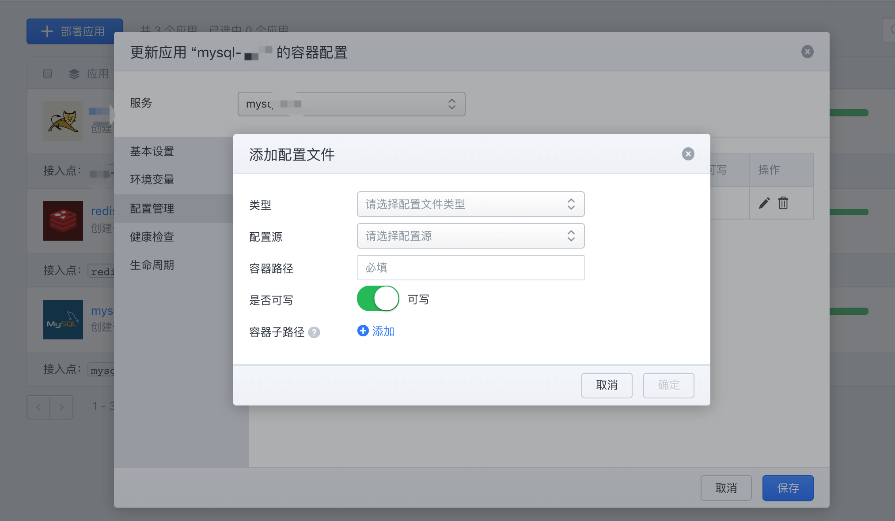
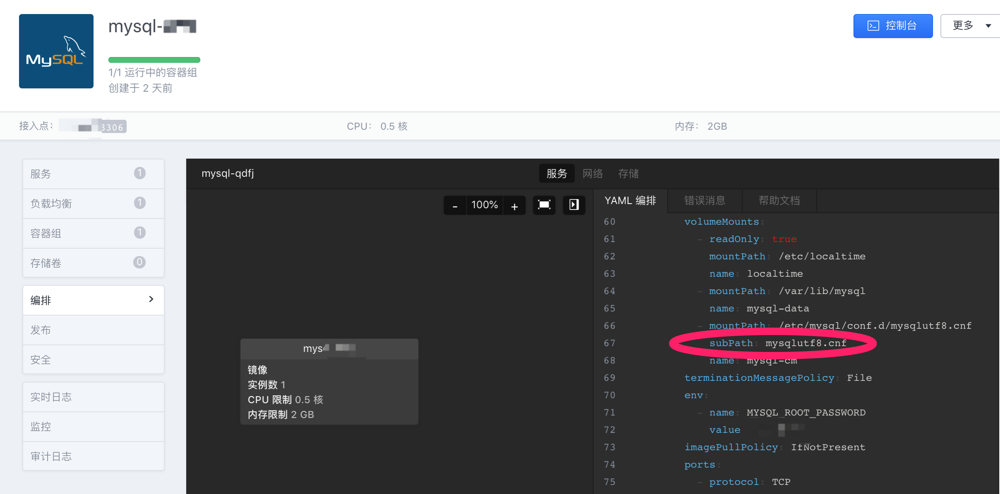

## 容器文件映射

在配置管理中，可以为容器挂载配置文件（ConfigMap）。

> 需要注意的是，挂载配置文件默认认为容器中该级目录中只有这一个文件，如果该级目录中有多个文件，且只想挂载其中的一个文件，需要在编排文件中增加 subPath 字段。

* 首先定义配置文件。

操作路径：【配置管理】--【配置文件】--【创建配置文件】

* 其次为应用挂载配置文件

操作路径：【应用】--【控制台右侧-三角符号】--【配置】--【容器配置】--【配置管理】--【添加配置文件】

* 如果只要挂载目录中的一个文件

操作路径：【应用】--【点击<应用名>】--【编排】--【展开YAML编排】

* 如果需要修改配置文件

操作路径：【配置管理】--【配置文件】--【点击<配置文件名>】--【编辑内容】

